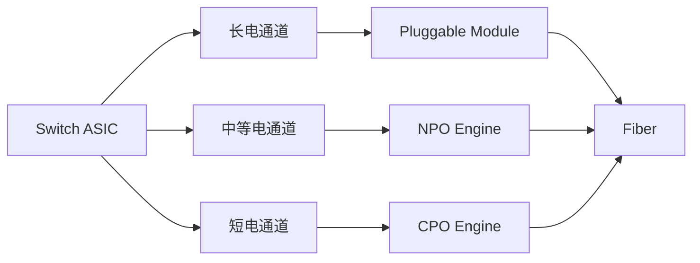

# CPO 分类框架

上级：[01 概览与问题定义](./README.md)

相关：[封装与集成路线](../03-architecture-platform/packaging-routes.md)、[产业链与角色](../02-industry/value-chain.md)

## 为什么要先分类

学习 CPO 最容易混淆的地方，是把下面几种维度混在一起：

- 系统位置
- 光电集成深度
- 激光器放置方式
- 光引擎实现技术
- 厂商平台名称

更稳妥的办法，是按正交维度拆开。

## 维度一：按系统位置分

- `Pluggable optics`：光模块仍在前面板或板边，通过较长电通道连接交换芯片
- `NPO / Near-packaged optics`：光引擎离芯片更近，但还不是严格同封装
- `CPO / Co-packaged optics`：光引擎与交换 ASIC 进入同一封装域或紧邻共封装域
- `OIO / On-board optics`：光器件主要位于板上，不一定与 ASIC 同封装

这里最重要的问题不是名字，而是“高速电通道被缩短到什么程度”。

## 维度二：按光源位置分

- `External laser source`：激光器在封装外，光通过光纤或波导送入封装
- `On-package laser`：激光器更靠近封装甚至进入封装
- `Remote laser + local modulation`：远端激光，本地调制

激光器位置决定热、可靠性、可维修性和安全边界。很多 CPO 方案会尽量把高热、高老化敏感度的激光器留在更易维护的位置。

## 维度三：按光引擎技术分

- `Silicon photonics`：以硅光波导、调制器和耦合结构为核心
- `InP / III-V`：常用于激光器或部分有源器件
- `Hybrid / heterogeneous integration`：把硅光与 III-V、CMOS driver/TIA 组合

不要把“硅光”直接等同于 “CPO”。硅光是器件和工艺路线，CPO 是系统级集成方式。

## 维度四：按封装关系分

- 交换 ASIC 与光引擎分芯片封装后再同板集成
- 多个光引擎围绕交换 ASIC 共封装
- ASIC、driver、TIA、硅光、耦合结构分层或分区集成

这一维度更接近先进封装视角。

## 维度五：按厂商方案名分

- Broadcom、Cisco、Marvell、NVIDIA、Intel 等厂商会给出各自平台表述
- 光引擎、硅光、交换芯片、封装、激光器供应商往往不是同一家公司

厂商名字只适合最后记，不适合作为第一层学习框架。

## 一句话记忆法

先问“光电转换放在哪里”，再问“激光器放哪里”，再问“光引擎怎么做”，最后再看“谁家的商品名”。

## 快速对照表

| 方案 | 光电转换位置 | 高速电链路长度 | 可维护性 | 热耦合压力 | 典型优势 | 典型代价 |
| --- | --- | --- | --- | --- | --- | --- |
| Pluggable optics | 前面板或板边模块 | 长 | 强 | 相对低 | 生态成熟、替换方便 | 电通道损耗和功耗高、面板密度受限 |
| NPO | 靠近封装但未必同封装 | 中 | 中 | 中 | 折中缩短电路径 | 架构边界不如 pluggable 清晰，也未完全获得 CPO 密度优势 |
| CPO | 封装级或紧邻共封装域 | 短 | 弱 | 高 | 带宽密度高、潜在系统能耗更优 | 热、测试、良率、维修和供应链复杂 |

## 一张图看关系

