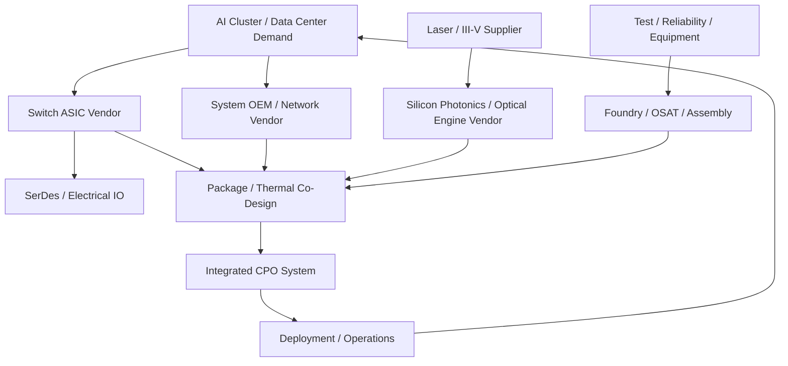

# 生态关系图与协作逻辑

上级：[02 产业链与角色](./README.md)

相关：[产业链与角色](./value-chain.md)、[公司与平台图谱](./company-landscape.md)

## 一张图看 CPO 生态

## 这张图真正想表达什么

CPO 不是简单的上下游串联，而是一个强耦合协作网络：

- 交换芯片厂商定义系统目标
- 光引擎和激光器供应链决定光学实现边界
- 封装与测试决定方案能否量产
- 系统厂商和运维团队决定客户是否接受

## 为什么这种协作比 pluggable 更难

在 pluggable 体系里，模块和交换机之间的标准接口更清晰；而在 CPO 里，很多问题必须提前到联合设计阶段解决：

- 热
- 布局
- 光纤引出
- 测试点
- 故障责任边界

## 读公司与论文时的一个简单问法

每看到一个方案，都问：

1. 谁在定义系统问题
2. 谁在承担封装和测试风险
3. 谁在为后期维护负责
