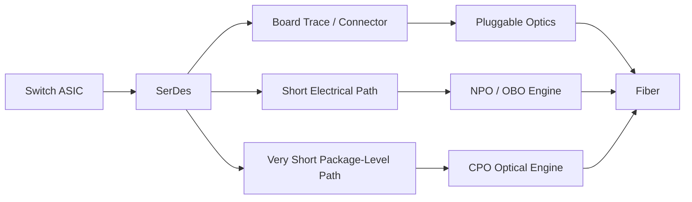

# 系统栈与接口位置

上级：[03 系统架构与集成平台](./README.md)

相关：[CPO 在解决什么问题](../01-overview/problem-statement.md)、[光链路基础](../04-optical-engine/optical-link-basics.md)

## 从交换芯片往外看

可以把一条高速链路抽象成：

`Switch ASIC -> SerDes -> package escape / substrate -> driver -> modulator -> fiber -> detector -> TIA -> electrical interface`

不同方案的差异，主要在于光电转换发生在这条链路的什么位置。

## Pluggable 的位置

在 pluggable optics 里：

- 交换芯片先把高速电信号拉到板边或前面板
- 经过连接器、走线、可能的 retimer/gearbox
- 最后进入模块做 E/O 或 O/E 转换

这意味着高速电链路较长，对损耗、均衡和功耗都不友好。

## CPO 的位置

在 CPO 里：

- 交换芯片附近就完成电光转换
- 高速电路径更短
- 光纤更早进入系统链路

系统本质变化是：原本“芯片到模块”的电通道，变成更短的“芯片到光引擎”的电通道。

## CPO 不只是少走一点线

它同时影响：

- 封装引脚分配
- substrate / interposer / bridge 设计
- 电源分配与噪声控制
- 散热器结构
- 光纤引出方式
- 可维护性与更换策略

## 关键判断问题

看一个方案是不是更接近 CPO，先问：

1. 高速电通道缩短到了什么程度
2. driver/TIA 在哪里
3. 光引擎与 ASIC 的热耦合有多强
4. 光纤是如何从封装或板上引出的

## 一张图看系统位置

## 快速对照表

| 维度 | Pluggable | NPO | CPO |
| --- | --- | --- | --- |
| 交换芯片到光引擎距离 | 远 | 近 | 最近 |
| 模块化边界 | 清晰 | 部分保留 | 明显削弱 |
| 维修粒度 | 小 | 中 | 大 |
| 封装协同复杂度 | 低 | 中 | 高 |
| 热设计压力 | 低到中 | 中 | 高 |
| 更适合回答的问题 | 生态和维护优先 | 折中优化 | 极限带宽密度与电功耗优化 |
