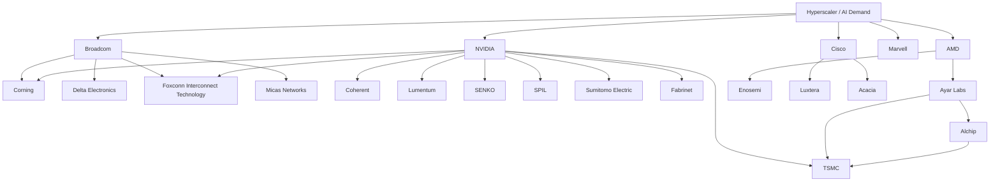

# 合作关系图

上级：[10 重点公司与合作关系图谱](./README.md)

相关：[生态关系图与协作逻辑](../02-industry/ecosystem-relationships.md)

## 一张公开关系图

## 这张图怎么读

这不是精确股权图，也不是全部供应商清单，而是根据公开材料抽出的“研究优先关系图”。

重点看的是三类关系：

- 平台主导方和组件/封装伙伴的关系
- optical I/O / silicon photonics 创新方和制造平台的关系
- 系统厂商通过收购或合作把 optics 能力拉到体内的关系

## 当前最值得跟踪的几条公开主线

### Broadcom 主线

公开材料显示，Broadcom 的 Bailly / TH5-Bailly 路线已经把以下协同放到台前：

- Broadcom 负责交换芯片与 CPO 平台主导
- Corning 提供 fiber / connector 相关能力
- Delta Electronics 推进系统产品化
- Foxconn Interconnect Technology 提供 socket、laser source cage 和 connector 相关部件
- Micas Networks 参与系统侧交付

这条线的特点是：更接近“交换机平台量产路线”。

### NVIDIA 主线

NVIDIA 在 2025 年 3 月公开的 photonics 路线中，直接点名了：

- TSMC
- Coherent
- Corning
- Foxconn
- Lumentum
- SENKO
- SPIL
- Sumitomo Electric
- Fabrinet

这说明 NVIDIA 的路线更像：由 AI 系统需求牵引，再把 silicon、optics、connector、assembly、manufacturing 多层一起拉动。

### Ayar Labs / Alchip / TSMC 主线

从 Ayar Labs 官方和 Alchip 官方公开材料看，这条线的关键词是：

- optical I/O chiplet
- remote light source
- UCIe / package integration
- advanced packaging
- TSMC COUPE / SoIC / packaging ecosystem

这条线更像“为下一代 AI 加速器和 scale-up fabric 提供可复用光 I/O 子系统”。

### Cisco 主线

Cisco 更值得从“长期光学能力内化”角度看：

- 2018 年宣布收购 Luxtera
- 2021 年完成 Acacia 收购
- 2026 年继续强化 Silicon One + optics + system 的整合叙事

这说明 Cisco 不是只把 optics 当外购模块，而是在持续把 silicon、optics 和 systems 绑得更紧。

### AMD 主线

截至 2025 年 5 月公开材料，AMD 已收购 Enosemi，以加速 AI 系统中的 photonics / CPO 能力。  
这更像是：AMD 正在补齐自身在 optical interconnect / photonics 方向上的能力拼图。

## 研究时要注意

- “合作”不等于“已经大规模量产”
- “展示生态”不等于“所有环节都成熟”
- 有些关系是平台验证关系，有些关系才是稳定供应关系

## 主要公开来源

- Broadcom，2024-03-14 与 2025-05-15 官方新闻稿
- NVIDIA，2025-03-18 官方新闻稿与官方产品页
- Intel 官方 Silicon Photonics 页面
- Marvell，2025-01-06 与 2025-03-31 官方新闻稿
- Cisco 官方收购与产品新闻稿
- AMD，2025-05-28 官方博客
- Ayar Labs 官方产品页
- Alchip 2025 年官方新闻稿
