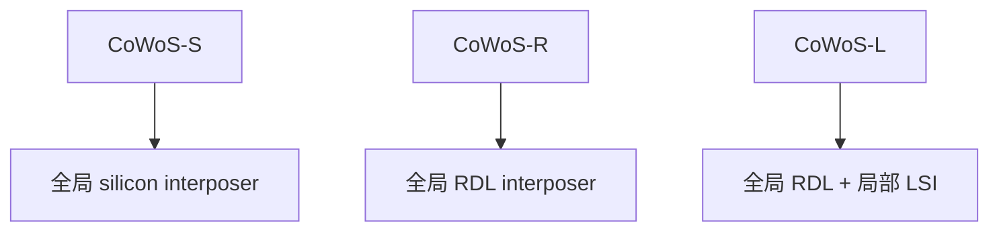
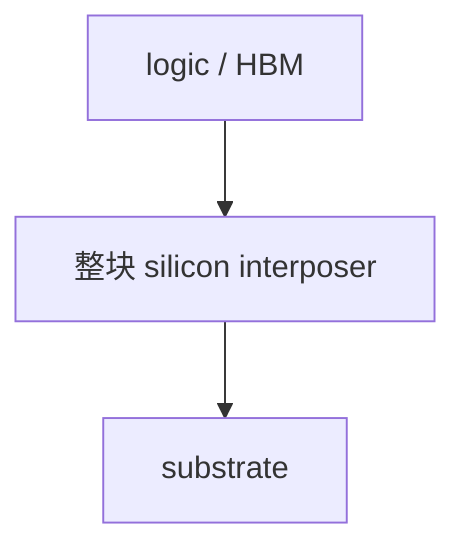
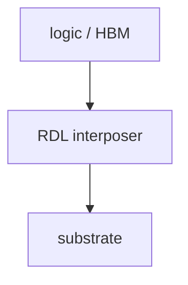
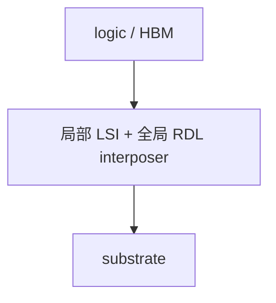

# CoWoS-S、CoWoS-R、CoWoS-L 的真正差别

上级：[[07 - TSMC 先进封装地图]]

相关：[[04 - Si Interposer]]、[[06 - Embedded Bridge]]、[[17 - 为什么 HBM 逼着产业走向 2.5D 和 3D]]

## 一张结构总览图

## 先给一个最有用的结论

三者的根本区别不是都叫 CoWoS，而是：

`中间互连平台到底是什么`

- **CoWoS-S**：整块 silicon interposer
- **CoWoS-R**：RDL interposer
- **CoWoS-L**：RDL interposer + embedded local silicon interconnect（LSI）

所以三者真正代表的是三种不同的系统权衡。

## 1. CoWoS-S：整块硅中介层路线

### 本质

把 logic die / chiplet / HBM 放到一整块 silicon interposer 上，再装到 substrate。

### 核心优势

- 互连密度最强
- 很适合 HBM
- PI / SI 容易做到很强
- 可集成 DTC / eDTC

### 核心代价

- 成本高
- 大面积硅平台难度高
- package 继续变大后，尺寸、warpage、良率、成本压力一起上升

### 适合什么

- 极限性能优先
- logic + HBM
- AI / supercomputing / ultra-HPC

### 截面直觉

## 2. CoWoS-R：RDL interposer 路线

### 本质

把原来整块硅 interposer 的角色，改由 polymer + Cu 的 RDL interposer 承担。

### 台积电公开强调的几个点

官方页面明确写到：

- 最小 4 µm pitch（2/2 µm line/space）
- RDL interposer 相对更柔顺
- 有利于 C4 joint integrity
- 有助于降低 SoC 与 substrate 的 CTE mismatch 影响

### 核心优势

- 更容易做更大尺寸
- 机械缓冲性更好
- 成本通常更优

### 核心代价

- 局部极限 routing density 不如整块硅 interposer
- 如果要冲最强局部高密度连接，仍会吃力

### 适合什么

- 大型复杂封装
### 截面直觉

- 需要在尺寸、机械和成本之间更平衡的场景

- 需要在尺寸、机械和成本之间更平衡的场景

## 3. CoWoS-L：RDL + 局部硅互连路线

### 本质

CoWoS-L 不是简单的 CoWoS-R 加点增强，而是：

- 全局用 RDL interposer 扩尺寸
- 局部用 LSI 做高密度互连

这里的 LSI 指 `Local Silicon Interconnect`。

### 为什么它重要

它代表了一种更现实的系统思路：

`不是整块平台都用最贵的硅能力，而是只在真正需要极高密度的地方用硅。`

### 台积电官方公开点

CoWoS-L 公开强调：

- LSI 提供多层 sub-micron copper lines
- 可支持 SoC-to-SoC、SoC-to-chiplet、SoC-to-HBM
- molding-based interposer 负责全局信号与供电
- 还能集成 stand-alone eDTC

### 它和 Embedded Bridge 的关系

从技术本质看，它非常接近 `bridge-like` 路线：

- 局部硅互连岛
- 外围大面积低成本平台

### 它解决了什么

它主要是在解决 CoWoS-S 往更大尺寸、更高 HBM 数量扩展时的矛盾：

- 全局都用大硅太贵
- 尺寸越来越难做
- 但局部又不能失去高密度连接能力

### 截面直觉

## 4. 你可以怎样记这三者

### CoWoS-S

`全局都用硅`

### CoWoS-R

`全局都用 RDL`

### CoWoS-L

`全局用 RDL，局部用硅`

## 5. 它们不是谁替代谁，而是不同目标函数

最容易犯的错是把三者理解成线性升级或线性替代。

更准确的理解是：

- CoWoS-S：极限密度优先
- CoWoS-R：尺寸/机械/成本平衡优先
- CoWoS-L：局部高密度 + 全局大平台的折中优先

## 5.1 一张对照表

| 平台 | 全局平台 | 局部极限密度 | 尺寸扩展性 | 成本压力 | 更像哪条通用路线 |
| --- | --- | --- | --- | --- | --- |
| CoWoS-S | silicon interposer | 最强 | 较弱 | 最高 | Si Interposer |
| CoWoS-R | RDL interposer | 较弱于 S | 更强 | 较低 | RDL-based 2.5D |
| CoWoS-L | RDL + LSI | 局部强 | 强 | 折中 | Bridge-like 混合路线 |

## 5.2 为什么现实里会分别选 S、R、L

### 为什么选 CoWoS-S

当系统最优先追求的是：

- 极限局部密度
- logic + HBM 的最强互连能力
- 更强的封装级 PI 支撑

就更容易选 CoWoS-S。

### 为什么选 CoWoS-R

当系统更在意：

- 更大尺寸扩展
- 机械与 warpage 平衡
- 成本压力

并且局部密度不必冲到 S 的极限时，就更容易选 CoWoS-R。

### 为什么选 CoWoS-L

当系统同时想要：

- 大尺寸平台
- 局部超高密度
- 比 full silicon interposer 更现实的全局成本

就会更偏向 CoWoS-L。

所以三者不是简单代际关系，而是三组不同目标函数：

- S：性能/密度优先
- R：尺寸/机械/成本优先
- L：局部密度与全局大平台折中优先

## 6. 台积电为什么越来越重视 L 和 R

因为 AI/HPC 封装继续放大以后，问题不再只是“局部密度够不够”，还包括：

- package 能不能继续变大
- warpage 能不能压住
- 成本能不能承受
- HBM 数量增加后全局 routing / power / thermal 怎么做

所以 CoWoS 的演化方向，本质上是在不断重做这道系统优化题。

## 6.1 它们各自最怕什么

### CoWoS-S 最怕什么

- 大尺寸硅平台带来的成本与良率压力
- warpage 和热机械问题随面积放大而恶化
- 当系统继续变大时，全局都用硅越来越重

### CoWoS-R 最怕什么

- 局部极限密度不够
- 当 HBM / logic 接口继续升维时，RDL interposer 可能遇到上限
- 需要在尺寸和密度之间不断找折中

### CoWoS-L 最怕什么

- 结构最折中，协同也最复杂
- 局部 LSI 与全局 RDL 之间的分工如果没切好，复杂度会上升但收益不一定匹配
- 它不是最简单的平台，所以设计和制造都更考验系统能力

## 常见误区

### 误区 1：CoWoS 就等于整块 silicon interposer

不对。那只是 CoWoS-S。

### 误区 2：CoWoS-L 只是 CoWoS-R 多加了几个被动件

不准确。CoWoS-L 的关键是局部 LSI，不是普通被动增强。

## 参考资料

- TSMC CoWoS 官方页：https://3dfabric.tsmc.com/english/dedicatedFoundry/technology/cowos.htm
- TSMC 3DFabric HPC：https://www.tsmc.com/schinese/dedicatedFoundry/technology/platform_HPC_tech_WLSI
