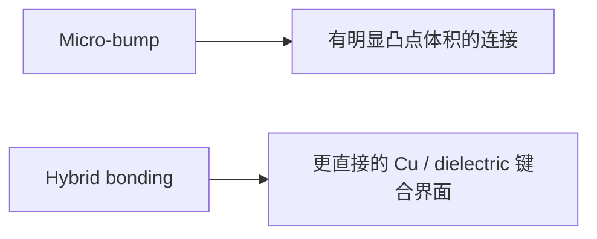
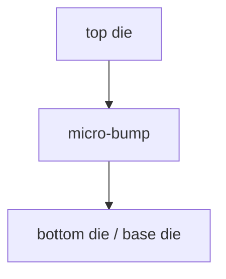
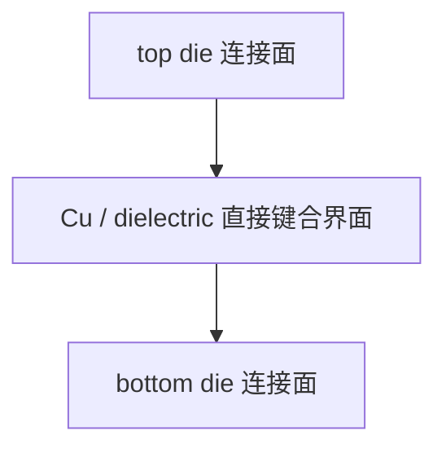

# Hybrid Bonding vs Micro-bump

上级：[[08 - 3D IC]]

相关：[[09 - W2W 与 D2W]]、[[15 - CTE、热应力与 Warpage：从概念到 3DIC]]

## 一张结构直觉图

## 先给结论

很多人会把这两者理解成：

- micro-bump：旧方案
- hybrid bonding：新方案

这不完全错，但不够工程化。

更准确地说：

- **micro-bump** 是一种更成熟、更宽工艺窗口的高密度封装互连方案
- **hybrid bonding** 是一种更高密度、更低互连寄生、但工艺门槛显著更高的连接方案

问题不是“谁更先进”，而是：

`你到底需不需要为更高的连接密度和更低 power-per-bit，付出更高的制造复杂度。`

## 1. Micro-bump 是什么

可以把它理解成：

- 两个 die 之间通过微小焊点/金属凸点连接
- 再配合 underfill 等材料完成机械和热机械支撑

它的特点是：

- 有明确的金属连接体积
- 工艺成熟
- 良率和可靠性经验更丰富
- pitch 已经比传统 bump 细很多

### 截面直觉

## 2. Hybrid bonding 是什么

Hybrid bonding 通常指：

- Cu-Cu 直接连接
- 同时介质层之间也直接键合

它不再依赖明显突出的 bump 作为主要连接体。

它的目标是：

- 更细 pitch
- 更短互连
- 更低寄生
- 更高带宽密度
- 更低 power-per-bit

### 截面直觉

## 3. 为什么 hybrid bonding 更吸引人

### 3.1 pitch 更细

当连接点更密时，die-to-die 可提供更高连接密度。

### 3.2 互连更短

连接路径更短，寄生更低，更有利于功耗和延迟。

### 3.3 更适合真正的 3DIC

当目标是把堆叠结构尽可能做成“像一个 SoC 一样”，hybrid bonding 更符合这个方向。

## 4. 为什么它更难

因为它把很多原本由 bump 结构“容错”的东西都收紧了。

### 4.1 表面平坦度要求更高

如果表面不够平，直接键合就很难稳定。

### 4.2 表面洁净度要求更高

污染、氧化、粗糙度都更容易影响界面质量。

### 4.3 对位精度要求更高

pitch 越细，对位误差容忍度越低。

### 4.4 薄 die handling 更难

真正做高密度 3DIC 往往伴随更薄 die、更复杂堆叠，制造窗口更窄。

### 4.5 热应力与可靠性问题没有消失

Hybrid bonding 解决的是连接密度和寄生问题，不是自动解决所有热机械问题。  
详见：[[15 - CTE、热应力与 Warpage：从概念到 3DIC]]

## 它们各自最怕什么

### Micro-bump 最怕什么

- 当系统继续要更细 pitch 时，它的连接上限会越来越明显
- 在极限带宽密度和 power-per-bit 目标下，寄生会开始变成负担
- 如果产品目标已经接近“像 SoC 一样的 die-to-die 集成”，micro-bump 可能不够用

### Hybrid bonding 最怕什么

- **表面平坦度不够**
- **洁净度不够**
- **对位误差过大**
- **薄 die handling 不稳定**
- **测试和可靠性验证不到位**

也就是说，Hybrid bonding 最怕的不是“理论上不好”，而是：

`它把很多问题都压缩进了一个极窄的制造窗口里。`

## 5. 为什么 micro-bump 仍然不会马上消失

因为很多产品并不需要最极限的连接密度，或者说即使需要，也未必值得付出 hybrid bonding 的全部复杂度。

在工程上，micro-bump 仍然有很强现实性：

- 工艺成熟
- 生态成熟
- 测试与可靠性经验更全
- 对大规模量产更友好

所以产业并不是“马上全面切换”，而是：

- 该用 micro-bump 的继续用
- 真正需要更高密度、更低功耗的场景再往 hybrid bonding 走

## 5.1 一张对照表

| 维度 | Micro-bump | Hybrid bonding |
| --- | --- | --- |
| 成熟度 | 更成熟 | 更前沿 |
| pitch 潜力 | 高，但有限 | 更高 |
| 互连寄生 | 较高 | 更低 |
| 工艺窗口 | 相对宽 | 更窄 |
| 对表面/对位要求 | 高 | 更高 |
| 典型吸引力 | 量产友好 | 极限密度与能效 |

## 为什么现实里会选 Micro-bump 或 Hybrid Bonding

### 为什么很多产品仍选 Micro-bump

因为现实系统常常不是只追求理论最优，而要综合考虑：

- 工艺成熟度
- 良率
- 设备与供应链成熟性
- 量产节奏

所以只要连接密度还够用，micro-bump 往往仍是更稳的工程选择。

### 为什么有些系统必须走向 Hybrid Bonding

当系统继续追求：

- 更细 pitch
- 更低 power-per-bit
- 更高带宽密度
- 更像 SoC 的 die-to-die 集成

micro-bump 的上限就会越来越接近，hybrid bonding 的吸引力就会显著上升。

所以更准确的理解不是：

- `hybrid bonding 一定替代 micro-bump`

而是：

- `当系统目标逼近连接极限时，hybrid bonding 会从可选项变成必要项`

## 6. 一个更有用的记忆方法

### Micro-bump

`更成熟的高密度互连`

### Hybrid bonding

`更像硅级互连的高密度连接`

## 7. 和 W2W / D2W 的关系

两者都可以和不同制造组织方式结合：

- W2W
- D2W

但当 pitch 继续往更细走、系统越来越追求极限 3D 连接密度时，hybrid bonding 的吸引力会越来越大。

这也是为什么：

- TSMC SoIC
- Intel Foveros Direct

这些平台都在强调 hybrid bonding。

## 常见误区

### 误区 1：Hybrid bonding 只是“更高级的 bump”

不准确。它的界面机制、制造窗口和挑战都明显不同。

### 误区 2：只要用了 hybrid bonding，性能问题就自动解决

不对。它改善的是连接上限，但热、CTE、warpage、测试问题仍然存在。

## 参考资料

- Intel Foundry Packaging：https://www.intel.com/content/www/us/en/foundry/packaging.html
- TSMC SoIC 官方页：https://3dfabric.tsmc.com/schinese/dedicatedFoundry/technology/SoIC.htm
- Cu-based thermocompression & hybrid bonding review：https://pmc.ncbi.nlm.nih.gov/articles/PMC10489970/
