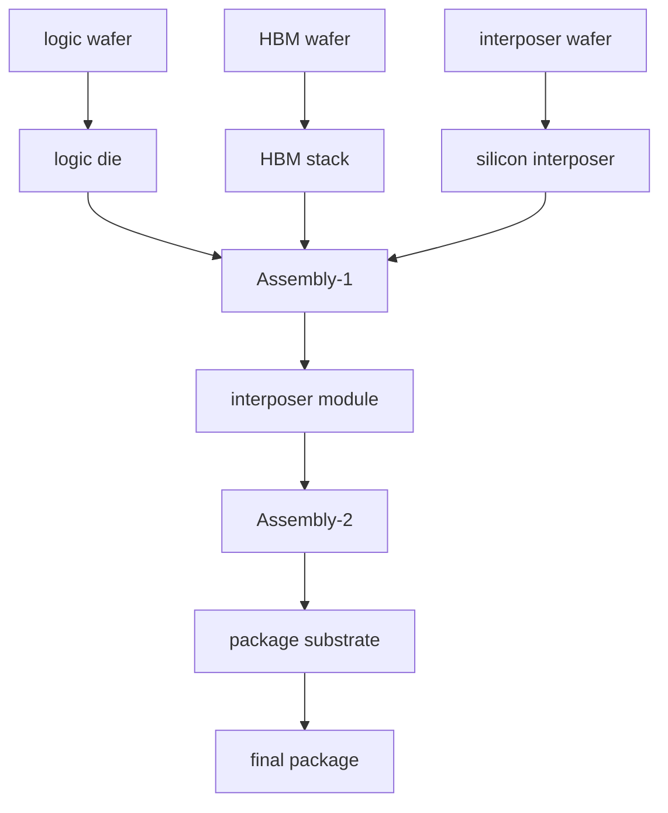

# CoWoS-S 的完整制造流程

上级：[[04 - Si Interposer]]

相关：[[18 - CoWoS-S、CoWoS-R、CoWoS-L 的真正差别]]、[[28 - 先进封装测试：Wafer Sort、KGD、中测、Final Test]]

## 先给结论

CoWoS-S 不是一个单步封装，而是一条多对象、多阶段的系统集成流程。

学习它时，最重要的是分清：

- logic die
- HBM stack
- silicon interposer
- substrate
- module

如果把这些对象混在一起，流程就会一直看不清。

## 1. Step 0：协同设计

真正的 CoWoS-S 不是“前道做完再想封装”，而是从前面就一起考虑：

- die partition
- bump map
- interposer routing
- HBM placement
- PI / SI
- thermal
- package size

这一步本质上是 chip-package co-design。

## 2. Step 1：logic wafer 制造

先完成：

- GPU / ASIC / CPU / chiplet 等逻辑 die 的前道制造

之后会进入测试、切割、筛选等流程。

这里最重要的认知是：

- wafer 只是制造载体
- 真正进入高价值组装的对象通常是经过筛选的 logic die

## 3. Step 2：HBM 制造与 stack 形成

HBM 不是普通单层 die，而是先完成自己的 memory stack。

详见：[[21 - HBM Stack 是怎么制造出来的]]

所以在 CoWoS-S 现场参与组装的“HBM”，通常已经是高价值 stack 对象，而不是一堆分散 DRAM die。

## 4. Step 3：silicon interposer 制造

CoWoS-S 的核心平台是 silicon interposer。

这一步通常包括：

- TSV 相关结构
- 多层 routing
- 有时还有 DTC / eDTC
- backside 相关处理

可以把它再压缩成三件事：

1. 做出顶部高密度连接平台
2. 做出从顶到底的垂直引出能力
3. 让这块硅平台足以承载后续 logic + HBM 集成

它的本质是先把高密度中间互连平台准备好。

## 5. Step 4：wafer sort / KGD / 物料准备

在真正组装前，需要明确：

- logic die 哪些是 KGD
- HBM stack 哪些是可用件
- interposer wafer / 单元状态

这一步决定后面 assembly 的有效良率。

在 CoWoS-S 这种高价值封装里，这一步的意义几乎就是：

`不要让坏件混进后面越来越贵的组装链。`

## 6. Step 5：Assembly-1，die / HBM 到 interposer

这是 CoWoS-S 的核心组装阶段之一。

可以理解成：

- 把 logic die / chiplet
- 把 HBM stack
- 贴装到 silicon interposer 上

形成一个中间 module。

很多资料会把这一步概括成 `chip on wafer`。  
但你学习时更建议直接盯对象关系：

- logic die 上 interposer
- HBM stack 上 interposer
- 得到局部高密度模块

这一步为什么难：

- 对位精度要求高
- 多颗高价值器件同时参与
- bump / underfill / 平整度都关键
- 一旦出错，损失巨大

同时，这一步还会直接决定：

- die-to-die / die-to-HBM 互连质量
- 局部热耦合
- warpage 起点
- 后续 package 的机械风险

## 7. Step 6：Assembly-2，module 到 substrate

把上一步形成的 interposer module 再组装到 package substrate 上。

这一步本质上是把：

- 局部高密度硅平台
- 接到最终可上板的大系统平台

所以这里同时涉及：

- 电源引出
- 全局信号引出
- 机械支撑
- 热路径

可以把两步 assembly 的分工记成：

- Assembly-1：形成“局部高密度系统”
- Assembly-2：把它接入“最终系统级封装”

## 8. Step 7：后续材料与结构完成

这一阶段会涉及：

- underfill / 封装相关材料
- lid / TIM / heat spreader 等散热结构
- 其他后续保护与机械加固

具体细节因产品而异，但其核心目的都是让系统从“能装上”变成“能长期可靠工作”。

这里最容易被低估的是：

- underfill
- TIM
- lid / heat spreader
- 机械保护结构

这些东西不是收尾件，而是热、机械和寿命表现的关键层。

## 9. Step 8：中测、final test 与可靠性验证

真正高价值 CoWoS-S 封装不会只做一次最终测试，而是会在不同阶段设置测试节点。

详见：[[28 - 先进封装测试：Wafer Sort、KGD、中测、Final Test]]

更工程化地说，测试不是末端附属动作，而是穿插在高价值组装链中的风险拦截系统。

## 10. 一个最常见的误区

### 误区：CoWoS-S 就是“die 贴到 interposer 上”

这太简化了。

更准确的说法是：

`CoWoS-S 是 logic die、HBM stack、silicon interposer、substrate 以及测试/热/供电/机械协同的一整套系统集成流程。`

## 11. 用对象层次重新画一遍

## 12. 最实用的理解方法

把 CoWoS-S 拆成三层：

### 第一层：器件准备

- logic die
- HBM stack
- interposer

### 第二层：局部高密度模块形成

- die / HBM -> interposer

### 第三层：最终 package 形成

- interposer module -> substrate -> final package

只要你按这三层看，流程就会清楚很多。
