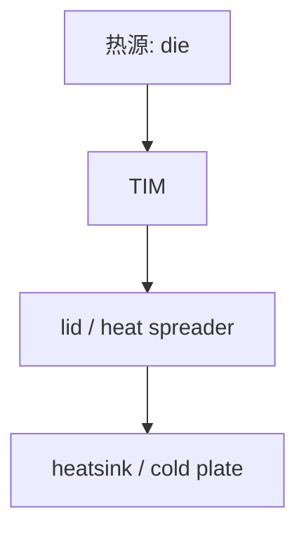
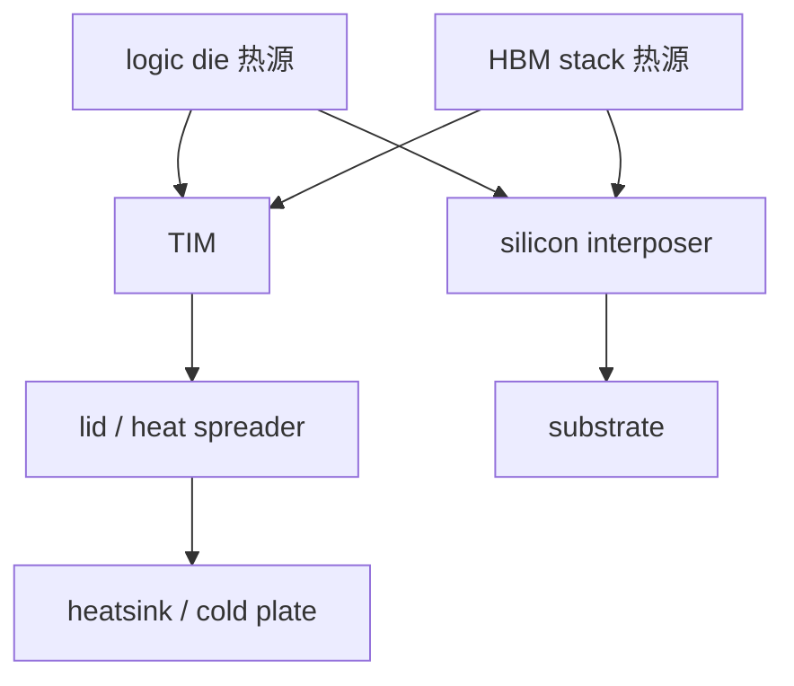
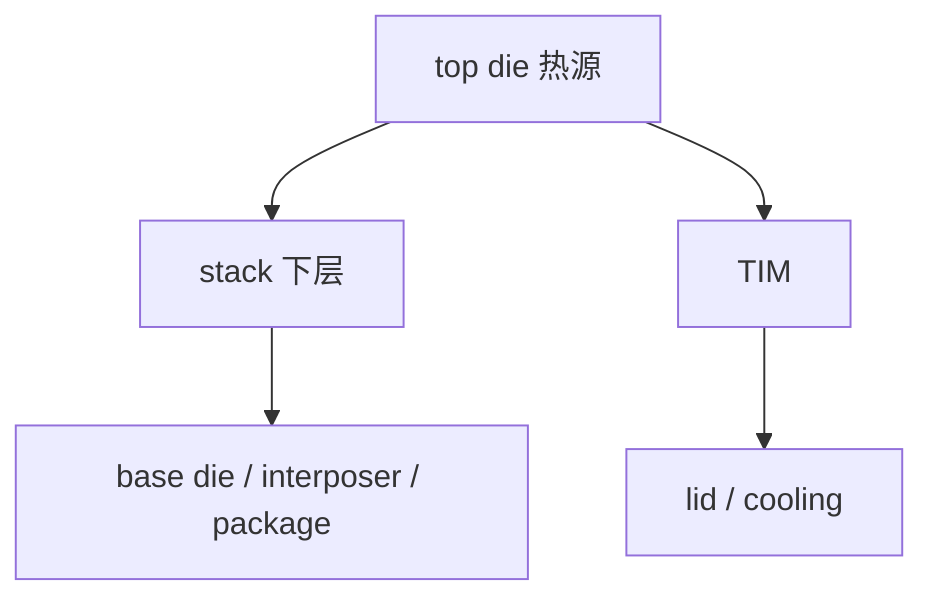

# 先进封装中的热路径图解

上级：[[10 - 共性工程问题]]

相关：[[15 - CTE、热应力与 Warpage：从概念到 3DIC]]、[[17 - 为什么 HBM 逼着产业走向 2.5D 和 3D]]、[[31 - AI GPU + HBM 封装的完整对象关系图]]

## 为什么热路径要单独拿出来看

因为很多先进封装问题表面上看是：

- 带宽问题
- 互连问题
- HBM 问题

但到量产和系统运行时，经常会变成：

- 热从哪里走
- 热能不能走出去
- 热会不会堆在最不该堆的地方

所以“热路径”不是散热器最后再加的东西，而是封装结构的一部分。

## 1. 普通单 die 封装的热路径

这类结构相对简单，因为：

- 热源主要集中在单颗 die
- 路径短
- 结构层级少

这里真正要管的主要是：

- die 到 TIM 的界面热阻
- TIM 到 lid / heat spreader 的热阻
- 热是不是能有效传到最终散热器

## 2. Si interposer + HBM 的热路径

这个结构开始复杂的原因：

- 热源不止一个
- logic 与 HBM 靠得很近
- interposer 同时承受电互连和热路径角色

更工程化地说，这里要同时处理两件事：

- 主热源怎么把热送出去
- 主热源会不会把旁边的 HBM 一起拖热

## 3. 3DIC 的热路径

3DIC 的热更难，是因为：

- 上层热源可能被下层结构“挡住”
- 热源离主散热界面更远
- 堆叠后局部温升更敏感

所以 3DIC 的热问题经常不是“整体都热”，而是：

- 某一层特别热
- 某一界面特别难过热
- 温度梯度特别大

## 4. 为什么 HBM 会让热问题放大

HBM 不只是“存储器贴在旁边”，它意味着：

- 多个 stack 紧邻高功耗 logic
- 系统功耗密度上升
- package 变大
- 热分布不再均匀

所以先进封装里常见的不是“一个热点”，而是：

- logic 主热点
- HBM 邻近热区
- 多芯片系统级热耦合

这意味着热设计不再只是“把最大热源压住”，而是要看：

- 热源之间怎么耦合
- 哪个器件最怕被旁边拖热
- 哪条热路最容易堵住

## 5. 热路径设计里最关键的几个问题

### 5.1 热主要往上走还是往下走

大多数高性能封装主要热路径仍希望向上走到 lid / heatsink。  
但在结构上，向下经过 interposer / substrate 的路径也会影响整体温度场。

### 5.2 最热的 die 在哪里

如果最热 die 放在最难散热的位置，系统风险会明显增加。

### 5.3 memory 和 logic 的相对位置如何

HBM 离 logic 太近有带宽优势，但热耦合会更强。

### 5.4 stack 会不会阻断热路径

越靠上的 die，越可能面临“热先经过别的层再出去”的问题。

### 5.5 顶部散热和底部散热分别承担什么

高性能先进封装通常主要靠顶部散热路径，但底部经过 interposer / substrate 的路径仍会影响整体温度场。  
真正的问题不是“底部是否散热”，而是：

- 顶部主热路够不够强
- 底部路径会不会变成热积累区

## 6. 三种结构的热路径对照

| 结构 | 热路径特点 | 主要热风险 |
| --- | --- | --- |
| 单 die | 热路短、主热源单一 | 界面热阻 |
| 2.5D + HBM | 多热源横向耦合 | logic-HBM 热耦合、package 热分布 |
| 3DIC | 垂直堆叠、热路更受限 | 上层 die 热阻、局部热点、温度梯度 |

## 7. 一句话图解

### 单 die

`热路短`

### 2.5D + HBM

`热源更多，热耦合更强`

### 3DIC

`热最难，因为热源离散热出口更远、层级更多`

## 8. 如果你是从架构角度看热

最有用的不是先问“散热器怎么配”，而是先问：

1. 最热的计算单元放在哪
2. HBM 离它多近
3. 有没有垂直堆叠阻断主热路
4. 热会不会反过来限制频率、带宽或封装尺寸

## 9. 最后要记住的结论

先进封装里的热问题不是独立于结构存在的；  
你怎么放 die、怎么堆 stack、怎么选 interposer / RDL / bridge，本质上都在重写热路径。
