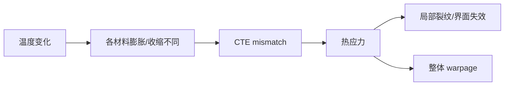
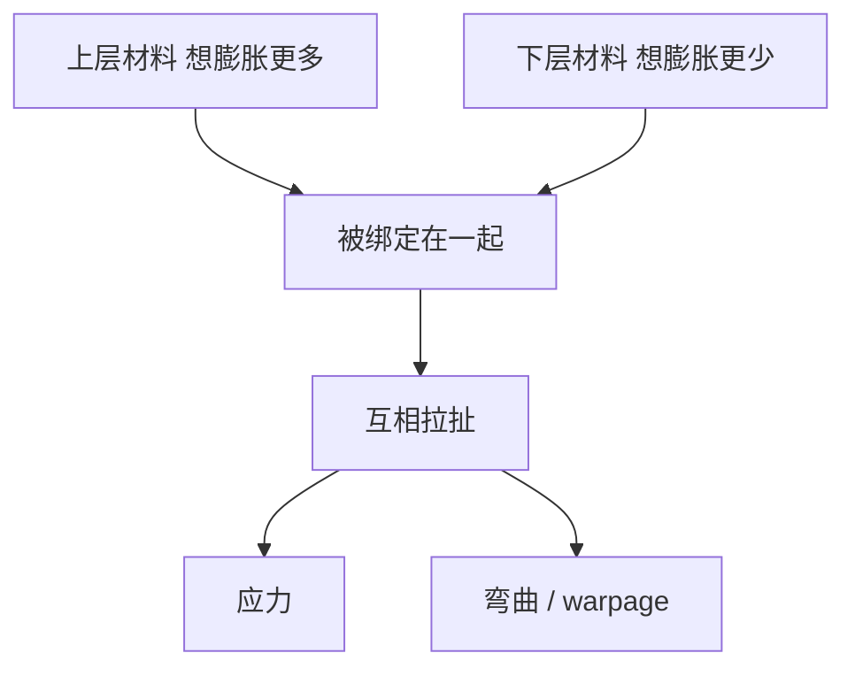
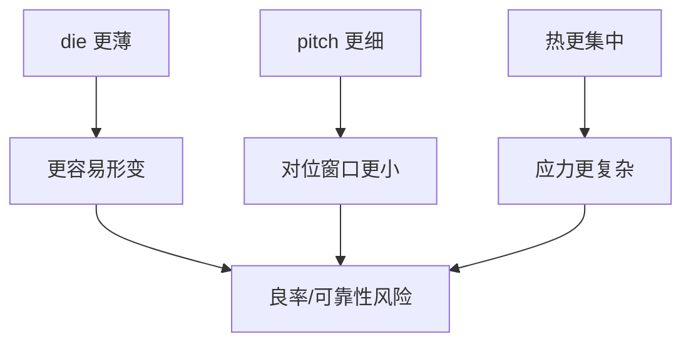

# 先进封装中的应力与 Warpage 图解

上级：[[10 - 共性工程问题]]

相关：[[15 - CTE、热应力与 Warpage：从概念到 3DIC]]

## 1. 最简因果图

这张图就是最核心的逻辑链：

`CTE mismatch -> 热应力 -> 局部失效 / 整体 warpage`

## 2. 一个最简单的两层结构示意

## 3. 为什么大硅 interposer 容易带来 warpage 压力

因为当结构里存在：

- 大面积硅
- 有机基板
- underfill / molding / RDL

这些材料被绑定后，整体热机械行为会很复杂。  
当尺寸继续放大时，warpage 往往不是线性变难，而是明显恶化。

## 4. 为什么 fan-out 也会 warpage

有时会误以为“有机材料更软，所以就不翘”。不对。

Fan-out 的 warpage 来源包括：

- mold compound 固化收缩
- die shift
- 多层 RDL 应力
- 与 carrier / substrate 的热机械耦合

所以：

- Si interposer 有自己的 warpage 问题
- fan-out 也有自己的 warpage 问题

只是来源和控制方式不同。

## 5. 3DIC 为什么更敏感

## 6. 一个最重要的图解结论

如果只记一件事，就记这个：

`warpage 不是单一故障，而是结构、材料、热、尺寸一起耦合后的外在表现。`

所以解决 warpage 从来不是只靠一个材料或一个后处理步骤，而是：

- 结构
- 材料
- 制程
- 尺寸
- 热设计

一起协同。

