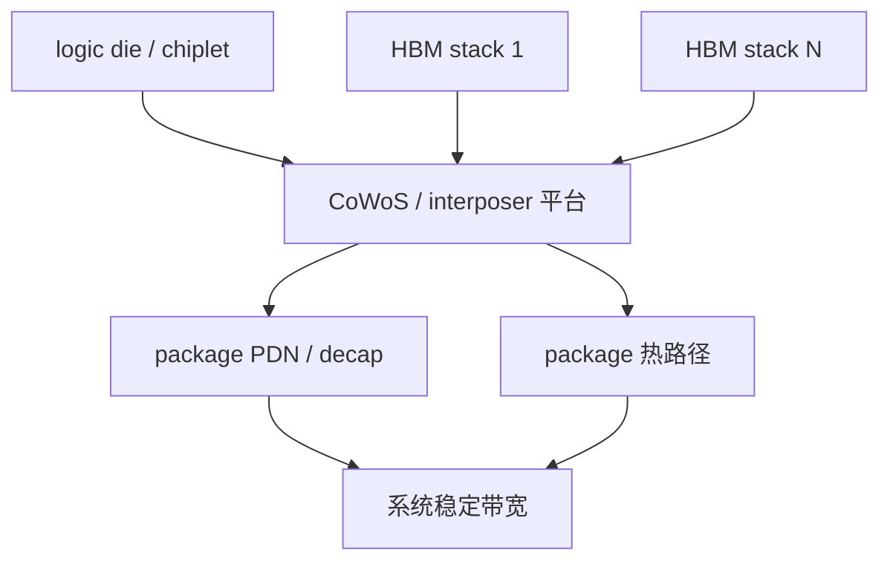
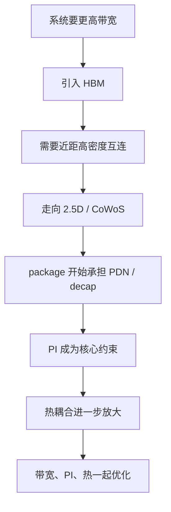

# 课程主线一：HBM、CoWoS、PI 与热

上级：[[00 - 先进封装 Wiki 索引]]

相关：[[17 - 为什么 HBM 逼着产业走向 2.5D 和 3D]]、[[18 - CoWoS-S、CoWoS-R、CoWoS-L 的真正差别]]、[[23 - 先进封装里的 PI、PDN、Decap 到底怎么理解]]、[[29 - 先进封装中的热路径图解]]

## 建议阅读顺序

建议按下面顺序配套阅读：

1. [[17 - 为什么 HBM 逼着产业走向 2.5D 和 3D]]
2. [[21 - HBM Stack 是怎么制造出来的]]
3. [[18 - CoWoS-S、CoWoS-R、CoWoS-L 的真正差别]]
4. [[23 - 先进封装里的 PI、PDN、Decap 到底怎么理解]]
5. [[29 - 先进封装中的热路径图解]]

## 对象关系图



这张图想表达的是：

- HBM 不是孤立 memory
- CoWoS 不只是连线平台
- PI 和热不是后置问题
- 它们共同决定系统能否把 HBM 带宽真正用起来

## 这条主线在回答什么

很多人学习先进封装时，会把这些问题分开看：

- HBM 是什么
- 为什么用 CoWoS
- 为什么 interposer 上还要讲 decap
- 为什么最后又绕到热

但在 AI/HPC 系统里，这四件事其实是一条连续逻辑链。  
这条主线要回答的是：

`为什么一旦系统要上 HBM，封装就不再只是“把器件装起来”，而会一路推到 CoWoS、PI 和热设计。`

## 1. 起点：系统为什么需要 HBM

AI/HPC 系统真正需要的不是“更快的内存颗粒”，而是：

- 更高总带宽
- 更低 power-per-bit
- 更大的带宽密度
- 在有限封装尺寸里继续提升 memory 接入能力

如果继续靠传统外部内存方案去做，问题会越来越严重：

- I/O 不够多
- 板级走线太长
- 高频损耗与 SI/PI 越来越难
- 功耗越来越高

所以系统开始转向 HBM。

## 2. HBM 为什么天然把问题推向先进封装

HBM 不是普通 DRAM，它本身已经是一个 3D memory stack。  
这意味着当系统决定使用 HBM 时，问题会立刻分成两层：

### 第一层：HBM 自己怎么做出来

- 多层 memory die 堆叠
- TSV
- 薄 die handling
- memory stack 测试与可靠性

详见：[[21 - HBM Stack 是怎么制造出来的]]

### 第二层：HBM stack 怎样和 logic die 连接

这才是把系统推向 2.5D / 3D 封装的关键。

## 3. 为什么 logic 和 HBM 必须靠得很近

HBM 的价值不是 memory stack 自己很复杂，而是它必须和 logic die 之间建立：

- 很宽的接口
- 很短的连接
- 很低的寄生
- 很好的功耗表现

一旦连接距离太长，就会出现：

- 功耗上升
- SI/PI 恶化
- 带宽收益被吃掉

所以 HBM 不是只需要“先进 memory”，而是需要“先进 memory + 先进封装互连平台”。

## 4. 为什么系统先走到 2.5D，而不是直接全部上 3DIC

这是很关键的一步。

理论上，垂直堆叠的 3DIC 可以提供更短互连；  
但在现实量产里，HBM 与大逻辑 die 的集成首先更常落到 2.5D，因为 2.5D 给了一个较稳的工程折中：

- 高密度横向互连足够强
- HBM 和 logic 足够近
- 系统尺寸可控
- 热和测试问题虽然难，但还在可管理区间

所以对很多 AI/HPC 系统来说，2.5D 不是“过渡方案”，而是第一阶段最现实的主战场。

## 5. 为什么 CoWoS 会变成主平台

HBM 一旦进场，封装平台就必须满足几件事：

- 承接多个 HBM stack
- 承接高价值 logic die / chiplet
- 提供极高密度 routing
- 处理 power delivery
- 处理热与 warpage

CoWoS 正好是在做这件事。

更具体地说：

- **CoWoS-S**：用整块 silicon interposer，追求最强密度与 HBM 互连能力
- **CoWoS-R**：用 RDL interposer，更偏尺寸、机械和成本平衡
- **CoWoS-L**：用 RDL + LSI，把局部高密度和全局大平台折中起来

详见：[[18 - CoWoS-S、CoWoS-R、CoWoS-L 的真正差别]]

## 6. 为什么一讲 CoWoS，马上就会讲到 PI

因为在 HBM 系统里，问题不再只是“信号连上了没有”，而是：

- 这么多高速接口、这么大的逻辑负载，电能不能稳地送到边上

HBM 系统通常具备这些特征：

- logic die 功耗高
- 瞬态电流大
- HBM stack 多
- package 层级复杂

于是问题就变成：

- PDN 怎么设计
- decap 放哪里
- interposer 能不能承担一部分供电与去耦角色

这就是为什么 CoWoS-S 会强调 DTC / eDTC，而先进封装会把 interposer 从“连接层”升级为“供电网络的一部分”。

详见：[[23 - 先进封装里的 PI、PDN、Decap 到底怎么理解]]

## 7. 为什么 PI 又会继续把问题推向热

到这里，逻辑开始再往前一步：

- HBM 让封装变复杂
- CoWoS 解决高密度互连
- PI 解决动态供电稳定

但系统不会因此自动成功，因为：

- 高功耗 logic 紧邻 HBM
- 多个热源开始耦合
- package 变大
- 局部热点与温度梯度更严重

于是热成为下一个核心约束。

这就是为什么 AI/HPC 封装里你很难只讲带宽，不讲热。

## 8. HBM 系统里的热到底难在哪里

最核心的不是“平均温度升高”，而是：

- logic die 通常是主热源
- HBM stack 通常就在主热源旁边
- interposer / substrate 会参与热路径与热耦合

所以要同时看：

- 主热源怎么散
- HBM 会不会被拖热
- 封装尺寸扩大后热分布是否失控

详见：[[29 - 先进封装中的热路径图解]]

## 9. 用一条因果链把它压缩起来

可以把整条主线写成：

```text
系统要更高带宽
-> 传统外部内存不够
-> 采用 HBM
-> HBM 需要近距高密度互连
-> 系统走向 2.5D / CoWoS
-> 封装开始承担 PDN / decap 角色
-> 功耗与热耦合进一步放大
-> 最终演化成“带宽 + PI + 热”一起优化的问题
```

## 9.1 图形化因果链



## 10. 为什么这条主线很重要

因为它告诉你：

- HBM 不是 memory 子问题
- CoWoS 不是单纯封装子问题
- PI 不是电源团队子问题
- 热也不是散热器团队最后再处理的问题

在 AI/HPC 系统里，这四者本来就是一体的。

## 11. 这条主线的最终心智模型

如果只记一句话，就记：

`HBM 把系统从“芯片设计问题”推成了“存储、封装、供电、热”一起耦合的系统工程问题，而 CoWoS 正是这条链路的核心承接平台。`

## 11.1 一张对照表

| 阶段 | 系统关注点 | 封装层面的变化 |
| --- | --- | --- |
| 没有 HBM | 传统外部内存带宽 | 普通 substrate 为主 |
| 引入 HBM | 近距超宽接口 | 需要 2.5D / 高密度互连 |
| 带宽继续提升 | HBM 数量变多 | interposer / RDL 平台变复杂 |
| 功耗上升 | 动态供电更困难 | PI / PDN / decap 前移到 package |
| 热密度上升 | 主热点与 HBM 热耦合 | 热路径成为封装选型约束 |

## 12. 常见误区

### 误区 1：HBM 只是“更快的 DRAM”

不对。HBM 本身就是 3D stack，并且它的系统价值依赖先进封装平台才能释放出来。

### 误区 2：CoWoS 只是把 GPU 和 HBM 放得近一点

不对。CoWoS 同时在解决高密度 routing、PDN、热、warpage 和大系统集成问题。

### 误区 3：PI 是电源团队自己的事

不对。先进封装里 PI 已经是 chip-package-system 联合问题。

### 误区 4：热是最后再补的散热器问题

不对。HBM 的位置、interposer 选择、封装尺寸本身都在重写热路径。

## 13. 检查题

1. 为什么 HBM 会天然把系统推向 2.5D，而不是普通 substrate 即可解决？
2. 为什么一旦进入 CoWoS 语境，讨论会很快从带宽转向 PI？
3. 为什么 AI/HPC 里的热问题不是“单个最大热点”那么简单？
4. CoWoS-S、R、L 在这条主线里分别解决的核心矛盾有什么不同？
