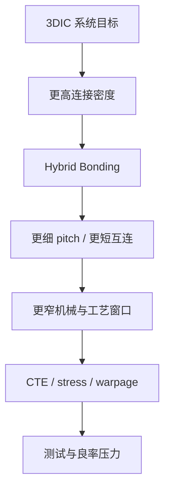
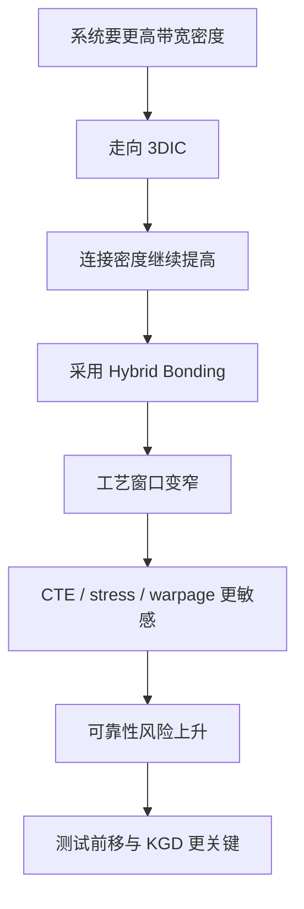

# 课程主线二：3DIC、Hybrid Bonding、CTE 与测试

上级：[[00 - 先进封装 Wiki 索引]]

相关：[[19 - Hybrid Bonding vs Micro-bump]]、[[15 - CTE、热应力与 Warpage：从概念到 3DIC]]、[[28 - 先进封装测试：Wafer Sort、KGD、中测、Final Test]]

## 建议阅读顺序

建议按下面顺序配套阅读：

1. [[08 - 3D IC]]
2. [[19 - Hybrid Bonding vs Micro-bump]]
3. [[22 - SoIC 的 Face-to-Face、Face-to-Back、CoW、WoW 到底是什么关系]]
4. [[15 - CTE、热应力与 Warpage：从概念到 3DIC]]
5. [[28 - 先进封装测试：Wafer Sort、KGD、中测、Final Test]]

## 对象关系图



这张图的核心意思是：

- hybrid bonding 不只是更细 pitch
- 它会把整个系统拉入更窄的制造窗口
- 然后逼着你正面解决热机械和测试问题

## 这条主线在回答什么

很多人在学 3DIC 时，最先看到的是：

- SoIC
- Foveros
- hybrid bonding
- W2W / D2W

但学着学着就会发现，后面所有现实问题都会绕到：

- CTE mismatch
- 热应力
- warpage
- 测试

这条主线的目的，就是把它们按工程逻辑串起来，而不是把它们当成四个彼此分离的章节。

## 1. 起点：为什么系统想要 3DIC

系统之所以走向 3DIC，通常不是为了“结构看起来更先进”，而是为了：

- 缩短互连
- 提高带宽密度
- 降低 power-per-bit
- 缩小系统 footprint
- 支持异构 chiplet 组合

所以 3DIC 的原始吸引力，本质上来自：

`更像 SoC 级别的 die-to-die 集成`

## 2. 为什么会走向 hybrid bonding

当系统继续追求更高密度连接时，传统 micro-bump 的问题会越来越明显：

- pitch 继续缩小时窗口变窄
- 互连寄生难以下降
- 连接体积和几何限制变成负担

于是行业就会看向 hybrid bonding，因为它能提供：

- 更细 pitch
- 更短互连
- 更低寄生
- 更高带宽密度

所以可以把它理解成：

`3DIC 进一步逼着互连方式从更成熟的 micro-bump，走向更接近硅级互连的 hybrid bonding。`

详见：[[19 - Hybrid Bonding vs Micro-bump]]

## 3. 为什么 hybrid bonding 一旦进来，材料与力学问题就会放大

这是整条主线最关键的转折点。

理论上，hybrid bonding 在电性能上更好；  
但它同时也意味着：

- pitch 更细
- 对位容差更小
- 表面平坦度要求更高
- 界面污染容忍度更低
- 薄 die handling 更难

也就是说，系统从“连接得上”变成了“连接得非常精细”，而精细之后，任何热机械扰动都会更致命。

## 4. 为什么最后会绕到 CTE mismatch

一旦你进入真实 3DIC 制造，就不再只有“两个逻辑块连起来”这么简单，而是进入：

- silicon
- Cu
- dielectric
- TSV / backside 结构
- underfill / adhesive
- 后续 package 层次

这些材料在热循环下都会膨胀/收缩，而且幅度不同。

于是逻辑链就变成：

```text
3DIC 追求更高连接密度
-> hybrid bonding / 更细 pitch
-> 对机械形变更敏感
-> CTE mismatch 和热应力更关键
-> warpage / 界面失效 / 可靠性风险上升
```

详见：[[15 - CTE、热应力与 Warpage：从概念到 3DIC]]

## 5. 为什么 3DIC 的 warpage 与应力问题比 2.5D 更棘手

因为 3DIC 里常常同时具备：

- 更薄 die
- 更细 pitch
- 更复杂堆叠
- 更难的热路径

所以应力问题不会只体现为“包体有点翘”，而会直接体现在：

- bonding 良率
- 界面可靠性
- 层间损伤
- 堆叠后长期寿命

也就是说，在 3DIC 里，力学不再只是机械问题，而是直接变成功能和良率问题。

## 6. 为什么最后又会回到测试

这一步很容易被忽略。

一旦系统走到 3DIC，封装对象就变得：

- 更贵
- 更难返工
- 更难探测内部节点
- 更难在最后才定位故障

因此测试策略必须前移。

于是逻辑链再往后走：

```text
3DIC 更复杂
-> 每层对象价值更高
-> bonding / stack 后失效代价更大
-> 必须做更强的 wafer sort / KGD / 中测 / final test
```

详见：[[28 - 先进封装测试：Wafer Sort、KGD、中测、Final Test]]

## 7. 这条主线最有用的压缩图

```text
系统追求更高带宽密度
-> 走向 3DIC
-> 需要更高密度连接
-> 走向 hybrid bonding
-> 制造窗口变窄
-> CTE mismatch / 热应力 / warpage 更关键
-> 可靠性和测试变成核心门槛
```

## 7.1 图形化因果链



## 8. 这条主线真正要建立的心智模型

学习 3DIC 时，不要把：

- hybrid bonding
- CTE / warpage
- 测试

看成后面才补上的“附属章节”。

更准确的理解是：

- hybrid bonding 决定了 3DIC 的上限
- CTE / warpage 决定了这个上限能不能量产
- 测试决定了这个量产能不能承受成本

## 9. 最后的压缩结论

`3DIC 的核心不只是“把 die 堆起来”，而是为了更高连接密度走向 hybrid bonding，再因为连接窗口极窄而被迫正面解决 CTE、warpage 和测试问题。`

## 9.1 一张对照表

| 环节 | 3DIC 追求的收益 | 随之放大的代价 |
| --- | --- | --- |
| 更短互连 | 带宽更高、功耗更低 | 连接窗口更窄 |
| 更细 pitch | 连接密度更高 | 对位和平坦度要求更高 |
| Hybrid bonding | 更低寄生、更像硅级互连 | 界面和洁净控制更难 |
| 多层堆叠 | footprint 更小 | 热、应力、warpage 更难 |
| 高价值 stack | 系统性能更强 | 测试前移、KGD 更关键 |

## 10. 常见误区

### 误区 1：3DIC 的难点主要是“怎么堆起来”

不对。真正难的是堆起来之后还能高良率、可测试、可长期工作。

### 误区 2：Hybrid bonding 只是更细 pitch 的 micro-bump

不准确。它意味着更不同的界面机制、更窄的工艺窗口和更高的表面/对位要求。

### 误区 3：CTE 和 warpage 是机械工程师后面再处理的问题

不对。它们会直接反噬 bonding 良率、可靠性和系统功能。

### 误区 4：测试只是最终出货前验一下

不对。3DIC 里测试是贯穿制造链的风险控制系统。

## 11. 检查题

1. 为什么 3DIC 会自然推动互连从 micro-bump 继续走向 hybrid bonding？
2. 为什么 hybrid bonding 之后，CTE mismatch 和 warpage 反而会变得更关键？
3. 为什么 3DIC 比 2.5D 更依赖 KGD 与中间测试节点？
4. CoW / WoW 与 Face-to-Face / Face-to-Back 分别回答的是哪一类问题？
