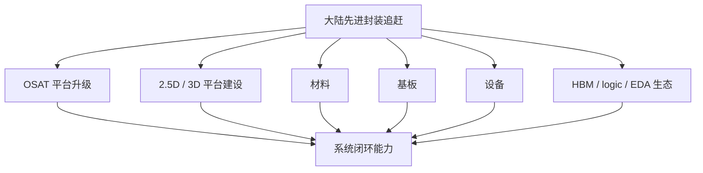
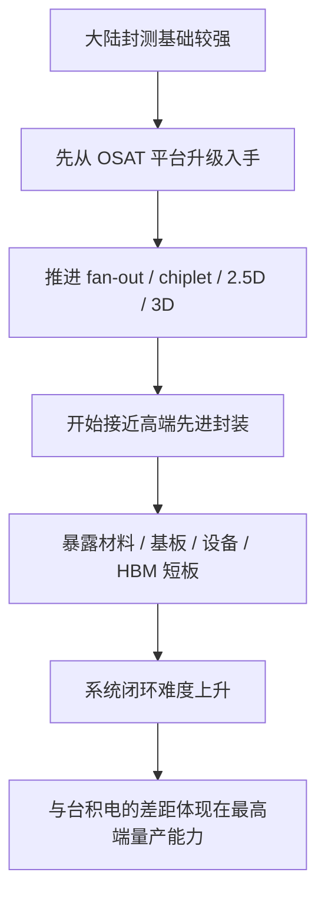

# 课程主线三：大陆追赶路径与系统短板

上级：[[00 - 先进封装 Wiki 索引]]

相关：[[16 - 大陆先进封装供应链现状]]、[[20 - 大陆先进封装：材料、基板、设备分别卡在哪]]、[[33 - 大陆 vs 台积电：先进封装系统对照]]

## 建议阅读顺序

建议按下面顺序配套阅读：

1. [[16 - 大陆先进封装供应链现状]]
2. [[20 - 大陆先进封装：材料、基板、设备分别卡在哪]]
3. [[24 - 台积电、Intel、大陆平台在 AI 封装上的真实差距]]
4. [[33 - 大陆 vs 台积电：先进封装系统对照]]

## 对象关系图

这张图想表达的是：

- 追赶不是只看封测厂
- 真正差距在整条链路能不能一起闭环

## 这条主线在回答什么

谈大陆先进封装时，最常见的两个极端说法是：

- “完全不行”
- “已经差不多追平”

这两种都不准确。  
这条主线要回答的是：

`大陆先进封装到底追到了哪里，为什么还没有形成台积电那种系统级优势。`

## 1. 起点：大陆并不是从零开始

如果只看封测基础，大陆并不弱，已经有：

- FC
- WLP
- Fan-out
- SiP
- bumping
- 多芯片封装组织能力

这意味着大陆不是停留在“传统封装时代没进入先进封装”，而是已经进入追赶阶段。

## 2. 为什么追赶首先会落在 OSAT 平台上

大陆更早、更现实的抓手通常不是：

- 自己先拥有最强 leading-edge logic foundry

而是：

- 先在后道封测平台上往高端走
- 先做 fan-out、RDL-based chiplet、2.5D 产线

所以你会看到大陆很多先进封装能力，首先体现在：

- OSAT 平台升级
- 高端产线建设
- Chiplet / 2.5D / 3D 路线布局

## 3. 为什么这还不够

因为先进封装真正难的，从来不是单一后道工艺，而是系统闭环。

一旦目标产品变成 AI/HPC 级高端封装，问题立刻扩大为：

- logic die 从哪来
- HBM 从哪来
- interposer / RDL / bridge 怎么做
- substrate 能不能承住
- PI / thermal / warpage 谁来收敛
- 测试和 KGD 怎么做

也就是说，追赶会从“封测平台升级”很快变成“整条链路一起升级”。

## 4. 为什么大陆在中高端先进封装上已经能看见进展

这是必须承认的事实。

大陆企业已经在公开资料里展示出：

- RDL-based chiplet 平台
- 2.5D / 3D 产线建设
- 面向 AI/HPC 的平台推进
- 稳定量产的一些先进封装产品

这说明追赶不是口号，而是已经进入工程阶段。

## 5. 但为什么离台积电仍有明显差距

因为最难的场景不是“能不能做出样品”，而是：

- 多颗 logic + 多颗 HBM
- 大尺寸 interposer / RDL / bridge
- 高良率量产
- 包级 PI / thermal / warpage 同时受控
- foundry + packaging + 客户生态一起跑通

这一层是系统级能力，不是单点突破就能直接补齐。

## 6. 这条追赶路径里最关键的三道坎

### 第一坎：材料与基板

如果没有高端：

- RDL 材料体系
- underfill / mold / adhesive
- ABF / 高端 substrate

很多平台只能停在“技术可做”，很难到“高良率、可复制量产”。

### 第二坎：设备与工艺窗口

如果：

- 高精度 bonding
- 薄 die handling
- TSV / backside / hybrid bonding 装备链

不够强，平台就算名义上存在，也很难往最窄工艺窗口冲。

### 第三坎：生态闭环

最难补的往往是：

- HBM 配套
- leading-edge logic 协同
- EDA / package co-design
- 客户导入与量产经验

这一层恰好是台积电最强的地方。

## 7. 所以大陆现在更像处在哪个阶段

如果用更系统的话说，可以理解成：

### 已经跨过的阶段

- 不是传统封装起点
- 不是完全没有先进平台
- 不是只会低端 assembly

### 正在推进的阶段

- fan-out / RDL / chiplet 平台成熟化
- 2.5D / 3D 产线与产品导入
- 面向 AI/HPC 的更高端平台形成

### 还没真正完成的阶段

- 最高难度 AI/HPC 场景的系统闭环
- logic + HBM + advanced packaging 的大规模稳定量产

## 8. 这条主线的最有用结论

以后看大陆先进封装，最不该问的是：

- “会不会做 2.5D？”

更该问的是：

1. 做到什么规模
2. 做到什么良率
3. 能否承接 logic + HBM 主战场
4. 材料 / 基板 / 设备 / 测试是不是一起跟上了

## 8.1 图形化因果链

## 9. 最后的压缩结论

`大陆先进封装已经从“有无问题”进入“系统成熟度问题”；真正的差距，不是有没有路线，而是能不能把最高端场景做成稳定、连续、可扩的系统平台。`

## 9.1 一张对照表

| 维度 | 大陆追赶现状 | 与台积电的关键差距 |
| --- | --- | --- |
| OSAT 能力 | 基础强、平台持续升级 | 最高端系统项目积累更少 |
| fan-out / RDL / chiplet | 已形成若干平台 | 平台连续性和量产深度不足 |
| 2.5D / 3D | 产线建设与导入推进中 | AI/HPC 最难场景成熟度不足 |
| 材料 / 基板 / 设备 | 有能力但链条不齐整 | 高端一致性与闭环不足 |
| HBM / logic / EDA 生态 | 系统协同仍弱 | 台积电一体化更强 |

## 10. 常见误区

### 误区 1：大陆先进封装还停留在传统封装

不对。已经进入 advanced packaging 追赶阶段，并出现了 2.5D/3D、Chiplet、RDL-based 平台。

### 误区 2：只要 OSAT 平台上去了，差距自然会消失

不对。真正难的是材料、基板、设备、HBM、测试和客户生态一起闭环。

### 误区 3：只要做出样品，就等于具备同等级能力

不对。最高端差距更多体现在高良率、可扩产、可复制量产。

### 误区 4：差距只在某一个单点工艺

不对。差距主要是系统能力差距，而不是单项名词差距。

## 11. 检查题

1. 为什么大陆的追赶通常先落在 OSAT/后道平台升级上？
2. 为什么“有 2.5D/3D 产线”不等于“具备台积电同等级 AI 封装能力”？
3. 在最高端 AI/HPC 封装里，大陆最关键的几个系统短板分别是什么？
4. 你会如何区分“平台存在”与“系统闭环完成”？
