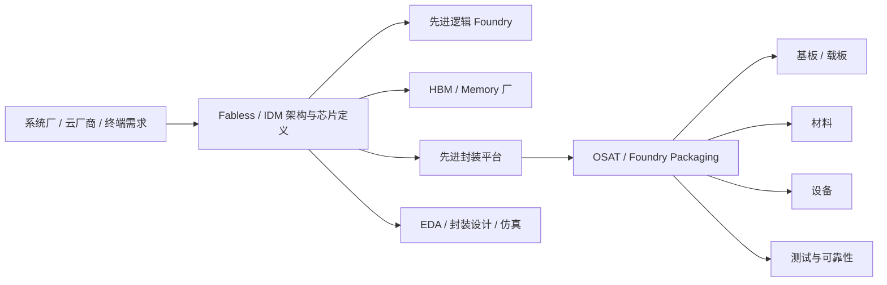

# 供应链地图：先进封装全景

上级：[[00 - 先进封装 Wiki 索引]]

相关：[[01 - 产业链与角色]]、[[16 - 大陆先进封装供应链现状]]、[[33 - 大陆 vs 台积电：先进封装系统对照]]

## 这页的作用

前面的 wiki 已经把技术路线讲得比较完整了。  
这一层开始回答另一个问题：

`先进封装这件事，产业链上到底是哪些环节一起把它做出来的？`

## 1. 一张全景图

## 2. 先进封装供应链不是单环节问题

如果只是普通封装，很多时候重点放在：

- die attach
- molding
- final test

但一旦进入先进封装，链条就明显拉长，至少会涉及：

- 前端逻辑制造
- HBM / memory stack
- interposer / RDL / bridge 平台
- substrate / ABF
- underfill / PI / Cu / bonding 材料
- 设备链
- EDA / co-design / 仿真
- 多阶段测试与可靠性

## 3. 可以把供应链拆成 6 层

### 第一层：需求与系统定义

谁在定义产品：

- AI GPU / AI ASIC 厂商
- 云厂商
- CPU / networking / mobile SoC 厂商

他们决定：

- 是否需要 HBM
- 是否要 chiplet
- 是否上 2.5D / 3D

### 第二层：芯片与 memory 来源

- logic die：来自 foundry / IDM
- HBM stack：来自 memory 厂

这是为什么先进封装经常天然带有跨公司、跨工艺协同属性。

### 第三层：先进封装平台

这层决定系统用哪条路：

- Si interposer
- RDL interposer / Fan-out
- bridge
- 3DIC

典型平台：

- CoWoS / InFO / SoIC
- EMIB / Foveros
- XDFOI 等

### 第四层：材料、基板、设备

这是很多人最容易低估的一层，但往往是量产成败关键。

详见：

- [[39 - 供应链地图：材料]]
- [[40 - 供应链地图：设备]]
- [[41 - 供应链地图：基板与载板]]

### 第五层：设计与仿真

先进封装不是纯制造问题，还需要：

- package co-design
- PI / SI / thermal / mechanical 仿真
- chip-package-system 联合优化

### 第六层：测试与可靠性

高价值封装必须把测试前移，并且做更多中间测试节点。

## 4. 为什么台积电的壁垒高

从供应链视角看，台积电的强项不是只有 CoWoS 产能，而是：

- 先进逻辑在自己体系里
- advanced packaging 在自己体系里
- 设计生态和客户导入在自己体系里
- HPC / AI 量产数据回流也在自己体系里

这使它不是只占一个环节，而是占了多个关键节点。

## 5. 为什么大陆追赶难

从供应链角度看，大陆并不是只有“封测厂能不能做”的问题，而是：

- HBM 是否配套
- 高端 substrate 是否配套
- 材料和设备链是否足够强
- EDA / 仿真 / 客户导入是否协同

这也是为什么大陆的差距更像“系统短板”，而不是单项工艺短板。

## 6. 这层建议怎么学

建议顺序：

1. 先看这页，建立全景图
2. 再看 [[39 - 供应链地图：材料]]
3. 再看 [[40 - 供应链地图：设备]]
4. 再看 [[41 - 供应链地图：基板与载板]]
5. 最后回到 [[33 - 大陆 vs 台积电：先进封装系统对照]]

