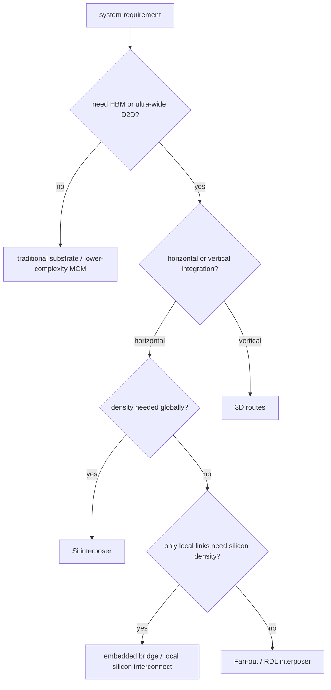

# 三种 2.5D 路线的 trade-off 全景

上级:[2.5D 路线](README.md)
相关:[Si Interposer:第一代主流 2.5D](si-interposer-fundamentals.md), [Fan-out RDL:Si Interposer 的替代路线](fan-out-rdl-overview.md), [Embedded Bridge:Intel EMIB 与 TSMC CoWoS-L](embedded-bridge-emib-and-cowos-l.md)

## 这页在回答什么问题

面对 Si interposer、Fan-out/RDL 和 embedded bridge，架构师应该如何从系统需求反推封装路线。本页把 2.5D 路线选择整理成一张 trade-off map。

## 先从需求反推

不要先问“采用哪家平台名”。先问系统瓶颈：

2.5D 的路线选择本质上是把带宽、密度、成本、尺寸、热、供电、测试和量产窗口放进同一张表里。

## 三条路线的目标函数

| 路线 | 优先目标 | 牺牲项 |
| --- | --- | --- |
| Si interposer | 极限互连密度、HBM 适配、PI/SI 能力 | 成本、面积、warpage、组合报废成本 |
| Fan-out/RDL | 成本、尺寸弹性、I/O 重分配、封装形态 | 极限密度、RDL stress、die shift 风险 |
| Embedded bridge | 局部硅级密度、全局平台扩展性 | 混合平台协同、桥区对位、设计分区复杂度 |

没有一条路线在所有维度上都占优。所谓先进封装选型，就是承认约束冲突，并把最昂贵的能力放在最需要的位置。

## 关键决策维度

| 维度 | 问题 | 倾向 |
| --- | --- | --- |
| HBM 数量 | 多颗 HBM stack 与 compute die 是否需要极宽接口 | Si interposer 或 CoWoS-S 类路线 |
| D2D 通信分布 | 高带宽链路是全局分散还是局部集中 | 局部集中时 bridge 更有意义 |
| Package 尺寸 | 是否需要大面积封装平台 | RDL 或 bridge-like 混合路线更值得比较 |
| 成本敏感度 | 是否能接受整块硅平台成本 | 成本敏感时减少 full silicon |
| 供电完整性 | 瞬态电流和 IR drop 是否成为瓶颈 | Si interposer 或带 decap 能力的平台更有利 |
| 热设计 | 高功耗 die 和 HBM 是否邻近 | 所有路线都要提前热协同 |
| KGD 策略 | 高价值 die 是否都能筛选后再集成 | 决定高复杂度路线的报废风险 |

## 路线选择示例

若产品是高功耗 AI 加速器，compute die 需要连接多颗 HBM stack，并且 HBM 接口宽度和 power-per-bit 是核心目标，Si interposer 是强候选。

若产品需要多 die 集成和封装级 I/O 重分配，但带宽密度没有冲到 HBM 级极限，Fan-out/RDL 可以提供更好的系统折中。

若产品只有少数 compute chiplet 之间需要很强 D2D，其他区域只需要常规扇出和供电，embedded bridge 或 local silicon interconnect 可以把硅级互连能力局部化。

## 常见误判

把 2.5D 选型看成“越贵越先进”会导致过度设计。把 RDL 看成“低成本所以必然更好”也会忽略密度和可靠性边界。把 bridge 看成“自动省钱”则会低估混合平台设计、对位和过渡区的复杂度。

正确的思路是从瓶颈反推：瓶颈在全局高密度，选 full silicon；瓶颈在系统平衡，选 RDL；瓶颈在局部链路，选 bridge-like。

## 一句话理解

2.5D 路线选择不是工艺名选择，而是决定把硅级互连能力放在全局、放在 RDL 平台内，还是只放在局部关键链路上。

## 架构师启示

架构师应把 D2D traffic map、HBM 带宽、package 尺寸、热设计功耗和 KGD 策略放在同一张决策表里。只要其中一个变量后期翻转，2.5D 路线就可能从 Si interposer 转向 RDL，或从 RDL 转向 bridge-like 混合结构。
