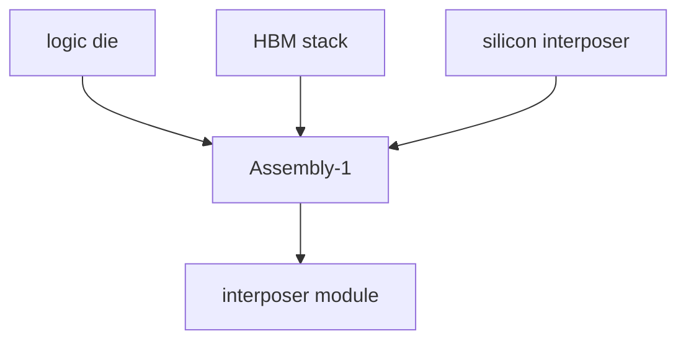
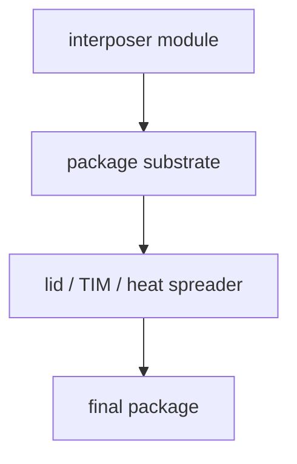

# CoWoS-S 完整制造流程

上级:[2.5D 路线](README.md)
相关:[Si Interposer:第一代主流 2.5D](si-interposer-fundamentals.md), [KGD:HBM/3DIC 时代的必要前提](../../03-wafer-test-and-cp/kgd-known-good-die.md), [HBM stack 是怎么制造出来的](../hbm-as-case-study/hbm-stack-manufacturing.md)

## 这页在回答什么问题

CoWoS-S 不是一个单步封装动作，而是一条多对象、多阶段的系统集成流程。本页按对象流转解释它从设计、物料准备、interposer、组装到测试的完整路径。

## 先分清对象

CoWoS-S 流程里至少有五类高价值对象：

| 对象 | 来自哪里 | 进入流程时的状态 |
| --- | --- | --- |
| Logic die | 前道晶圆制造与 CP 筛选 | KGD 或接近 KGD 的裸 die |
| HBM stack | DRAM die 堆叠与测试 | 已形成 memory stack |
| Silicon interposer | 独立 interposer wafer/process | 带 routing、TSV、可能带 decap |
| Package substrate | 基板制造 | 承接 interposer module |
| Final package | 后段组装后形成 | 可进入 final test 和系统验证 |

如果把这些对象混在一起，CoWoS-S 会被误解成“把芯片贴到一块硅上”。真实流程更像多条制造链在封装阶段汇合。

## Step 0:协同设计

CoWoS-S 的设计起点不是封装厂收到 die 之后。系统早期就要共同定义 die partition、HBM placement、bump map、interposer routing、供电、散热、substrate 尺寸和测试节点。

```text
architecture
  -> die partition
  -> HBM count and placement
  -> interposer routing / PDN
  -> substrate and thermal structure
```

这一步的核心是 chip-package co-design。封装路线会反向约束 die size、I/O 位置、D2D PHY、HBM 通道组织和热设计功耗。

## Step 1:logic wafer 到 logic die

逻辑芯片先完成前道制造，然后进入 CP、切割和筛选。进入 CoWoS-S 高价值组装链的对象不应只是“切下来的 die”，而应是经过测试策略筛出的可用 die。这里与 `03-wafer-test-and-cp` 的 KGD 逻辑直接相连。

## Step 2:HBM stack 准备

HBM 不是单层 memory die。它在进入 CoWoS-S 组装时已经是由多层 DRAM die 堆叠、带 TSV 和底部接口的 stack 对象。HBM stack 自身也需要测试和质量控制，因为它一旦与 logic die、interposer 共同进入组装，失效成本会迅速升高。

## Step 3:silicon interposer 制造

Interposer 需要先形成高密度顶部 routing、TSV 垂直引出、背面处理和可能的 decap 结构。它的任务可以压缩为三件事：

1. 承载 logic 与 HBM 的细间距连接。
2. 把顶部高密度互连引到底部 substrate。
3. 为供电、信号完整性和封装结构提供稳定平台。

## Step 4:物料筛选与组装前准备

这一步决定后续 assembly 的有效良率。logic die、HBM stack、interposer 单元和 substrate 都需要在进入更高成本阶段前明确状态。高价值 2.5D 封装的基本原则是：越往后越贵，越不能让坏件混入。

## Step 5:Assembly-1 到 interposer

Assembly-1 把 logic die、chiplet 和 HBM stack 组装到 silicon interposer 上，形成中间 module。



这一步难在对位、bump 连接、underfill、平整度和局部应力控制。它还会影响 die-to-HBM 链路质量、局部热耦合和后续 substrate 组装窗口。

## Step 6:Assembly-2 到 substrate

Assembly-2 把 interposer module 组装到 package substrate 上。此时系统从“局部高密度模块”接入“最终封装级平台”。电源、全局信号、机械支撑和板级连接都在这里进入更大尺度。



## Step 7:热、机械和保护结构完成

后续材料不是收尾装饰。Underfill、molding、TIM、lid、heat spreader 和 stiffener 会共同影响热阻、翘曲、应力分布和长期可靠性。高功耗 logic 与 HBM 邻近时，这些结构会直接决定是否能在目标功耗下稳定工作。

## Step 8:中间测试、final test 与可靠性验证

CoWoS-S 的测试不能只放在终点。流程中需要在 die、HBM stack、interposer module、final package 等阶段设置拦截点，降低坏件进入后续高成本环节的概率。测试策略本质上是组合良率管理。

## 一句话理解

CoWoS-S 是 logic die、HBM stack、silicon interposer、substrate、热结构和测试节点共同构成的高价值 2.5D 系统集成流程。

## 架构师启示

如果架构方案依赖 CoWoS-S，就必须在早期把 HBM 数量、die 尺寸、bump map、KGD 策略和散热结构一起定义。把封装留到物理实现末尾，会导致接口宽度、功耗密度或 package 尺寸在后期无法收敛。
