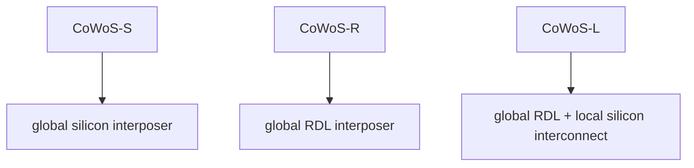
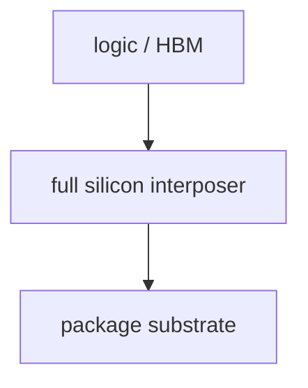
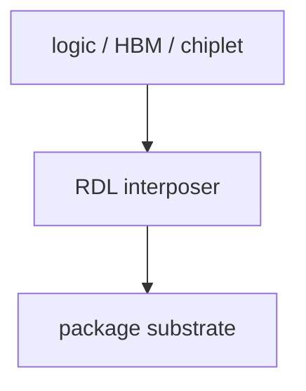
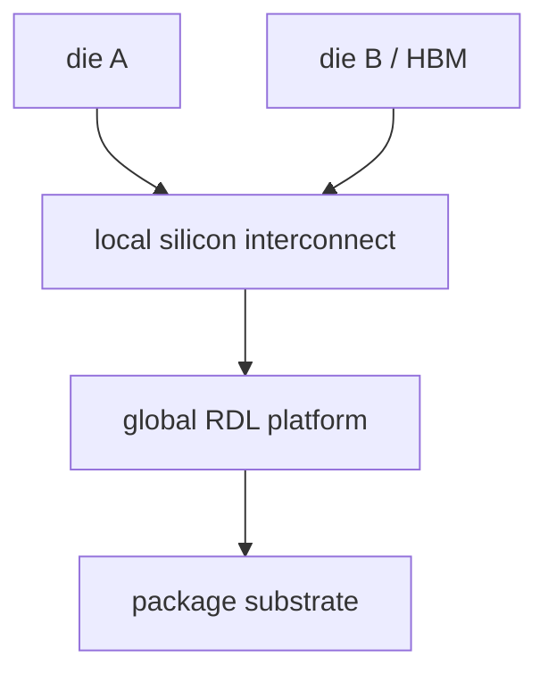

# CoWoS-S/R/L 的真正差别

上级:[2.5D 路线](README.md)
相关:[Si Interposer:第一代主流 2.5D](si-interposer-fundamentals.md), [Fan-out RDL:Si Interposer 的替代路线](fan-out-rdl-overview.md), [Embedded Bridge:Intel EMIB 与 TSMC CoWoS-L](embedded-bridge-emib-and-cowos-l.md)

## 这页在回答什么问题

CoWoS-S、CoWoS-R、CoWoS-L 同属 2.5D 封装语境，但它们的中间互连平台不同。本页把三者拆成结构差异，而不是把它们当成同一个工艺名。

## 根本区别

三者的关键差别是：中间互连平台到底由什么承担。

这个区别会传导到 routing density、尺寸扩展、机械表现、成本结构和供电设计。名字相近不代表目标函数相同。

## CoWoS-S

CoWoS-S 的核心是整块 silicon interposer。logic die、chiplet 和 HBM stack 坐在这块硅平台上，再通过 TSV 与 substrate 相连。

它的优势是局部互连密度强、HBM 适配清晰、PI/SI 能力好，也有条件集成封装级 decap。代价是大面积硅平台带来的成本、尺寸、良率、warpage 和热机械压力。

## CoWoS-R

CoWoS-R 把中间平台从整块硅 interposer 换成 RDL interposer。它以 polymer dielectric + Cu RDL 承担封装级重布线和 die 间连接。

它的价值在尺寸扩展、机械缓冲和成本结构上更有弹性。代价是局部极限 routing density 弱于整块硅平台，因此对 HBM 数量、接口宽度和局部 D2D 密度有更明确的边界。

## CoWoS-L

CoWoS-L 是全局 RDL 平台加局部 silicon interconnect。它把“全局大平台”和“局部高密度硅能力”分开处理。

这条路线的意义是避免把整个平台都做成硅，同时保留关键局部区域的高密度互连能力。它与 embedded bridge 的系统思想接近：局部用硅，全局用更具扩展性的封装平台。

## 对照表

| 平台 | 全局平台 | 局部密度 | 尺寸扩展 | 主要风险 | 更接近的通用路线 |
| --- | --- | --- | --- | --- | --- |
| CoWoS-S | Silicon interposer | 很强 | 受大硅平台约束 | 成本、良率、warpage | Si interposer |
| CoWoS-R | RDL interposer | 中高 | 更有弹性 | 极限密度和 RDL stress | Fan-out / RDL |
| CoWoS-L | RDL + local silicon interconnect | 局部很强 | 强于 full silicon | 混合平台协同 | Embedded bridge |

## 不要理解成线性替代

CoWoS-S、R、L 不是简单的新旧替代。它们针对不同瓶颈：

| 目标 | 更偏向 |
| --- | --- |
| HBM 互连密度和 PI/SI 上限优先 | CoWoS-S |
| 尺寸、机械和成本平衡优先 | CoWoS-R |
| 大平台内保留局部超高密度 | CoWoS-L |

工程选择不是问“哪一个更先进”，而是问“系统瓶颈落在哪一类封装变量上”。

## 一句话理解

CoWoS-S/R/L 的真正差别是中间互连层：S 用整块硅，R 用全局 RDL，L 用全局 RDL 加局部硅互连。

## 架构师启示

架构师看到平台名时，要把它翻译成结构能力。若需求来自 HBM 接口密度，S 的强项更直接；若需求来自 package 尺寸和机械弹性，R 更值得比较；若只有局部 D2D 链路要求极高密度，L 或 bridge-like 结构可能更贴近成本和性能的共同约束。
