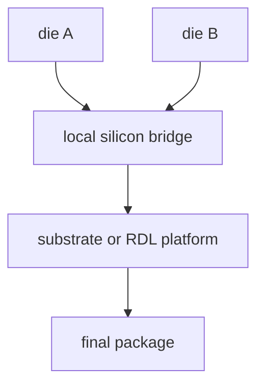

# Embedded Bridge:Intel EMIB 与 TSMC CoWoS-L

上级:[2.5D 路线](README.md)
相关:[CoWoS-S/R/L 的真正差别](cowos-s-r-l-comparison.md), [Fan-out RDL:Si Interposer 的替代路线](fan-out-rdl-overview.md), [2.5D 路线的 trade-off 全景](2.5d-routes-tradeoff-map.md)

## 这页在回答什么问题

Embedded bridge 为什么不是“缩小版 interposer”，它如何在局部高密度互连和全局低成本平台之间折中，以及 EMIB、CoWoS-L 这类路线应如何理解。

## 基本思想

Embedded bridge 可以概括成：

```text
local silicon bridge + global substrate/RDL platform
```

只有 die-to-die 关键互连区域使用硅级高密度桥，其余大面积区域交给 substrate 或 RDL 平台。它的目标不是把整块 interposer 缩小，而是把硅能力从“全局平台”改成“局部互连岛”。



## 两类结构

| 类型 | 结构直觉 | 代表性例子 | 关键问题 |
| --- | --- | --- | --- |
| In-substrate bridge | 桥埋在 package substrate 体系内 | EMIB | bridge 与 substrate 过渡、装配对位 |
| In-RDL bridge | 桥嵌入 Fan-out/RDL 平台 | CoWoS-L 类 local silicon interconnect | RDL 与局部硅互连协同 |

这里的代表性例子用于说明结构思想，不用于讨论商业排名。重点是：bridge 的价值来自局部高密度，而不是全局平台替代。

## 为什么要 bridge

Bridge 适合处在中间地带的系统：

| 系统状态 | Bridge 的意义 |
| --- | --- |
| 普通 substrate/RDL 的局部密度不够 | 用局部硅桥解决关键链路 |
| Full silicon interposer 成本或面积压力太高 | 避免全局都付出硅成本 |
| D2D 高带宽集中在少数邻近 die 间 | 把高密度能力放在真正需要的位置 |
| Package 仍要继续做大 | 外围平台保持扩展性 |

这就是 bridge 的工程吸引力：它让封装能力按区域分级，而不是让整个平台都采用同一种昂贵能力。

## CoWoS-L 与 bridge-like 思想

CoWoS-L 可理解为全局 RDL 平台加局部 silicon interconnect。局部硅互连负责高密度 die-to-die 或 die-to-HBM 链路，全局 RDL 负责更大尺度的扇出、供电和封装组织。

```text
critical local links -> silicon interconnect
global package fabric -> RDL platform
```

这种结构和 embedded bridge 的本质相通：局部用硅解决密度，外围用更具扩展性的封装平台控制成本和尺寸。

## 主要工程难点

Bridge 的复杂度来自混合平台：

| 难点 | 为什么关键 |
| --- | --- |
| 桥区定位 | 局部高密度连接对对位误差敏感 |
| 桥到外围平台过渡 | 高密度局部互连必须平滑接入低密度全局平台 |
| 热机械耦合 | 局部硅、RDL/substrate、underfill 的材料差异会产生应力 |
| 设计分区 | 哪些链路走 bridge、哪些走外围平台，会影响收益 |
| 测试和失效定位 | 局部桥区失效会影响多个高价值 die |

Bridge 最怕的是分区切错：引入了局部硅桥的复杂度，却没有把真正高带宽、高密度链路放到桥上。

## 与 Si interposer、RDL 的关系

| 路线 | 互连能力布局 | 适合目标 |
| --- | --- | --- |
| Si interposer | 全局高密度硅平台 | 极限 HBM 和全局高密度需求 |
| Fan-out/RDL | 全局中高密度 RDL 平台 | 成本、尺寸、I/O 重分配折中 |
| Embedded bridge | 局部高密度硅 + 全局低成本平台 | 局部 D2D 密度很高但全局不需要 full silicon |

## 一句话理解

Embedded bridge 把硅级互连从整块平台压缩到关键局部区域，用局部高密度换取比 full interposer 更细的成本和尺寸控制。

## 架构师启示

Bridge 要从 traffic map 出发，而不是从封装名出发。若两个 chiplet 之间有持续高带宽、低延迟、低能耗需求，把它们放到 bridge 覆盖区域内才有意义；若通信分布很分散，局部桥会变成复杂度负担。
