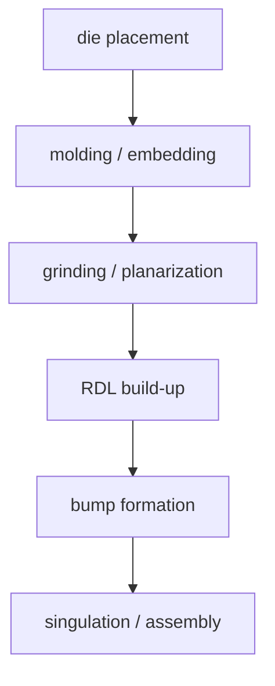
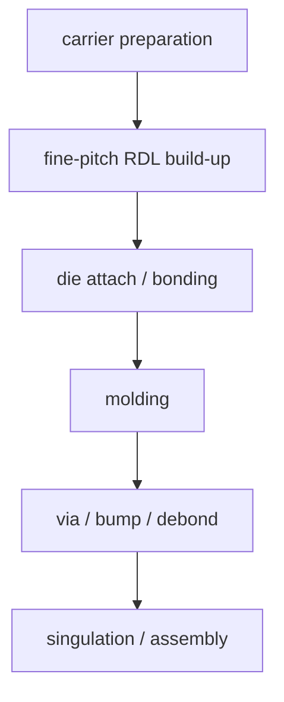

# Chip-first vs Chip-last:两条 Fan-out 工艺

上级:[2.5D 路线](README.md)
相关:[Fan-out RDL:Si Interposer 的替代路线](fan-out-rdl-overview.md), [RDL:重布线层](../key-components/rdl-redistribution-layer.md), [Molding 与 Underfill](../key-components/molding-and-underfill.md)

## 这页在回答什么问题

Fan-out 工艺为什么会分成 chip-first 和 chip-last，两者的流程差异如何影响 RDL 对位、die shift、成本和适用场景。

## 判断标准

区分 chip-first 与 chip-last，只看 die 在 RDL 形成前后进入流程：

| 路线 | 判断标准 | 另一个常用描述 |
| --- | --- | --- |
| Chip-first | die 先被放到载体并被 molding，再做 RDL | mold-first / RDL-last |
| Chip-last | 先做 RDL，再把 die 贴到 RDL 平台 | RDL-first |

这个顺序差异会改变对位误差来源、RDL 制作环境和量产窗口。

## Chip-first 流程

Chip-first 的流程直观：先把 die 放入重构平台，再在其上形成 RDL。它适合成本和流程简化优先的产品，但 RDL 会受到 die placement、die protrusion、mold shrinkage 和 warpage 的影响。

## Chip-last 流程

Chip-last 先在 carrier 上形成 RDL，再把 die 接入。RDL 制作阶段不被 die shift 直接干扰，更适合 fine-pitch、高密度、多 die Fan-out。但它对 carrier 管理、die attach 对位和后续接合窗口要求更高。

## 两者的工程差异

| 维度 | Chip-first | Chip-last |
| --- | --- | --- |
| RDL 形成时机 | die 已在重构平台内 | die 尚未接入 |
| 主要误差来源 | die shift、mold shrinkage、warpage | RDL-to-die 对位、bonding 窗口 |
| 流程直觉 | 更直接 | 更强调前置 RDL 精度 |
| 适合方向 | 成本敏感、中低复杂度 Fan-out | 高密度、多 die、fine-pitch Fan-out |
| 主要风险 | RDL 对 die 偏移敏感 | 接合和载体流程复杂 |

## 选择方法

如果产品的 I/O 密度较低、成本压力强、流程简化优先，chip-first 更容易成立。若产品追求更高 RDL 精度、更复杂的多 die 互连或更细 pitch，chip-last 更值得评估。

选择时不要只看流程步骤数量。更关键的问题是：哪一种误差更容易被产品容忍，哪一种流程窗口更容易被制造体系控制。

## 与架构的连接

Chip-first 与 chip-last 会影响 D2D 接口 pitch、RDL 层数、die 间距、封装尺寸和组合良率。架构师定义 chiplet placement 时，如果没有把 die shift 和 RDL overlay 纳入约束，后端工艺可能会在很晚阶段反向修改 floorplan 或 bump map。

## 一句话理解

Chip-first 先放 die 再做 RDL，chip-last 先做 RDL 再接 die；它们的本质差异是把主要对位风险放在流程的不同位置。

## 架构师启示

Fan-out 架构不能只写“采用 RDL”。如果 D2D 接口密度高、die 间距紧、RDL 层数多，架构师需要提前知道制造路线偏 chip-first 还是 chip-last，因为它会改变可接受的 bump pitch、die placement 公差和测试拦截策略。
