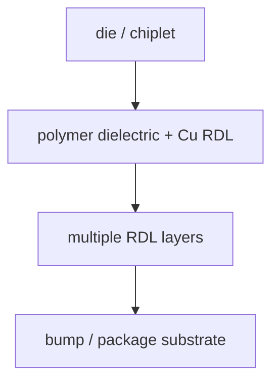

# Fan-out RDL:Si Interposer 的替代路线

上级:[2.5D 路线](README.md)
相关:[Chip-first vs Chip-last:两条 Fan-out 工艺](fan-out-chip-first-vs-chip-last.md), [RDL:重布线层](../key-components/rdl-redistribution-layer.md), [CoWoS-S/R/L 的真正差别](cowos-s-r-l-comparison.md)

## 这页在回答什么问题

Fan-out RDL 为什么能成为 Si interposer 之外的 2.5D 路线，它解决哪些问题，又在哪些场景会遇到边界。

## 基本结构

Fan-out RDL 使用 polymer dielectric 和 Cu traces 构成封装级重布线平台，把 die 的 I/O 扇出到 die 面积之外，并支持多 die 间连接。



与 Si interposer 相比，Fan-out RDL 的核心不是整块硅，而是封装级 build-up 互连。它在成本、厚度、尺寸弹性和 I/O 重分配上有吸引力，但极限 routing density 和尺寸稳定性弱于硅平台。

## 它在 2.5D 中的位置

Fan-out RDL 适合的问题不是“所有 HBM 级极限互连”，而是这类系统：

| 系统需求 | Fan-out RDL 的价值 |
| --- | --- |
| I/O 需要从 die 面积外扩展 | RDL 可以重分配 pad 和 bump |
| 多 die 间需要中高密度连接 | 比传统 substrate 更细密 |
| Package 厚度和成本敏感 | 少用或不用整块硅平台 |
| 需要较大封装形态 | RDL 平台尺寸弹性更好 |

如果系统需要极限 HBM 接口密度、很强封装级 decap 和最严格的局部 PI/SI，Si interposer 仍然更直接。若只有局部链路需要硅级密度，bridge-like 路线也可能更合适。

## “Fan-out 更灵活”是什么意思

灵活不等于绝对性能更强。Fan-out 的灵活性主要体现在封装级 I/O 重映射、多 die 布局和外形控制上。它能把 die 的原始 pad 分布转换成更适合 substrate 或板级系统的 bump 分布，也能在 die 之间提供短距连接。

```text
die pad map
   -> RDL redistribution
   -> package bump map
```

这种能力对 mobile、networking、部分 chiplet 系统有价值。对极限高带宽 memory 系统，RDL 的线宽线距、overlay、warpage 和 stress 会成为必须评估的边界。

## 主要挑战

Fan-out RDL 的风险集中在重构晶圆/面板和多层 build-up：

| 挑战 | 影响 |
| --- | --- |
| Die shift | die 放置偏移会影响 RDL 对位和连接良率 |
| Mold shrinkage | 重构平台尺寸变化会影响 overlay |
| RDL stress | 多层金属和 polymer 叠加带来裂纹与可靠性风险 |
| Warpage | 大尺寸封装会放大平整度和贴装窗口问题 |
| 局部密度上限 | 极限 HBM/D2D 链路可能超出纯 RDL 能力 |

## 与 Si interposer 的对照

| 维度 | Fan-out RDL | Si interposer |
| --- | --- | --- |
| 平台材料 | polymer + Cu | silicon + metal routing + TSV |
| 局部密度 | 中高 | 很高 |
| 机械顺从性 | 更有弹性 | 刚性更强 |
| 成本结构 | 更有机会降低全局成本 | 大硅平台成本高 |
| 典型风险 | die shift、RDL stress、warpage | 大面积硅、TSV、热机械耦合 |

## 一句话理解

Fan-out RDL 用封装级 polymer/Cu 重布线替代整块硅中介层，在密度、成本、尺寸和机械表现之间提供另一种 2.5D 折中。

## 架构师启示

当系统需要高于传统 substrate 的互连能力，但不需要全局硅中介层的极限密度时，Fan-out RDL 值得进入候选集。架构师要特别检查 D2D 带宽、RDL 层数、package 尺寸和 warpage 窗口，避免把“可重布线”误解成“密度无限”。
