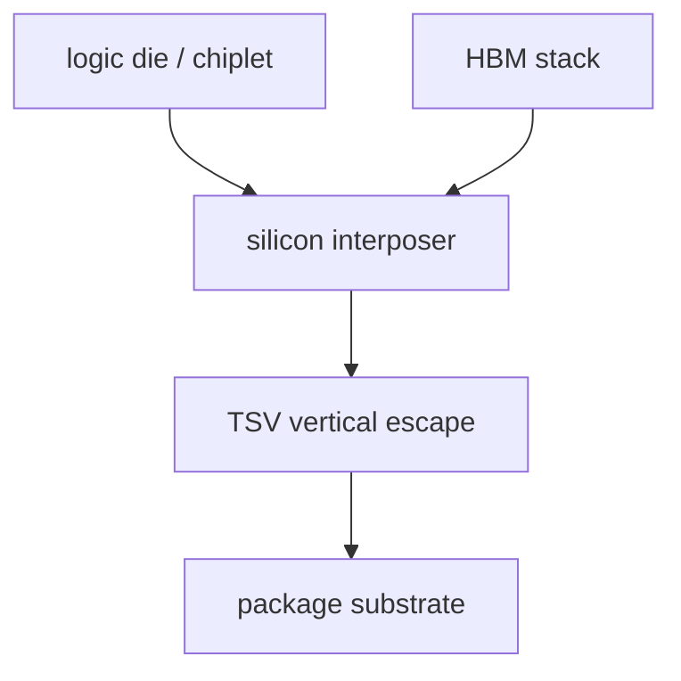

# Si Interposer:第一代主流 2.5D

上级:[2.5D 路线](README.md)
相关:[CoWoS-S/R/L 的真正差别](cowos-s-r-l-comparison.md), [CoWoS-S 完整制造流程](cowos-s-complete-process.md), [TSV](../3d-routes/tsv-through-silicon-via.md)

## 这页在回答什么问题

Si interposer 是什么，为什么它会成为 logic + HBM 的经典 2.5D 平台，以及它的强项和工程代价分别在哪里。

## 基本结构

Si interposer 是一块不承担主计算任务的硅互连平台。它位于上层 die/HBM stack 与下层 package substrate 之间，负责高密度 routing、TSV 垂直引出、供电分配，并可能集成 decap 结构。



这张图的重点是层级分工：logic die 和 HBM stack 提供功能，silicon interposer 提供高密度横向连接，substrate 负责更大尺度的供电、信号引出和机械支撑。

## 它为什么适合 HBM

HBM 的接口宽、距离短、信号数量多，对供电完整性和信号完整性要求高。传统 substrate 难以在相同面积内提供足够细的 routing 和足够稳定的互连环境。Si interposer 用硅工艺提供更高的线宽线距能力和更稳定的几何控制，因此适合连接 logic die 与多颗 HBM stack。

```text
logic die <==== very wide interface ====> HBM stack
              on silicon interposer
```

Si interposer 的价值不只是“线更密”。它还把 HBM 与 logic 的相对位置、供电路径、decap 布局、热耦合和测试边界放在同一个封装系统内处理。

## 关键对象不要混淆

| 对象 | 角色 |
| --- | --- |
| Logic wafer | 前道制造出的逻辑晶圆 |
| Logic die | 切割并筛选后进入封装的计算芯片 |
| HBM stack | 由多层 DRAM die 堆叠形成的高带宽内存对象 |
| Silicon interposer | 承载 die 与 HBM 的高密度中间互连平台 |
| Package substrate | 连接 interposer module 与板级系统的封装基板 |

理解 Si interposer 时最容易出错的是把 wafer、die、interposer 和 substrate 混成同一个对象。它们处在不同制造阶段，也承受不同风险。

## 工程强项

Si interposer 的强项集中在局部高密度区域：

| 能力 | 架构意义 |
| --- | --- |
| 高 routing density | 支撑超宽 HBM interface 和 chiplet D2D |
| TSV | 把顶部高密度互连接到底部 substrate |
| 几何稳定性 | 有利于 fine-pitch bump 和可预测寄生参数 |
| Decap 集成空间 | 改善封装级 PDN 和瞬态响应 |
| 成熟 HBM 适配 | logic + 多 HBM 的系统组织路径清晰 |

这些能力共同解释了为什么高端 AI/HPC package 会把 Si interposer 作为重要路线。

## 主要代价

Si interposer 的代价来自“整块硅平台”这个前提。平台越大，成本、良率、翘曲、热机械耦合和基板协同压力都会放大。若系统只有局部几个 die 之间需要极高密度连接，整块 interposer 可能把不需要硅能力的区域也变成高成本区域。

| 风险 | 原因 |
| --- | --- |
| 面积放大 | 大硅平台成本和缺陷风险提高 |
| Warpage | 硅、substrate、underfill、lid 的 CTE 和厚度共同作用 |
| 热耦合 | 高功耗 logic 与 HBM 邻近布局会形成局部热点 |
| 报废成本 | 多个高价值 KGD 进入同一组装链，失效损失被放大 |

## 它不是 3DIC

Si interposer 里有 TSV，但这不表示整个 package 就是 3DIC。Si interposer 的主任务是横向连接并排 die；TSV 用于把 interposer 顶部信号和电源引到底部 substrate。3DIC 的主问题是 die 与 die 之间的垂直堆叠和垂直互连。

## 一句话理解

Si interposer 是用整块硅平台换取极高横向互连密度和 HBM 适配能力的 2.5D 路线。

## 架构师启示

当架构定义要求多颗 HBM 与 compute die 之间保持极宽、短距、低能耗连接时，Si interposer 是强候选。它的代价也必须在架构早期进入模型：HBM 数量、package 尺寸、热设计功耗、KGD 策略和 substrate 能力一起决定这条路线能不能闭合。
