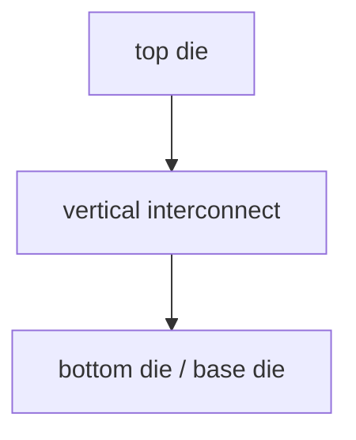

# 3DIC:为什么需要垂直堆叠

上级:[3D 路线](README.md)
相关:[Micro-bump vs Hybrid Bonding](micro-bump-vs-hybrid-bonding.md), [Wafer-to-Wafer vs Die-to-Wafer](w2w-vs-d2w.md), [3DIC 的热与应力挑战](3dic-thermal-and-stress-challenges.md)

## 这页在回答什么问题

系统为什么要从 2.5D 横向集成继续走向 3D 垂直堆叠，3DIC 的收益来自哪里，代价又为什么会集中到热、应力、测试和良率。

## 3DIC 的基本动机

当单颗大 die 继续扩展遇到 reticle、良率、成本和长距离片上互连瓶颈时，系统会尝试把功能拆成多个 die，再用封装或堆叠方式重新组合。2.5D 解决横向高密度连接，3DIC 进一步把 die 放到垂直方向。



垂直堆叠的吸引力来自距离缩短。两个功能块不再隔着大面积片上走线或长距离封装走线，而是通过短的垂直连接通信。

## 主要收益

| 收益 | 架构含义 |
| --- | --- |
| 更高带宽密度 | 单位面积可提供更多 die-to-die 连接 |
| 更低 power-per-bit | 互连更短，寄生更低 |
| 更小 footprint | 多个 die 在 Z 向叠放，平面面积下降 |
| 异构集成 | 不同节点、不同功能可分开制造再组合 |
| 更接近 SoC 的 D2D | chiplet 间通信更像片上互连 |

这些收益解释了为什么 3DIC 会出现在高性能计算、缓存堆叠、逻辑堆叠和部分 memory 结构中。

## 两类问题要分开

3DIC 至少包含两类问题：

| 问题 | 关注点 |
| --- | --- |
| 拓扑问题 | 谁在上、谁在下，face-to-face 还是 face-to-back |
| 工艺问题 | 用 micro-bump、hybrid bonding、TSV，还是它们的组合 |

拓扑决定信号、供电和热路径；工艺决定 pitch、寄生、对位、公差和可靠性窗口。

## 3DIC 为什么更难

3DIC 把功能块放得更近，也把失效机制放得更近。Die 变薄后更容易受应力影响，bonding pitch 变细后对平坦度和洁净度更敏感，堆叠后内部节点更难探测，热从中间层逃逸的路径也更差。

```text
shorter interconnect
  -> higher density
  -> tighter process window
  -> stronger dependence on test and reliability
```

所以 3DIC 的工程难点不是“能不能堆”，而是堆叠以后能不能以可接受良率、可测试性和长期可靠性量产。

## 与 2.5D 的关系

2.5D 和 3D 不是互斥路线。一个系统可以同时使用两者：例如先用 3D 堆叠形成一个 logic-on-logic 或 memory stack，再把这个 stack 放到 2.5D interposer/RDL 平台上，与 HBM、I/O die 或 substrate 连接。

这种组合说明封装路线是分层的：核心 die-to-die 可以是 3D，系统级扩展可以是 2.5D。

## 一句话理解

3DIC 用垂直堆叠缩短 die-to-die 距离，换取带宽密度、能效和 footprint，但代价是制造窗口、热应力、测试和良率显著收紧。

## 架构师启示

架构师只有在通信局部性足够强、垂直堆叠收益明确、且测试与热路径可闭合时，才应该把 3DIC 作为核心路线。若 traffic 分散或功耗密度过高，3D 堆叠可能让系统瓶颈从互连转移到散热和良率。
