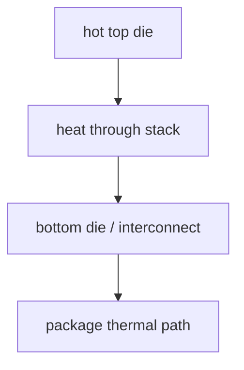

# 3DIC 的热与应力挑战

上级:[3D 路线](README.md)
相关:[Micro-bump vs Hybrid Bonding](micro-bump-vs-hybrid-bonding.md), [TSV:贯穿硅基的纵向连接](tsv-through-silicon-via.md), [热、应力与 Warpage](../../06-cross-cutting-engineering/stress-warpage-cte.md)

## 这页在回答什么问题

3DIC 为什么会把热、CTE mismatch、应力、warpage 和测试问题放大，以及这些问题如何反向约束架构和堆叠方案。

## CTE mismatch 是起点

CTE 是热膨胀系数。材料升温会膨胀，降温会收缩；不同材料的膨胀幅度不同。当 silicon、Cu、dielectric、underfill、mold compound、substrate、TIM 和 lid 被连接成一个结构时，温度变化就会产生约束和应力。

```text
temperature change
  -> different expansion / contraction
  -> stress
  -> warpage / cracks / interface failure
```

3DIC 的材料层更薄、更密、更接近关键电连接界面，因此热机械扰动更容易影响功能。

## 为什么 3DIC 更敏感

| 因素 | 对 3DIC 的影响 |
| --- | --- |
| Die thinning | 刚性下降，更容易形变和受损 |
| Fine pitch bonding | 对平坦度、coplanarity、对位误差更敏感 |
| Vertical stack | 中间层散热路径变差，热点更难排出 |
| 多材料界面 | Cu、Si、介质、underfill 的应力耦合更复杂 |
| 内部节点不可见 | 失效定位和测试更困难 |

在 2.5D 中，热和应力已经重要；在 3DIC 中，它们会直接影响 bonding 良率和长期可靠性。

## 热路径问题

垂直堆叠会让某些 die 远离 heat spreader 或 lid。若高功耗 die 被放在散热路径不利的位置，局部热点会抬高温度梯度。温度梯度又会加剧应力，形成热和机械问题的耦合。



因此 3DIC 的 floorplan 不是只看信号距离，也要看热从哪里出去。

## 应力与 warpage 影响什么

| 受影响对象 | 可能后果 |
| --- | --- |
| Hybrid bonding interface | 局部未键合、界面失效 |
| Micro-bump | 疲劳、开裂、接触不稳定 |
| TSV 邻近区域 | keep-out、应力耦合、可靠性下降 |
| BEOL/low-k | 脆弱层损伤 |
| RDL/underfill | 裂纹、delamination |
| 测试接触 | 探针或接触窗口变窄 |

Warpage 不是外观问题。它会压缩 bonding、贴装、underfill、测试和板级组装窗口。

## 测试为什么更关键

3DIC 堆叠之后，内部连接和内部 die 更难直接访问。若把测试只放到 final package，失效定位会很困难，报废成本也会更高。测试必须前移到 wafer sort、KGD、bonding 后中间测试和 final test 的多个节点。

```text
KGD before stack
  -> bonding inspection / intermediate test
  -> package final test
  -> reliability qualification
```

测试策略和热机械设计在 3DIC 中是同一个良率问题的两面。

## 一句话理解

3DIC 把 die 放得更近，也把热、应力、界面失效和测试盲区放得更近；它的难点是让高密度堆叠在制造和长期工作中都保持可靠。

## 架构师启示

如果 3DIC 架构把最高功耗 die 放在散热不利位置，或把关键接口放在应力最敏感区域，后续工艺很难补救。架构师应在 partition 和 floorplan 阶段就引入热路径、CTE、bonding pitch、测试访问和失效隔离约束。
