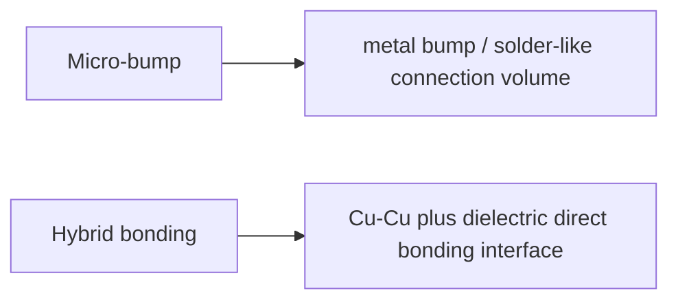
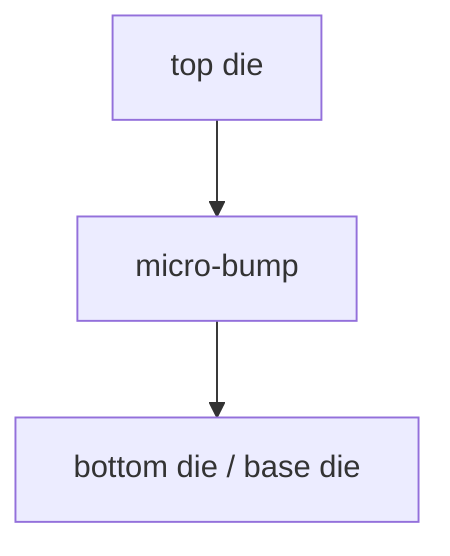
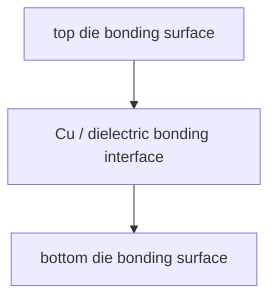

# Micro-bump vs Hybrid Bonding:键合技术的代际差

上级:[3D 路线](README.md)
相关:[Wafer-to-Wafer vs Die-to-Wafer](w2w-vs-d2w.md), [3DIC 的热与应力挑战](3dic-thermal-and-stress-challenges.md), [Bump 与 Pad](../key-components/bumps-and-pads.md)

## 这页在回答什么问题

Micro-bump 和 hybrid bonding 都用于高密度 die-to-die 连接，但它们的界面机制、pitch 潜力、工艺窗口和可靠性风险不同。本页解释两者的工程差异。

## 基本区别

Micro-bump 通过微小金属凸点形成连接，并依赖 underfill 等材料提供机械支撑。Hybrid bonding 则通过 Cu-Cu 直接连接和介质层键合形成更短、更密的界面。

## Micro-bump

Micro-bump 可以看成成熟的高密度封装互连。它比传统 bump 细很多，但仍然有明确的连接体积。

它的优势是工艺经验、可靠性经验和量产窗口更成熟。它的边界是 pitch 继续缩小时，连接体积、寄生、电阻电感、underfill 和对位窗口都会限制更高密度集成。

## Hybrid bonding

Hybrid bonding 直接把上下表面的 Cu pad 和 dielectric 界面对接。它减少了凸点体积，使互连更短，pitch 潜力更高，寄生更低。

它的代价是制造窗口显著收紧：表面平坦度、洁净度、粗糙度、对位精度、薄 die handling 和界面可靠性都必须被严格控制。

## 对照表

| 维度 | Micro-bump | Hybrid bonding |
| --- | --- | --- |
| 连接机制 | 凸点连接 | Cu/介质直接键合 |
| Pitch 潜力 | 高但受凸点体积限制 | 更高 |
| 互连寄生 | 相对更高 | 更低 |
| 工艺成熟度 | 更成熟 | 门槛更高 |
| 表面要求 | 高 | 更高 |
| 主要价值 | 高密度且量产友好 | 极限密度和低 power-per-bit |

## 为什么 hybrid bonding 会变重要

当系统希望 die-to-die 更像片上互连时，连接 pitch、互连长度和寄生都要继续下降。Micro-bump 的几何结构会逐渐接近上限，hybrid bonding 则把连接界面压得更短、更密，因此成为高端 3DIC 的关键路线。

但 hybrid bonding 不是自动替代 micro-bump。若产品的带宽密度目标没有逼近 micro-bump 上限，成熟工艺窗口和可靠性经验仍然可能更有价值。

## 一句话理解

Micro-bump 是成熟的高密度凸点连接，hybrid bonding 是更短、更密但制造窗口更窄的直接键合连接。

## 架构师启示

连接技术不是后端实现细节。若架构收益依赖极低 power-per-bit 和超高 D2D 密度，就要提前确认 hybrid bonding 的 pitch、平坦度、测试和热应力窗口能否支持；若 micro-bump 已满足带宽目标，强行上 hybrid bonding 可能只是在制造端增加风险。
