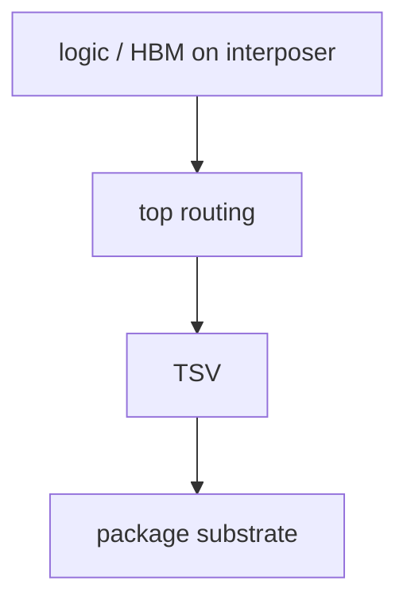

# TSV:贯穿硅基的纵向连接

上级:[3D 路线](README.md)
相关:[Si Interposer:第一代主流 2.5D](../2.5d-routes/si-interposer-fundamentals.md), [HBM stack 是怎么制造出来的](../hbm-as-case-study/hbm-stack-manufacturing.md), [3DIC:为什么需要垂直堆叠](3dic-fundamentals.md)

## 这页在回答什么问题

TSV 是什么，它与 2.5D、3DIC、HBM 的关系是什么，以及为什么“用了 TSV”不能直接等同于“这是 3DIC”。

## TSV 的定义

TSV 是 Through-Silicon Via，硅通孔。它是在硅内部形成垂直导通路径，把信号、电源或地从硅的一面引到另一面。

```text
top surface
   |
 through-silicon via
   |
bottom surface
```

TSV 是一种垂直互连能力，不是系统结构本身。2.5D 和 3D 都可能用 TSV，但它们的定义不由 TSV 决定。

## TSV 在 2.5D 中的作用

在 silicon interposer 中，logic die 和 HBM stack 位于 interposer 顶部，package substrate 位于下方。Interposer 顶部需要高密度 routing，底部需要连接 substrate，TSV 就承担顶面到底面的垂直引出。



这里的主结构仍是 2.5D，因为 die 与 HBM 在 interposer 上横向并排集成。

## TSV 在 3D 和 HBM 中的作用

在 HBM 这类 memory stack 中，多层 DRAM die 需要垂直连接，TSV 是核心结构之一。在某些 3DIC 结构中，TSV 也用于把某层 die 的连接从正面引到背面，或接入后续封装层次。

```text
DRAM die
  | TSV
DRAM die
  | TSV
base die / logic interface
```

这里 TSV 支撑垂直堆叠，但 3DIC 的定义仍是 die 的垂直集成关系。

## TSV 怎么制造

TSV 不是“打一孔就导通”。它涉及高深宽比孔洞、绝缘层、barrier/seed、金属填充、平坦化和背面处理。每一步都会影响电阻、电迁移、应力和可靠性。

| 工艺要点 | 关键风险 |
| --- | --- |
| 深孔形成 | 侧壁形貌和深宽比控制 |
| 绝缘层 | 漏电和击穿 |
| Barrier/seed | 金属填充连续性 |
| Cu filling | 空洞、应力、可靠性 |
| CMP/backside | 厚度、平坦度、露铜控制 |

## 主要代价

TSV 会占用硅面积，也会在硅、绝缘层和金属之间引入热机械耦合。它附近可能需要 keep-out zone，避免应力或噪声影响敏感器件。TSV 还会改变局部热路径和电源路径，不能只按理想导线处理。

## 一句话理解

TSV 是硅里的垂直通道；它可以服务 2.5D interposer、HBM stack 或 3DIC，但它本身不是 2.5D 或 3D 的定义。

## 架构师启示

架构师看到 TSV 时，要追问它承担的是 interposer 顶到底的引出、memory stack 层间连接，还是 3D die 的背面引出。不同位置的 TSV 会带来不同面积、应力、供电和测试约束。
