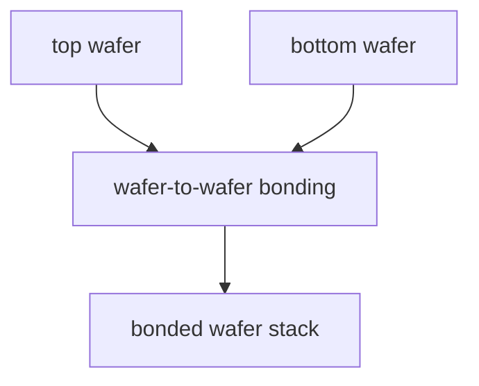
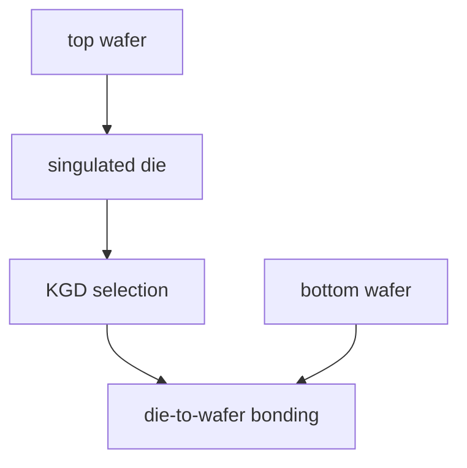

# Wafer-to-Wafer vs Die-to-Wafer:工艺与良率

上级:[3D 路线](README.md)
相关:[SoIC:F2F/F2B/CoW/WoW 的关系](soic-face-to-face-to-back.md), [KGD:HBM/3DIC 时代的必要前提](../../03-wafer-test-and-cp/kgd-known-good-die.md), [Micro-bump vs Hybrid Bonding](micro-bump-vs-hybrid-bonding.md)

## 这页在回答什么问题

W2W 和 D2W 分别是什么，为什么它们的核心差异不是连接材料，而是制造组织方式和良率控制方式。

## 定义

| 缩写 | 全称 | 含义 |
| --- | --- | --- |
| W2W | Wafer-to-Wafer | 整片 wafer 对整片 wafer 键合 |
| D2W | Die-to-Wafer | 切割后的 die 逐颗贴到 wafer 上 |
| WoW | Wafer-on-Wafer | W2W 的平台语境表达 |
| CoW | Chip-on-Wafer | D2W 的平台语境表达 |

W2W/D2W 回答的是制造组织方式，不回答 die 朝向，也不直接决定 micro-bump 或 hybrid bonding。

## W2W

W2W 先把上下两片 wafer 都制造完成，再整片对整片键合。

它适合同尺寸 die、规则阵列、高良率节点和结构重复度高的产品。优势是并行度高、流程组织整齐、吞吐潜力好。短板是良率耦合强：一片 wafer 上的坏 die 可能与另一片 wafer 上的好 die 绑定在一起。

## D2W

D2W 保留下层 wafer 形态，上层先切割成 die，筛选后逐颗贴装和键合。

它适合异构集成、不同尺寸 die、高价值逻辑 die 和更依赖 KGD 的产品。优势是能筛选上层 die，系统灵活性高。代价是 die handling、贴装节拍、对位管理和物流复杂度更高。

## 良率差异

| 维度 | W2W | D2W |
| --- | --- | --- |
| 对 die 尺寸 | 更适合同尺寸规则阵列 | 可混合不同尺寸 |
| KGD 能力 | 受限 | 更强 |
| 吞吐潜力 | 更高 | 受逐颗贴装影响 |
| 异构灵活性 | 较弱 | 更强 |
| 良率风险 | wafer 间坏点耦合 | die 筛选可降低无效组合 |

选择 W2W 还是 D2W，本质上是在吞吐、规则性、KGD、异构能力和组合良率之间做取舍。

## 与 Face-to-Face/Face-to-Back 的关系

W2W/D2W 不是 die 朝向。一个 D2W 流程可以采用 face-to-back 结构，一个 W2W 流程也可以有自己的朝向设计。制造组织和结构拓扑要分开分析。

## 一句话理解

W2W 是规则 wafer 对 wafer 的高并行路线，D2W 是面向异构和 KGD 控制的 die 对 wafer 路线。

## 架构师启示

如果系统由同尺寸、高良率、规则阵列组成，W2W 的吞吐和流程整齐性有吸引力。若系统包含昂贵逻辑 die、不同节点或不同尺寸 chiplet，D2W 的 KGD 筛选和异构弹性更可能决定经济性。
