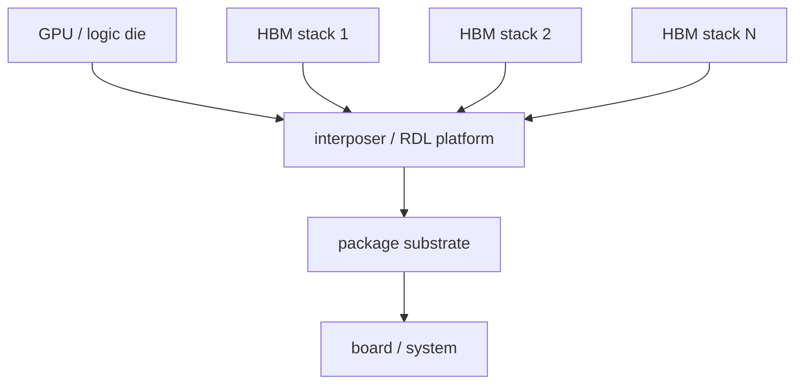
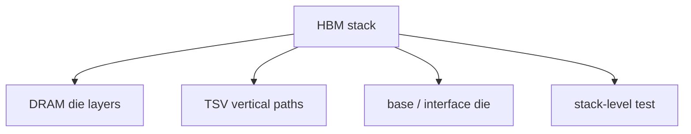
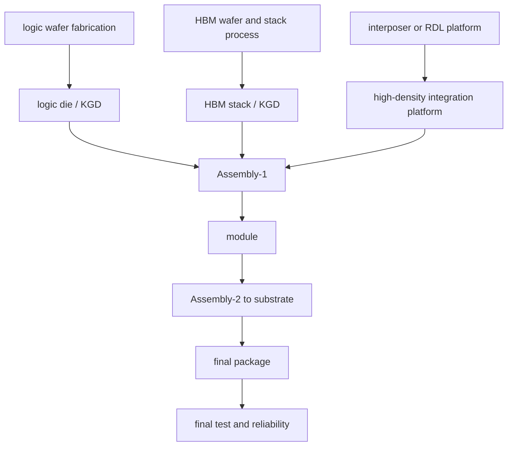

# AI GPU + HBM 封装的完整对象关系

上级:[HBM:先进封装的标志性应用](README.md)
相关:[CoWoS-S 完整制造流程](../2.5d-routes/cowos-s-complete-process.md), [HBM stack 是怎么制造出来的](hbm-stack-manufacturing.md), [热路径管理](../../06-cross-cutting-engineering/thermal-path-and-management.md)

## 这页在回答什么问题

AI GPU + HBM package 中到底有哪些对象，它们如何从 wafer、die、stack、interposer、substrate 逐步组成最终产品。

## 对象关系总图



这张图的关键是不要把 GPU die、HBM die、HBM stack、interposer、substrate 混成一个层级。AI GPU package 是多个高价值对象的系统集成。

## HBM stack 内部层级



因此封装厂面对的不是“多颗 DRAM die 直接放在 GPU 旁边”，而是已经形成的 HBM stack。

## 完整制造对象流



Assembly-1 形成 logic + HBM 的高密度模块，Assembly-2 把该模块接入 substrate 和系统级封装。测试节点穿插在对象准备、模块形成和最终封装之后。

## PI 与热为什么必须在图里

AI GPU + HBM 的带宽不是只由 interface 宽度决定。高功耗 logic die 需要稳定 PDN，多个 HBM stack 需要低噪声接口，interposer/RDL 和 substrate 需要承担供电、decap 和回流路径。与此同时，logic 主热源与 HBM 邻近，热耦合会影响 HBM 温度和系统频率。

```text
bandwidth target
  -> interface width
  -> package routing / PDN
  -> thermal stability
  -> usable sustained performance
```

## 一句话理解

AI GPU + HBM package 是 logic KGD、HBM stack KGD、高密度 interposer/RDL、substrate、热结构和测试节点共同组成的系统对象。

## 架构师启示

架构师画 GPU + HBM block diagram 时，必须把 package 也画进来。HBM stack 位置、NoC 到 memory controller 的流量、interposer routing、PDN、decap 和热路径共同决定最终可持续带宽，而不是逻辑接口宽度单独决定。
