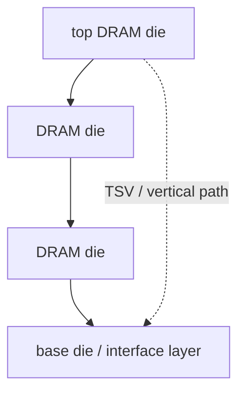

# HBM stack 是怎么制造出来的

上级:[HBM:先进封装的标志性应用](README.md)
相关:[TSV:贯穿硅基的纵向连接](../3d-routes/tsv-through-silicon-via.md), [Wafer-to-Wafer vs Die-to-Wafer](../3d-routes/w2w-vs-d2w.md), [KGD](../../03-wafer-test-and-cp/kgd-known-good-die.md)

## 这页在回答什么问题

HBM stack 不是几颗 DRAM 简单叠放。本页解释 HBM stack 的主要对象、制造主线、测试意义，以及它为什么在进入 AI package 前已经是高价值 3D 器件。

## HBM stack 的对象

一个简化 HBM stack 包含多层 DRAM memory die、TSV 垂直通道、层间连接、base die 或底部接口层，以及保护和热机械相关材料。

在 CoWoS 或类似 2.5D package 里看到的“一颗 HBM”，已经是一个完成内部堆叠和筛选的 memory stack，而不是分散的 DRAM die。

## 制造主线

| 步骤 | 目的 |
| --- | --- |
| DRAM wafer 制造 | 形成 memory die |
| TSV 相关结构 | 提供层间垂直互连能力 |
| Wafer thinning | 降低堆叠厚度，支持多层 stack |
| Singulation | 切割出 memory die |
| Die stacking | 多层 DRAM die 对位、连接和堆叠 |
| Base/interface 形成 | 让 stack 对外连接到系统封装 |
| Test and screening | 避免坏 stack 进入高价值 package |

真实流程会因厂商和代际不同而变化，但核心逻辑不变：先把 memory 自身做成 3D stack，再作为单个高价值对象进入 logic package。

## 为什么 HBM 制造难

HBM 同时是 DRAM 制造问题和先进封装问题。DRAM die 要薄化、对位、堆叠，还要通过 TSV 和层间连接形成可靠通路。层数增加后，热、应力、良率耦合和测试难度都会上升。

| 难点 | 影响 |
| --- | --- |
| Thin die handling | 破片、翘曲、应力敏感 |
| TSV yield | 层间连接和可靠性 |
| Stack alignment | 多层对位误差累积 |
| Thermal path | 中间层热更难排出 |
| Test coverage | 内部层失效更难定位 |

## 为什么 KGD 更关键

HBM stack 一旦进入 logic + interposer/RDL 组装，就会和高价值 logic die 绑定。坏 HBM stack 不只是自身报废，还可能浪费 interposer、substrate、logic die 和组装成本。因此 HBM 的测试和筛选是系统良率的一部分。

## 一句话理解

HBM stack 是先完成内部 TSV、薄化、堆叠和筛选的 3D memory 器件，再作为高价值 KGD 进入 logic + HBM 的 2.5D/3D 系统封装。

## 架构师启示

架构师评估 HBM 数量时，也在评估高价值 stack 数量和组合良率风险。每增加一个 stack，不只是增加带宽，也增加测试、热、供电、布局和报废成本约束。
