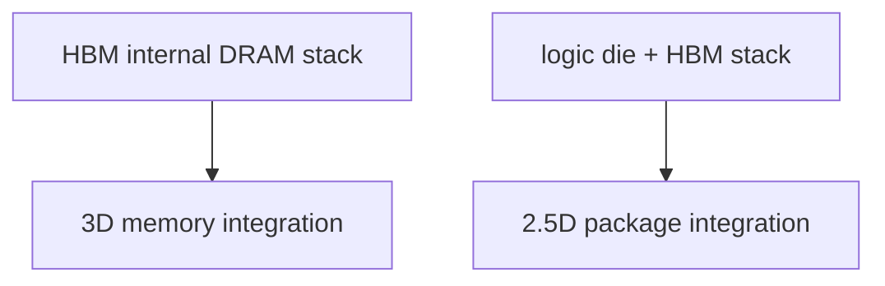

# HBM 如何把产业逼向 2.5D 和 3D

上级:[HBM:先进封装的标志性应用](README.md)
相关:[Si Interposer](../2.5d-routes/si-interposer-fundamentals.md), [3DIC:为什么需要垂直堆叠](../3d-routes/3dic-fundamentals.md), [供电完整性](../../06-cross-cutting-engineering/power-delivery-pi-pdn-decap.md)

## 这页在回答什么问题

HBM 为什么不能被当成普通外部内存看待，它如何同时推动 memory 内部 3D stack 和 logic-memory 之间的 2.5D 高密度封装。

## 传统外部内存的瓶颈

如果继续依赖较长板级走线和较高频率通道来提高总带宽，系统会遇到 I/O 数量、信号完整性、供电完整性、功耗和板级面积的共同限制。单根线速率越高，寄生、损耗和功耗越难控制。

HBM 换了一种思路：不只追求更高单线速率，而是用更宽接口、更短距离和更高并行度提高总带宽。

```text
less long-distance high-speed signaling
more short-distance wide parallel interface
```

## HBM 的两层封装含义

HBM 首先是 3D memory stack：多层 DRAM die 垂直堆叠，通过 TSV 等结构形成层间连接。它不是一颗平面 DRAM。

HBM 进入 AI/HPC package 后，又需要和 logic die 近距离连接。这个连接不能靠普通 substrate 长距离绕线完成，而需要 silicon interposer、RDL interposer 或 local silicon interconnect 等高密度平台。



## 为什么 logic 和 HBM 必须近

HBM 的系统价值来自 logic die 能以高总带宽、低能耗访问 memory stack。要做到这一点，logic-to-HBM 链路需要短、宽、寄生低，并且具备足够好的 PI/SI。

这把系统推向 2.5D：

| 需求 | 封装响应 |
| --- | --- |
| 超宽 memory interface | 高密度 interposer/RDL routing |
| 低 power-per-bit | 短距连接和低寄生 |
| 多 HBM stack | 大尺寸封装平台 |
| 高并发访存 | package PDN 和 decap 前置 |
| 高功耗 logic | 热路径协同设计 |

## 为什么还会继续走向 3D

2.5D 已经显著缩短 logic 与 HBM 的距离，但带宽、功耗和 footprint 继续收紧时，系统会继续寻找更短互连和更高连接密度。3DIC、hybrid bonding、logic-on-logic、cache-on-logic 等路线都来自这个方向。

HBM 本身已经证明了垂直堆叠在 memory 中的价值；下一步问题是 logic、cache、I/O 或 memory controller 等功能是否也需要更紧密的垂直组织。

## 一句话理解

HBM 通过 3D memory stack 提供容量和带宽密度，又通过超宽近距接口把 logic-memory 集成推向 2.5D 和更高密度 3DIC。

## 架构师启示

当架构把性能目标建立在 HBM 带宽上时，memory controller、NoC、package interposer/RDL、PDN 和热设计必须一起定义。否则 HBM 的理论带宽会被封装互连、供电噪声或热限制吃掉。
