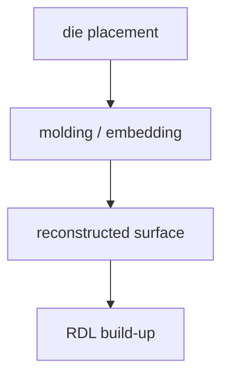

# Molding 与 Underfill:机械保护层

上级:[关键工艺组件](README.md)
相关:[Chip-first vs Chip-last](../2.5d-routes/fan-out-chip-first-vs-chip-last.md), [3DIC 的热与应力挑战](../3d-routes/3dic-thermal-and-stress-challenges.md), [热、应力与 Warpage](../../06-cross-cutting-engineering/stress-warpage-cte.md)

## 这页在回答什么问题

Molding 和 underfill 为什么不是封装最后的保护材料，而是会直接影响 warpage、界面可靠性、bump fatigue、delamination 和热机械寿命的关键组件。

## 两者的角色

| 材料/结构 | 主要作用 |
| --- | --- |
| Molding compound | 包覆和保护 die/RDL 结构，形成重构平台或机械保护 |
| Underfill | 填充 die 与 substrate/interposer/RDL 之间空隙，分散 bump 应力 |

Molding 更像外部或平台级保护与支撑，underfill 更像连接界面附近的应力缓冲。二者都会参与 CTE mismatch 和 warpage。

## Molding

Fan-out 的 chip-first 路线中，die placement 后会通过 molding/embedding 形成重构平台，再进行 grinding、planarization 和 RDL build-up。Molding 的收缩、模量、CTE 和固化过程会影响 die shift、表面平整度和后续 RDL overlay。



Molding 不是单纯包住 die。它决定后续加工基准是否稳定。

## Underfill

Underfill 填入 die 与下层平台之间，包覆 bump 或 micro-bump，降低热循环中连接点承受的局部应力。它也会改变热路径和界面应力分布。

```text
die
  bump array surrounded by underfill
interposer / substrate
```

Underfill 的材料选择和填充质量会影响 bump fatigue、void、delamination 和长期可靠性。

## 主要失效模式

| 失效模式 | 相关机制 |
| --- | --- |
| Warpage | CTE mismatch、固化收缩、结构不对称 |
| Delamination | 界面附着不足、污染、热循环应力 |
| RDL cracking | 多层 build-up 应力和平台形变 |
| Bump fatigue | 热循环下连接点反复受力 |
| Void | 填充不完全导致局部热和机械弱点 |

这些失效模式会互相影响。Delamination 会改变局部应力和热路径，warpage 会影响 bonding 和测试接触，bump fatigue 会转化为电连接失效。

## 为什么先进封装更敏感

先进封装的 die 更贵、互连更细、package 更大、材料更多。Molding 和 underfill 的微小差异会被高密度连接和大尺寸结构放大。对 3DIC 来说，薄 die 和细 pitch 还会进一步压缩材料选择窗口。

## 一句话理解

Molding 和 underfill 是封装里的热机械控制层；它们保护结构，也可能通过收缩、CTE mismatch 和界面问题引发 warpage、疲劳和剥离。

## 架构师启示

架构师不需要指定材料配方，但必须知道材料窗口会反向约束 package 尺寸、die placement、bump pitch 和热循环寿命。若架构把高功耗 die、细 pitch 连接和大面积 RDL 同时推到极限，molding 与 underfill 会成为可靠性瓶颈。
