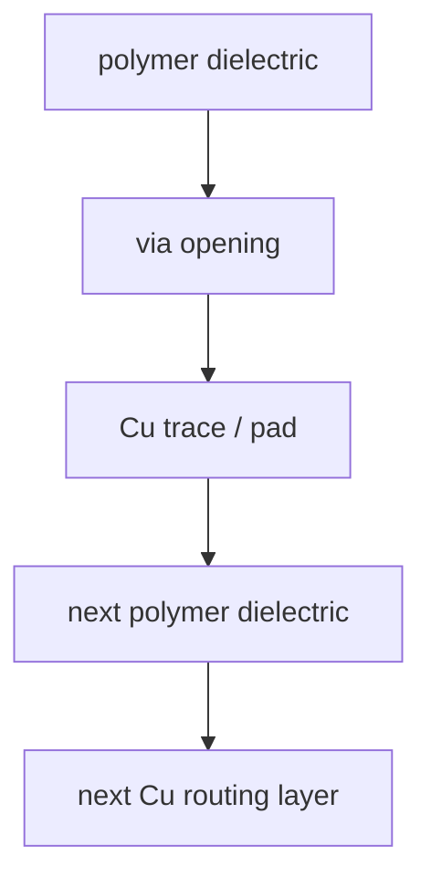

# RDL:截面结构与制造流程

上级:[关键工艺组件](README.md)
相关:[Fan-out RDL](../2.5d-routes/fan-out-rdl-overview.md), [Chip-first vs Chip-last](../2.5d-routes/fan-out-chip-first-vs-chip-last.md), [失效模式目录](../../06-cross-cutting-engineering/failure-modes-catalog.md)

## 这页在回答什么问题

RDL 是什么，它的截面结构如何形成，为什么它不只是“几根铜线”，而是先进封装中承担 signal、power 和 die-to-die routing 的公共底座。

## RDL 的本质

RDL 是 Redistribution Layer，重布线层。它把 die 原始 pad 重新映射到封装需要的位置，并在封装级承担 die-to-die、die-to-substrate 或 die-to-ball 互连。

```text
die pad map
  -> RDL redistribution
  -> package bump / D2D interface
```

RDL 的关键是“redistribution”：把原来不适合直接出封装或互连的位置，转换成系统级更可用的连接图。

## 截面结构

简化的 RDL 截面可以理解为多层 build-up：



它不是单层金属，而是 polymer dielectric、via、Cu trace、pad 反复堆叠形成的封装级互连网络。

## 制造主线

| 步骤 | 目的 |
| --- | --- |
| 准备承载表面 | die+mold 重构表面、carrier 或 interposer 表面 |
| 形成介质层 | 提供绝缘和层间支撑 |
| 开 via | 建立上下层接触窗口 |
| 形成 Cu routing | 图形化并电镀形成走线和 pad |
| 重复 build-up | 增加 routing 层数和互连能力 |
| 形成最终接口 | 连接 bump、substrate 或下一层封装结构 |

实际平台的材料和顺序会变化，但骨架离不开介质、通孔、铜互连和层层堆叠。

## 为什么 RDL 难

RDL 同时承受电、机械和制造窗口约束。线宽线距越细，图形化和 overlay 越难；层数越多，应力、warpage、via reliability 和 cracking 风险越高；封装尺寸越大，平整度和尺寸稳定性越难控制。

| 难点 | 影响 |
| --- | --- |
| Fine line/space | routing density 与良率窗口 |
| 多层 build-up | 应力累积和 warpage |
| Polymer/Cu mismatch | 热循环和 cracking |
| Power routing | IR drop 与电迁移 |
| High-speed signal | 损耗、串扰、阻抗控制 |

## RDL 在路线中的角色

Fan-out 依赖 RDL 扇出 I/O，CoWoS-R 使用 RDL interposer，CoWoS-L 和 bridge-like 路线也需要 RDL 承担全局平台。RDL 不是某一条路线的局部工艺，而是先进封装的公共底座之一。

## 一句话理解

RDL 是封装级多层金属互连网络，用来重映射 I/O、连接 die、承载 power/signal routing，并把工艺难度推向应力、细线和良率控制。

## 架构师启示

当架构要求更多 chiplet、更宽 D2D、更大 package 时，RDL 层数、line/space、via 密度和 power routing 都会被推高。架构师需要把 RDL 视为可用互连资源，而不是无限可扩展的布线背景。
