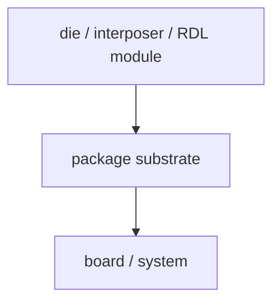

# 基板与载板:被忽视但关键的一环

上级:[关键工艺组件](README.md)
相关:[后道封装](../README.md), [Si Interposer](../2.5d-routes/si-interposer-fundamentals.md), [供电完整性](../../06-cross-cutting-engineering/power-delivery-pi-pdn-decap.md)

## 这页在回答什么问题

Package substrate 和 carrier 分别是什么，为什么基板不是“下面托着的板”，而是决定供电、信号、机械和封装尺寸上限的关键平台。

## Substrate 的系统角色

Package substrate 位于 interposer/RDL/module 与 board 之间。它把局部高密度封装结构接入更大系统，负责电源、信号、机械支撑和板级连接。



当上层封装能力提高后，substrate 会承接更多电流、更复杂高速信号、更大 package 尺寸和更严格 warpage 窗口。

## Substrate 影响什么

| 维度 | Substrate 的影响 |
| --- | --- |
| Power delivery | 电流路径、IR drop、decap 布局 |
| Signal escape | 高速信号扇出、损耗、阻抗控制 |
| Package size | 大尺寸封装的支撑和层数 |
| Mechanical support | 平整度、warpage、板级可靠性 |
| Assembly yield | interposer/module 到 substrate 的连接窗口 |

高端封装并不只受 interposer 或 HBM 限制。若 substrate 无法承载电源、信号和尺寸，整个 package 也无法成立。

## Carrier 的制造角色

Carrier 更偏制造过程对象。Fan-out、RDL build-up、chip-last 或某些临时键合流程中，会用 carrier 提供临时支撑、平整表面和加工基准。流程结束后，carrier 可能被 debond，不进入最终产品。

```text
temporary carrier
  -> build RDL / attach die / molding
  -> debond
  -> final package structure
```

Substrate 是最终产品的一部分；carrier 常是制造过程中的临时支撑。两者都叫“承载”，但角色完全不同。

## 高端基板为什么难

高端基板的难点来自多目标叠加：层数高、I/O 多、电流大、高速信号敏感、封装尺寸大、翘曲窗口窄。它要同时满足电气、机械和组装要求。

| 难点 | 后果 |
| --- | --- |
| 高层数和细线 | 成本、良率和供应能力压力 |
| 大电流 | IR drop、热点和 decap 需求 |
| 大尺寸 | warpage 和平整度风险 |
| 高速信号 | 损耗、串扰、阻抗控制 |
| CTE mismatch | 连接疲劳和板级可靠性问题 |

## 一句话理解

Substrate 是最终封装连接系统板级世界的电气和机械平台，carrier 是制造过程中提供支撑和基准的临时平台。

## 架构师启示

架构师不能只确认 interposer 或 RDL 能画出连接，还要确认 substrate 能把电源、信号和热机械载荷带出 package。HBM 数量、logic 功耗和 package 尺寸提高时，基板能力可能成为系统上限。
