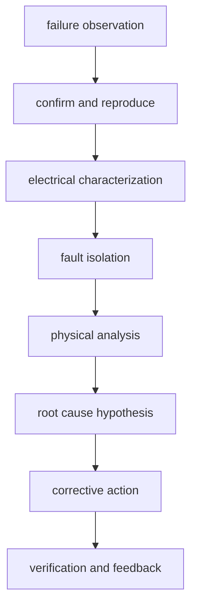

# 失效分析的工程流程

上级:[终测与可靠性](README.md)
相关:[Final Test 的方法与流程](final-test-methodology.md), [Burn-in 与应力测试](burn-in-and-stress-test.md), [失效模式目录](../06-cross-cutting-engineering/failure-modes-catalog.md)

## 这页在回答什么问题

芯片或先进封装出现失效后，工程上如何从现象走到根因，再把结论反馈到设计、工艺、材料、测试和制造协作链。

## FA 的目标

Failure Analysis 不是写一份“坏了”的报告，而是回答四个问题：

| 问题 | 目的 |
| --- | --- |
| 失效是否真实可复现 | 排除误测、接触问题和偶发现象 |
| 失效位置在哪里 | 缩小到 die、RDL、bump、TSV、substrate 或界面 |
| 失效机制是什么 | 裂纹、疲劳、污染、开短路、热损伤、PI/SI 问题 |
| 如何防止再发生 | 反馈到设计、工艺、材料、测试或规格 |

FA 的价值在闭环，而不是事后归档。

## 基本流程



这条流程会在实际项目中反复迭代。物理分析看到裂纹后，还要回到电性、热历史、工艺记录和设计边界验证假设。

## 先进封装的失效定位更难

多 die、HBM stack、interposer/RDL、substrate、underfill 和 lid 会把内部节点藏起来。Final Test 看到的可能只是接口错误、带宽下降、功耗异常或无法启动，但根因可能在 bonding interface、RDL crack、bump fatigue、delamination、TSV 或 PDN 上。

```text
package-level symptom
  -> internal structure candidate
  -> fault isolation
  -> destructive / non-destructive analysis
```

因此 FA 需要结合测试日志、binning 数据、热应力历史、X-ray/SAM/切片等手段，以及设计侧 DFT/diagnostic pattern。

## 常见失效模式

| 失效模式 | 可能表现 |
| --- | --- |
| RDL cracking | 开路、间歇连接、热循环后失效 |
| Bump fatigue | 接触不稳定、温循后连接退化 |
| Delamination | 热路径恶化、界面开裂、湿热后失效 |
| Warpage | bonding/贴装失败、测试接触不良 |
| Bonding defect | 局部未键合、对位偏差、3D stack 失效 |
| PI/SI 问题 | 高负载下功能异常、接口误码 |

这些模式会互相耦合。比如 delamination 可能导致热阻上升，热阻上升再触发局部过热和电性异常。

## 反馈闭环

FA 结论需要落到行动：

| 根因方向 | 反馈对象 |
| --- | --- |
| 设计 margin 不足 | 架构、DFT、layout、PDN/SI |
| 工艺窗口过窄 | 装配、bonding、RDL、molding |
| 材料界面问题 | underfill、mold、adhesive、substrate |
| 测试漏测 | CP、intermediate test、final test pattern |
| 使用条件超界 | 规格、系统散热、板级设计 |

没有 corrective action 和验证，FA 只是描述问题。

## 一句话理解

失效分析把 final test、stress test 或客户现场看到的症状拆回真实根因，并把根因反馈到设计、工艺、材料和测试策略。

## 架构师启示

架构师应为 FA 留下可观测性和可诊断性。复杂封装如果没有分区测试、错误日志、接口诊断和功耗/温度可观测点，失效后很难区分是 NoC/memory controller 问题、HBM 问题、封装互连问题，还是热和供电共同触发的问题。
