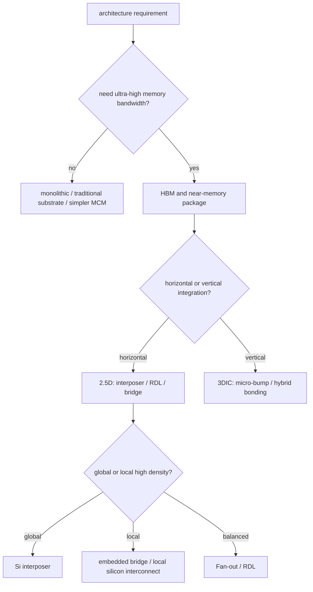

# 从架构需求反推工艺与封装选型

上级:[跨工艺共性问题](README.md)
相关:[封装分类](../04-back-end-packaging/packaging-taxonomy.md), [2.5D 路线 trade-off](../04-back-end-packaging/2.5d-routes/2.5d-routes-tradeoff-map.md), [关键指标表](../08-reference/key-metrics-table.md)

## 这页在回答什么问题

如何从架构需求反推出前道节点、chiplet 切分、HBM、2.5D/3D 封装、测试和可靠性策略，而不是从工艺名词反推产品。

## 先定义架构变量

架构选型要先把需求拆成四类变量：

| 变量 | 例子 | 会影响什么 |
| --- | --- | --- |
| Resource | compute、SRAM、HBM、I/O、power budget | die partition、memory hierarchy、package size |
| Topology | 单 die、多 chiplet、2.5D、3D stack | interconnect distance、thermal path、yield model |
| Interaction | NoC traffic、D2D bandwidth、HBM access pattern | routing density、SI/PI、controller placement |
| Capability | process node、RDL density、bond pitch、test coverage | feasible package route and cost |

这四类变量不能分开看。Resource 变多会改变 Topology，Topology 会改变 Interaction，Capability 决定这些交互能不能被制造出来。

## 反推流程



这个流程不是固定答案，而是逼迫设计团队先说明瓶颈在哪里。

## 关键问题清单

| 问题 | 指向 |
| --- | --- |
| 是否需要 HBM 或超高带宽 memory | 2.5D/3D、interposer/RDL、HBM package |
| D2D traffic 是局部集中还是全局分散 | bridge、Si interposer、RDL 平台 |
| 功耗密度是否超过单 die 热路径能力 | chiplet、热扩散、3D stack 风险 |
| Die 是否太大影响良率 | chiplet 切分、KGD、封装组合良率 |
| 是否需要不同节点混合 | 异构 chiplet、D2W、package co-design |
| 测试能否隔离失效 | DFT、中测、final test、FA |

## 路线选择的典型映射

| 架构需求 | 更可能的路线 |
| --- | --- |
| 单 die 足够，I/O 不极端 | 传统 flip-chip / substrate |
| 多 HBM stack + 高功耗 logic | Si interposer 或高密度 2.5D |
| 局部 chiplet D2D 极高带宽 | embedded bridge / local silicon interconnect |
| 大尺寸、成本和机械折中 | Fan-out / RDL interposer |
| 极短垂直互连和高带宽密度 | 3DIC / hybrid bonding |
| 高价值异构 die | D2W/CoW 与强 KGD 策略 |

## 不要从平台名开始

平台名容易让讨论变成“用不用某条路线”。更稳的方式是先写出带宽、功耗、热、尺寸、良率、测试和可靠性目标，再把它们映射到封装能力。

```text
requirement first
  -> constraints
  -> feasible routes
  -> platform selection
```

## 一句话理解

工艺和封装路线不是从名词库里挑出来的，而是由架构的 Resource、Topology、Interaction 和制造 Capability 共同反推出来的。

## 架构师启示

架构师要把封装选型变成可验证的约束求解：memory bandwidth、NoC traffic、D2D distance、power density、KGD、test access 和 thermal path 都必须有明确数字或边界。没有这些输入，所谓路线选择只是偏好，不是工程决策。
