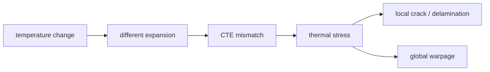

# 应力、Warpage、CTE 失配:机械可靠性的核心

上级:[跨工艺共性问题](README.md)
相关:[Molding 与 Underfill](../04-back-end-packaging/key-components/molding-and-underfill.md), [3DIC 的热与应力挑战](../04-back-end-packaging/3d-routes/3dic-thermal-and-stress-challenges.md), [失效模式总览](failure-modes-catalog.md)

## 这页在回答什么问题

CTE mismatch、热应力和 warpage 是什么关系，为什么它们会影响 RDL、bump、hybrid bonding、underfill、substrate 和最终可靠性。

## 最简因果链

CTE 是热膨胀系数。不同材料在温度变化下膨胀或收缩幅度不同，被绑定在一起后就会互相拉扯。



CTE mismatch 是原因之一，热应力是中间机制，warpage 是结构尺度上的表现之一。

## 为什么先进封装更敏感

先进封装把 silicon die、Cu、polymer dielectric、underfill、mold compound、substrate、TIM、lid 和 solder/bump 连接成复杂结构。材料越多，尺寸越大，pitch 越细，应力和翘曲越容易影响制造窗口。

| 结构 | 典型应力来源 |
| --- | --- |
| Si interposer | 大硅平台与有机基板耦合 |
| Fan-out/RDL | mold shrinkage、多层 RDL、die shift |
| Embedded bridge | 局部硅桥与外围平台过渡 |
| 3DIC | thin die、fine pitch、stack 温度梯度 |
| HBM package | logic-HBM 热耦合、大 package 尺寸 |

## Warpage 影响什么

Warpage 不是外观问题。它会影响 die placement、bonding、micro-bump 接触、underfill 填充、测试接触、substrate 组装和板级可靠性。

```text
warpage
  -> coplanarity loss
  -> bonding / test / assembly window narrows
  -> yield and reliability risk
```

细 pitch 连接对平整度更敏感，因此 hybrid bonding 和 3DIC 对 warpage 的容忍度更低。

## 局部失效模式

| 失效 | 应力相关机制 |
| --- | --- |
| RDL cracking | 多层 build-up、Cu/polymer mismatch、热循环 |
| Bump fatigue | 连接点在热循环中反复受力 |
| Delamination | 界面附着不足加上热机械载荷 |
| Bonding defect | 平坦度、对位和界面形变影响键合 |
| Low-k / BEOL damage | 封装应力传入先进逻辑脆弱层 |

## 控制思路

应力和 warpage 需要结构、材料、制程、尺寸和热设计共同控制。改变 underfill、mold、RDL 层数、substrate stack-up、die thickness、lid/stiffener 或 package 对称性，都可能改变整体行为。

## 一句话理解

CTE mismatch 会转化为热应力，热应力会表现为 warpage、crack、fatigue 或 delamination，并直接压缩先进封装的量产窗口。

## 架构师启示

架构师定义 package 尺寸、die placement、HBM 数量和 3D stack 时，已经在定义热机械风险。若系统同时追求大尺寸、高功耗、fine pitch 和多材料堆叠，warpage 与应力必须进入早期约束。
