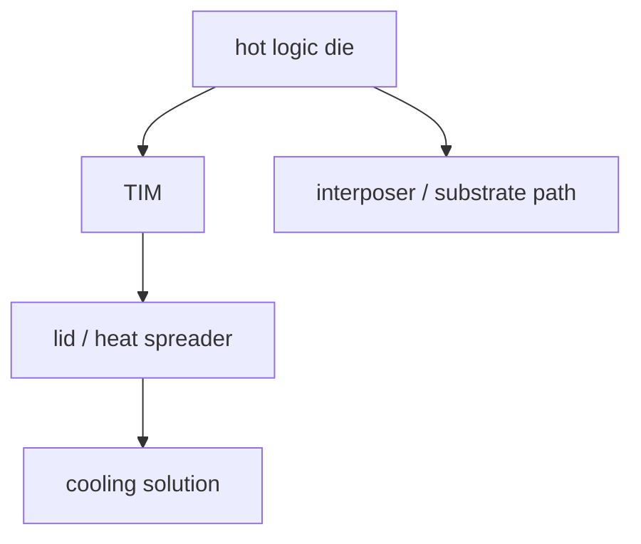
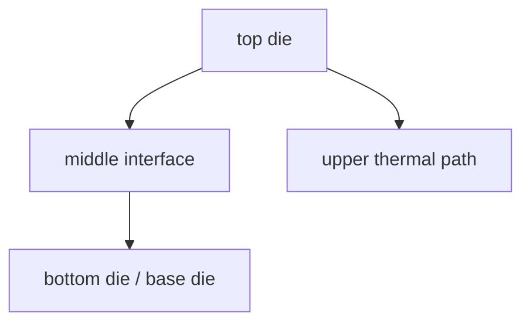

# 先进封装中的热路径与管理

上级:[跨工艺共性问题](README.md)
相关:[HBM:先进封装的标志性应用](../04-back-end-packaging/hbm-as-case-study/README.md), [3DIC 的热与应力挑战](../04-back-end-packaging/3d-routes/3dic-thermal-and-stress-challenges.md), [应力、Warpage、CTE 失配](stress-warpage-cte.md)

## 这页在回答什么问题

先进封装里的热从哪里来、往哪里走，为什么 die placement、HBM 邻近、3D 堆叠和封装材料会直接决定可持续性能。

## 热路径不是散热器附件

热路径是 package 结构的一部分。高功耗 die 产生热量，热量需要经过 TIM、lid、heat spreader、cold plate 或其他散热结构离开系统；同时，interposer、substrate、underfill 和相邻 die 也会参与温度场。

如果封装结构阻断主热路，或者把高功耗 die 放在热出口不利的位置，后续散热器很难补救。

## 2.5D + HBM 的热问题

2.5D package 中，logic die 和多个 HBM stack 横向邻近。带宽收益来自近距离，但近距离也带来热耦合。

风险不只在 logic die 自己过热，还在于 logic 主热点把 HBM 拖入更高温区。HBM 温度会影响带宽稳定性、刷新、可靠性和系统节流策略。

## 3DIC 的热问题

3DIC 把 die 垂直堆叠，缩短互连，也让中间层更难散热。热源可能被其他 die、bonding interface 或 base die 包住，温度梯度更强。

3DIC 的热设计要同时问：最热 die 在哪一层，热是否要穿过其他 active die，顶部和底部路径分别承担什么。

## 热管理变量

| 变量 | 影响 |
| --- | --- |
| Die placement | 热源距离、HBM 热耦合、局部热点 |
| TIM/lid | 主热路界面热阻 |
| Stack order | 3DIC 中热源离散热出口的距离 |
| Package size | 热扩散面积和温度分布 |
| Power profile | 峰值功耗、动态热点、热循环 |
| Substrate/interposer | 下方热路径和热机械耦合 |

## 热与其他约束的耦合

热会改变材料膨胀，进而影响应力和 warpage；热会改变电阻，进而影响 PDN 和 IR drop；热还会改变时序 margin 和接口误码率。热不是独立维度，而是会把机械、电气和可靠性问题一起放大。

## 一句话理解

先进封装的热路径由 die placement、stack 拓扑、TIM/lid、interposer/substrate 和功耗分布共同决定，直接约束持续性能和可靠性。

## 架构师启示

架构师在放置 compute die、HBM stack 和 3D die 时，应先画热路径再画最终带宽图。若最高功耗区域被放到散热路径不利位置，封装路线再先进也可能被温度和节流限制住。
