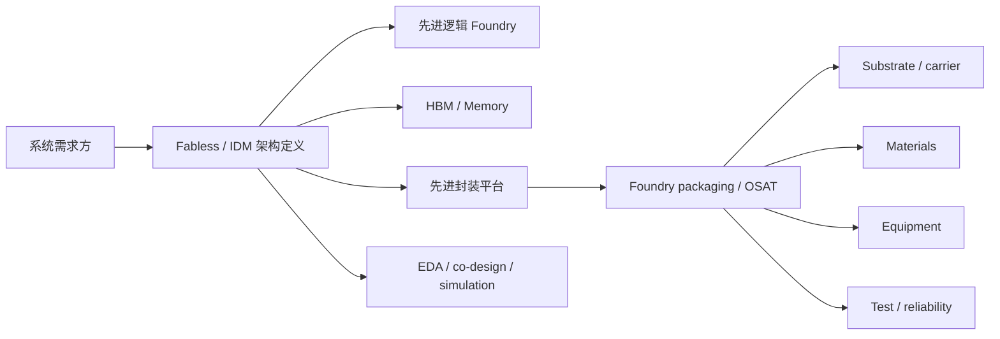

# 产业地图

上级:[芯片制造与封测 Wiki 总览](../01-overview/README.md)
相关:[封装分类](../04-back-end-packaging/packaging-taxonomy.md), [跨工艺共性问题](../06-cross-cutting-engineering/README.md), [关键指标表](../08-reference/key-metrics-table.md)

## 这页在回答什么问题

先进封装产业链由哪些角色共同组成，为什么不能只看封测厂或单个平台名。本章把 foundry/IDM、OSAT、HBM、基板、材料、设备、EDA/仿真和测试放到同一张地图里。

## 产业链全景

AI/HPC 先进封装不是单点外包问题，而是系统定义、先进逻辑、HBM stack、2.5D/3D 封装平台、基板、材料、设备、仿真和测试一起闭合。

## 本章结构

| 文档 | 作用 |
| --- | --- |
| industry-chain-overview | 产业链分层和角色关系 |
| foundry-landscape-tsmc-intel-samsung | TSMC、Intel、Samsung 的平台型能力 |
| osat-landscape-ase-amkor-jcet-tongfu | OSAT 在先进封装中的位置 |
| materials-supply-chain | 材料如何影响 RDL、bonding、warpage 和可靠性 |
| equipment-vendors | TSV、RDL、bonding、thin die 和测试设备 |
| substrate-and-carrier-supply | ABF/substrate/carrier 对大封装的约束 |
| mainland-china-bottlenecks | 大陆在材料、基板、设备、HBM 与生态上的短板 |
| mainland-china-vs-tsmc-real-gap | 大陆平台与台积电体系在 AI 封装上的系统差距 |

## 读产业地图的方法

看公司时不要只问“有没有先进封装”。先问它处在哪一层：是定义系统需求，制造先进逻辑，供应 HBM，做封装平台，提供 OSAT 产能，还是提供材料、设备和基板。再问它的能力是否已经进入 AI/HPC 级高价值量产。

| 层级 | 关键问题 |
| --- | --- |
| Foundry/IDM | 是否能把先进逻辑与先进封装协同 |
| OSAT | 是否能提供高密度 fan-out、2.5D/3D、测试和可靠性 |
| Memory | HBM stack 是否能与封装平台协同 |
| Substrate | 大尺寸、高层数、高电流 package 是否能承载 |
| Materials | RDL、underfill、mold、bonding、TIM 是否稳定 |
| Equipment | 对位、薄化、bonding、RDL 和测试窗口是否可量产 |

## 一句话理解

先进封装产业地图不是公司名单，而是把系统需求、平台能力、材料设备、基板和量产测试放在同一条制造闭环里看。

## 架构师启示

架构师评估封装路线时，也在评估产业链可得性。一个架构需要 HBM、CoWoS-like 2.5D、大尺寸 substrate 和高密度测试时，任何一个环节供给不足都会反向改变产品定义和上市节奏。
