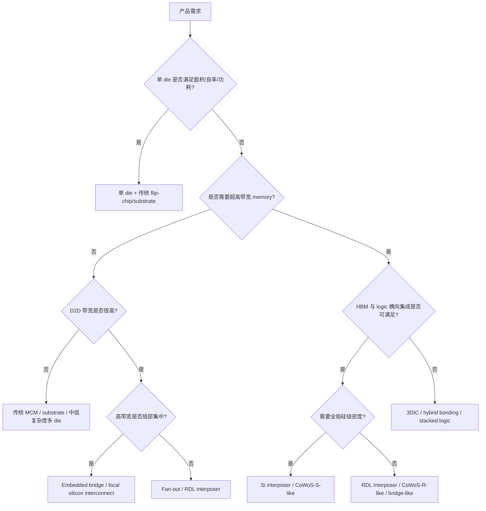

# 工艺与封装选型决策树

上级:[参考资料](README.md)
相关:[从架构需求反推工艺与封装选型](../06-cross-cutting-engineering/from-architecture-to-process-selection.md), [封装分类](../04-back-end-packaging/packaging-taxonomy.md), [关键指标速查表](key-metrics-table.md)

## 这页在回答什么问题

如果从产品需求出发，如何快速判断是单 die、传统封装、2.5D、Fan-out/RDL、bridge，还是 3DIC。本页提供决策树。

## 决策树

## 决策问题

| 问题 | 影响 |
| --- | --- |
| 单 die 是否过大 | 前道良率、reticle、成本 |
| 是否需要 HBM | 2.5D/3D、高密度 package、热/PI |
| D2D traffic 分布如何 | Si interposer、RDL、bridge 的选择 |
| 功耗密度如何 | 热路径、3D stack 风险、lid/TIM |
| 是否异构节点 | chiplet、D2W、KGD |
| 测试能否前移 | KGD、中测、final test、FA |
| 供应链是否可得 | HBM、substrate、材料、设备、OSAT/foundry |

## 路线快速映射

| 需求形态 | 候选路线 |
| --- | --- |
| 单 die 可行，I/O 压力不高 | 传统 flip-chip / substrate |
| 多 die 但带宽中等 | MCM / substrate / Fan-out |
| HBM + 高功耗 logic | Si interposer 或 RDL interposer |
| 局部 chiplet 高带宽 | Embedded bridge |
| 大尺寸、成本和机械折中 | Fan-out/RDL |
| 极短互连和高带宽密度 | 3DIC / hybrid bonding |

## 决策树的边界

这棵树只给第一轮判断。实际项目还要回到热、PI、SI、warpage、良率经济性、测试覆盖和产业链可得性做二次筛选。

## 一句话理解

工艺与封装选型应从系统瓶颈出发：带宽、功耗、尺寸、良率、测试和供应链共同决定路线。

## 架构师启示

架构师应把决策树变成可量化检查表。每个分支都要有数字支撑，例如 HBM 带宽、D2D 距离、package 尺寸、功耗密度、KGD 良率和 substrate 约束。
