# 先进封装 Wiki 索引

## 说明

这是基于 [`raw/chat.md`](/mnt/e/IC/raw/chat.md) 与整理稿 [`raw/先进封装-wiki.md`](/mnt/e/IC/raw/先进封装-wiki.md) 拆分出的 Obsidian 风格笔记目录。

建议阅读顺序：

1. [[01 - 产业链与角色]]
2. [[02 - 分类框架]]
3. [[03 - 技术路线总览]]
4. [[04 - Si Interposer]]
5. [[05 - Fan-out RDL]]
6. [[06 - Embedded Bridge]]
7. [[07 - TSMC 先进封装地图]]
8. [[08 - 3D IC]]
9. [[09 - W2W 与 D2W]]
10. [[10 - 共性工程问题]]
11. [[11 - 学习路径与常见误区]]
12. [[12 - 术语表]]
13. [[14 - 为什么台积电领先先进封装]]
14. [[15 - CTE、热应力与 Warpage：从概念到 3DIC]]
15. [[16 - 大陆先进封装供应链现状]]
16. [[17 - 为什么 HBM 逼着产业走向 2.5D 和 3D]]
17. [[18 - CoWoS-S、CoWoS-R、CoWoS-L 的真正差别]]
18. [[19 - Hybrid Bonding vs Micro-bump]]
19. [[20 - 大陆先进封装：材料、基板、设备分别卡在哪]]
20. [[21 - HBM Stack 是怎么制造出来的]]
21. [[22 - SoIC 的 Face-to-Face、Face-to-Back、CoW、WoW 到底是什么关系]]
22. [[23 - 先进封装里的 PI、PDN、Decap 到底怎么理解]]
23. [[24 - 台积电、Intel、大陆平台在 AI 封装上的真实差距]]
24. [[25 - TSV 到底是什么，和 2.5D、3D 是什么关系]]
25. [[26 - RDL 的截面结构和制造流程]]
26. [[27 - CoWoS-S 的完整制造流程]]
27. [[28 - 先进封装测试：Wafer Sort、KGD、中测、Final Test]]
28. [[29 - 先进封装中的热路径图解]]
29. [[30 - 先进封装中的应力与 Warpage 图解]]
30. [[31 - AI GPU + HBM 封装的完整对象关系图]]
31. [[32 - 从系统需求反推封装路线的选型方法]]
32. [[33 - 大陆 vs 台积电：先进封装系统对照]]
33. [[34 - 课程主线一：HBM、CoWoS、PI 与热]]
34. [[35 - 课程主线二：3DIC、Hybrid Bonding、CTE 与测试]]
35. [[36 - 课程主线三：大陆追赶路径与系统短板]]
36. [[37 - 供应链地图：先进封装全景]]
37. [[38 - 工艺深水区：先进封装关键工艺总览]]
38. [[39 - 供应链地图：材料]]
39. [[40 - 供应链地图：设备]]
40. [[41 - 供应链地图：基板与载板]]
41. [[42 - 工艺深水区：TSV]]
42. [[43 - 工艺深水区：RDL]]
43. [[44 - 工艺深水区：Hybrid Bonding]]
44. [[45 - 工艺深水区：先进封装测试与可靠性]]
45. [[46 - 企业地图：先进封装关键玩家总览]]
46. [[47 - 数据层：先进封装关键指标总表]]
47. [[48 - 失效模式层：先进封装常见失效总览]]
48. [[49 - 企业地图：TSMC]]
49. [[50 - 企业地图：Intel Foundry]]
50. [[51 - 企业地图：Samsung Foundry]]
51. [[52 - 企业地图：ASE]]
52. [[53 - 企业地图：JCET]]
53. [[54 - 企业地图：Tongfu]]
54. [[55 - 企业地图：Huatian]]
55. [[56 - 企业地图：Amkor]]
56. [[57 - 失效模式：RDL Cracking]]
57. [[58 - 失效模式：Bump Fatigue]]
58. [[59 - 失效模式：Delamination]]
59. [[60 - 失效模式：Warpage]]
60. [[61 - 失效模式：Bonding Defect]]
61. [[62 - 总对照：路线、平台、公司、失效模式]]
62. [[63 - 阅读路径：按目标学习先进封装]]
63. [[64 - 主题导航：按问题找笔记]]
64. [[65 - 高频问题：先进封装里最容易混的 20 个问题]]

扩展阅读：

- [[13 - 先进封装图解版]]

## 一句话总纲

先进封装不是单一工艺，而是一张从 Fan-out RDL、Si interposer、Embedded Bridge 到 3D IC 的连续技术地图；核心是在互连密度、带宽、功耗、热、良率、测试与成本之间寻找系统级最优解。

## 笔记关系图

```mermaid
graph TD
    A[产业链与角色] --> B[分类框架]
    B --> C[技术路线总览]
    C --> D[Si Interposer]
    C --> E[Fan-out RDL]
    C --> F[Embedded Bridge]
    C --> G[3D IC]
    G --> H[W2W 与 D2W]
    C --> I[TSMC 先进封装地图]
    D --> J[共性工程问题]
    E --> J
    F --> J
    G --> J
    B --> K[术语表]
    I --> L[为什么台积电领先]
    G --> M[CTE/热应力/Warpage]
    I --> N[大陆供应链现状]
    C --> O[HBM 驱动]
    I --> P[CoWoS 差别]
    G --> Q[Hybrid Bonding vs Micro-bump]
    N --> R[材料/基板/设备短板]
    O --> S[HBM Stack 制造]
    G --> T[SoIC 结构关系]
    J --> U[PI/PDN/Decap]
    L --> V[AI 封装差距]
    D --> W[TSV]
    E --> X[RDL 结构与流程]
    D --> Y[CoWoS-S 制造流程]
    J --> Z[先进封装测试]
    J --> AA[热路径图解]
    J --> AB[应力/Warpage 图解]
    O --> AC[AI GPU + HBM 对象关系]
    C --> AD[封装路线选型]
    N --> AE[大陆 vs 台积电系统对照]
    O --> AF[课程主线一]
    G --> AG[课程主线二]
    N --> AH[课程主线三]
    C --> AI[供应链地图]
    C --> AJ[工艺深水区]
    AI --> AK[材料]
    AI --> AL[设备]
    AI --> AM[基板]
    AJ --> AN[TSV 深水区]
    AJ --> AO[RDL 深水区]
    AJ --> AP[Hybrid Bonding 深水区]
    AJ --> AQ[测试与可靠性深水区]
    AI --> AR[企业地图]
    AJ --> AS[数据层]
    AJ --> AT[失效模式层]
    AR --> AU[TSMC]
    AR --> AV[Intel Foundry]
    AR --> AW[Samsung Foundry]
    AR --> AX[ASE]
    AR --> AY[JCET]
    AR --> AZ[Tongfu]
    AR --> BA[Huatian]
    AR --> BB[Amkor]
    AT --> BC[RDL Cracking]
    AT --> BD[Bump Fatigue]
    AT --> BE[Delamination]
    AT --> BF[Warpage]
    AT --> BG[Bonding Defect]
    C --> BH[总对照]
    C --> BI[阅读路径]
    C --> BJ[主题导航]
    C --> BK[高频问题]
    C --> BL[图解版]
```

