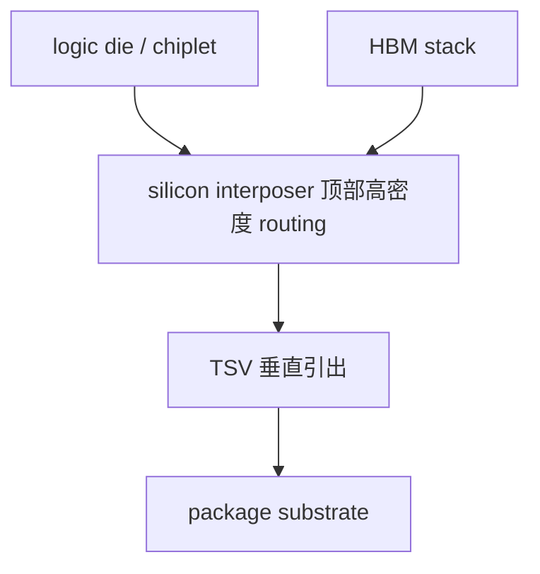
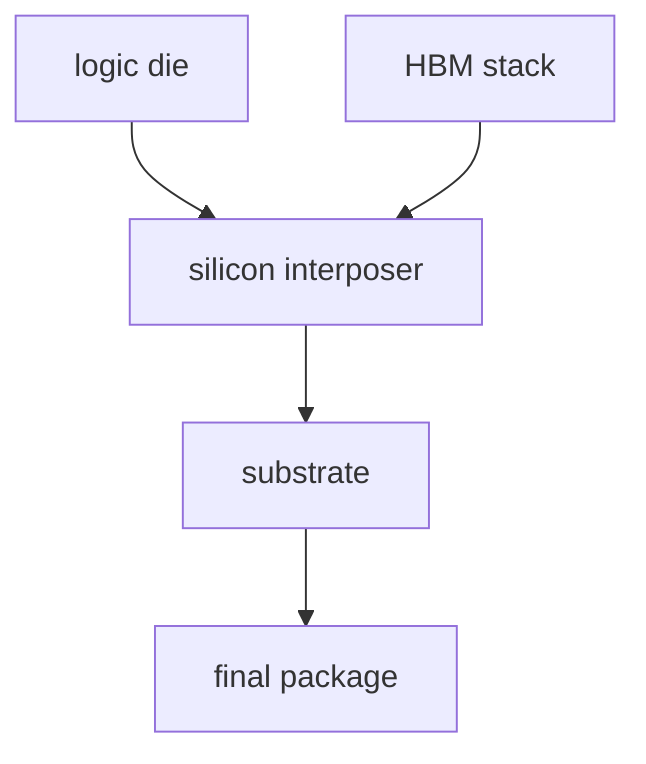

# Si Interposer

上级：[[00 - 先进封装 Wiki 索引]]

相关：[[03 - 技术路线总览]]、[[07 - TSMC 先进封装地图]]、[[10 - 共性工程问题]]

## 一张截面示意图

这张图想表达的是：

- 上层是高价值功能器件
- 中间是高密度硅互连平台
- 再往下通过 TSV 接到最终 substrate

## 本质

Si interposer 是一块不承担主要逻辑计算、但承担高密度布线、TSV、供电和有时 decap 的硅互连平台。

## 先分清几个对象

- wafer：整片晶圆
- die：从 wafer 切下来的裸芯片
- HBM stack：已经先垂直堆好的 memory 器件
- interposer：中间硅互连层
- substrate：最终封装基板

关键点：

`wafer != die`

## 典型封装主线

1. logic wafer 制造
2. HBM wafer 制造并形成 HBM stack
3. interposer wafer 制造
4. logic die + HBM stack 组装到 interposer 上
5. interposer module 再组装到 substrate 上
6. final test 与可靠性验证

## 对象关系图

## 一张对照表

| 层级 | Si interposer 在做什么 |
| --- | --- |
| die 层 | 承接 logic / HBM 等器件 |
| interposer 层 | 提供高密度 routing、TSV、部分 decap 能力 |
| substrate 层 | 提供系统级引出、供电、机械支撑 |

## 为什么现实里会选 Si interposer

现实里真正会选 Si interposer，通常说明系统同时提出了下面这些要求：

- HBM 接口非常宽
- 局部互连密度要求极高
- PI / SI 约束很严
- 可以接受较高封装成本来换性能上限

所以它更像一种：

`当系统性能和高密度互连优先级最高时的强平台选择`

典型场景：

- AI / HPC logic + HBM
- 高端 chiplet 系统
- 对局部极限 routing density 有明确要求的产品

如果系统更在意的是：

- 尺寸继续放大
- 成本压力
- 机械顺从性和 warpage 平衡

那就会更认真比较 RDL interposer 或 bridge-like 路线，而不是默认 full silicon interposer。

## 为什么适合 HBM

因为 HBM 需要：

- 极高 I/O 数量
- 极短 die-to-die 互连
- 更强 PI/SI
- 高带宽和较低每比特能耗

Si interposer 正好在这些指标上很强。

## 它最怕什么

如果只从工程风险角度压缩，Si interposer 最怕的是：

- **尺寸继续放大**：大面积硅平台会同时放大成本、良率和 warpage 压力
- **成本失控**：当全局都用硅时，系统很容易在性能之外被成本反噬
- **热与机械耦合**：大硅平台、高功耗 logic、HBM 邻近布局会一起推高热与应力问题
- **全局平台过重**：如果系统只有局部区域需要极限密度，full silicon interposer 可能显得“用力过猛”

## DTC / eDTC 的意义

interposer 在高性能封装中不仅负责走线，还可能承担高密度 decap 平台角色。

其价值在于：

- 离负载更近
- 可提供更大 decap 面积
- 不挤占逻辑 die 面积
- 有利于缩短 PDN 路径，增强 PI

## 代表平台

- [[07 - TSMC 先进封装地图#CoWoS-S]]

## 常见误区

### 误区 1：interposer 就是一块“过线的硅片”

不够准确。高端 interposer 还会牵涉 TSV、PI、热与机械问题。

### 误区 2：用了 interposer 就等于 3DIC

不对。interposer 主要是 2.5D 横向高密度互连平台。
