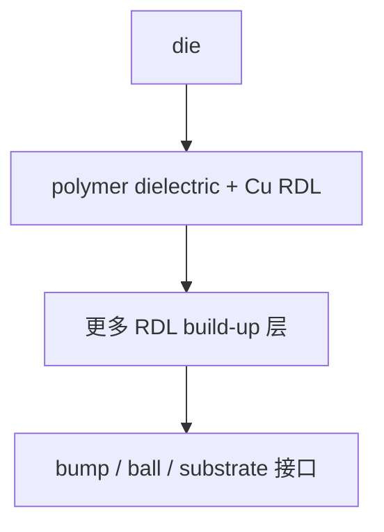
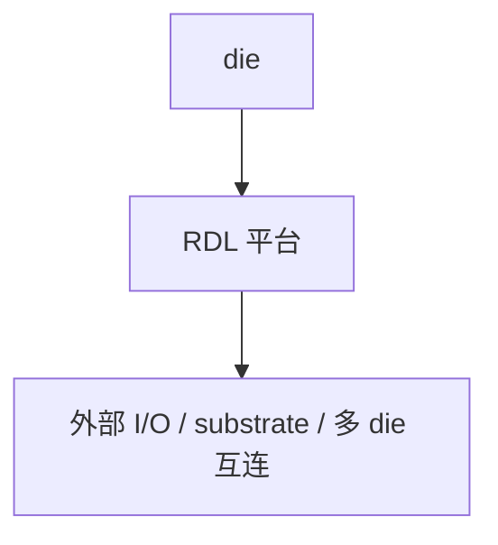

# Fan-out RDL

上级：[[00 - 先进封装 Wiki 索引]]

相关：[[03 - 技术路线总览]]、[[07 - TSMC 先进封装地图]]、[[10 - 共性工程问题]]

## 一张截面示意图

这张图想表达的是：

- Fan-out 的核心不是整块硅
- 而是多层 polymer + Cu 的封装级互连平台

## 本质

Fan-out RDL 的核心是用 polymer dielectric + Cu traces 组成封装级高密度重布线平台，把 die 的 I/O 扇出到 die 面积之外，并在多个 die 间建立互连。

## 相对 Si interposer 的位置

它不是“全面优于” Si interposer，而是在特定区间更有吸引力：

- 中短距离 D2D
- 不需要极限 I/O 密度
- 更关注薄型化、成本和系统整合灵活性

## 常见结论如何理解

### “精度较低”

表示其 line/space、overlay、尺寸稳定性通常弱于硅平台，因此极限 routing density 通常不如 Si interposer。

### “走线更灵活”

表示它更适合封装级重布线、I/O 重映射和多 die 布局定制，不表示绝对布线能力更强。

### “短距性能可能更好”

表示在某些短距 D2D 场景下，如果路径更直接、层级更少，则可获得较好的链路性能和成本平衡。

### “机械更柔顺”

表示 polymer-based 结构在某些条件下更容易提供 CTE 缓冲，但不表示没有 warpage。

## 核心挑战

- die shift
- mold shrinkage
- warpage
- RDL stress
- 大尺寸时的良率与平整度

## 它最怕什么

如果只从风险视角压缩，Fan-out / RDL 最怕的是：

- **die shift**：一旦 die 放置和后续重构过程偏移，RDL 精度和后续连接都会受影响
- **RDL stress 累积**：多层 build-up 后，局部裂纹和可靠性压力会上升
- **大尺寸 warpage**：系统越大，平整度和翘曲越容易成为良率瓶颈
- **局部极限密度不够**：如果系统需要 HBM 级超高密度局部互连，纯 RDL 方案可能到顶

## 对象关系图

## 一张对照表

| 维度 | Fan-out / RDL 的典型特点 |
| --- | --- |
| 核心平台 | polymer dielectric + Cu RDL |
| 主要价值 | I/O 扇出、多 die 互连、系统整合灵活 |
| 相对 Si interposer | 成本通常更低、机械更柔顺、极限密度较弱 |
| 主要风险 | die shift、warpage、RDL stress |

## 为什么现实里会选 Fan-out / RDL

现实里选择 Fan-out / RDL，通常说明系统想要的是下面这组平衡：

- 比传统 substrate 更高的互连能力
- 比 full silicon interposer 更低的总体成本压力
- 更灵活的 I/O 重分配与多 die 系统整合
- 更薄或更适合某些移动/网络类产品的封装形态

所以 Fan-out / RDL 经常被选中的原因不是“它比 interposer 更先进”，而是：

`它在密度、成本、尺寸和机械表现之间给了更现实的折中。`

典型适合场景：

- mobile
- networking
- 某些 chiplet / 多 die 系统
- 不需要极限 HBM 级密度、但需要明显高于普通 substrate 的互连平台

如果系统开始要求：

- 极限局部高密度
- 超宽 HBM 接口
- 更强封装级 decap / PI 支撑

那么 Fan-out / RDL 就可能不够，需要进一步看 Si interposer 或 bridge 路线。

## 两种制造路线

详见：[[05A - Fan-out 制造路线：Chip-first 与 Chip-last]]

## 代表平台

- [[07 - TSMC 先进封装地图#InFO]]

## 常见误区

### 误区 1：RDL 就是几根再分配的线

不对。它是多层 build-up 互连平台。

### 误区 2：Fan-out 天然不翘曲

不对。它只是 warpage 机制和大硅 interposer 不同，不代表没有 warpage。
