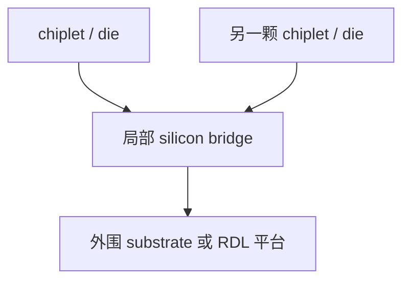
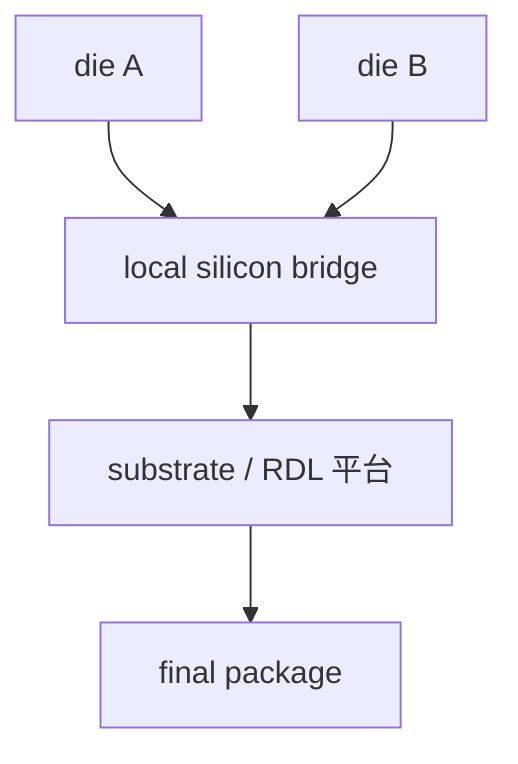

# Embedded Bridge

上级：[[00 - 先进封装 Wiki 索引]]

相关：[[03 - 技术路线总览]]、[[07 - TSMC 先进封装地图]]、[[10 - 共性工程问题]]

## 一张截面示意图

这张图想表达的是：

- 只有关键互连区域用硅桥
- 外围大面积平台仍然是较低成本的 substrate 或 RDL

## 本质

Embedded Bridge 可以记成：

`局部硅互连岛 + 外围低成本大平台`

它不是简单“缩小版 Si interposer”，而是把局部高密度互连能力抽出来，嵌到 substrate 或 fan-out RDL 体系里。

## 两大结构流派

### in-substrate bridge

- 桥埋在 substrate 内
- 典型代表：Intel EMIB
- 大部分互连平台仍是 substrate

### in-RDL bridge

- 桥埋在 fan-out RDL 层里
- 典型代表：ASE FOCoS-Bridge
- bridge 区域提供 ultra-fine routing，外围保留 fan-out 扩展性

## 对象关系图

## 一张对照表

| 路线 | 核心思路 | 典型优势 | 主要难点 |
| --- | --- | --- | --- |
| in-substrate | 桥埋在基板里 | 更贴近 substrate 体系 | 桥区与基板过渡 |
| in-RDL | 桥埋在 RDL 里 | 兼顾 fan-out 扩展与局部高密度 | RDL 与桥协同更复杂 |

## 为什么现实里会选 Embedded Bridge

现实里会认真考虑 Embedded Bridge，通常说明系统已经处在一个中间地带：

- 普通 RDL / substrate 的局部密度不够
- 但 full silicon interposer 又太贵、太大或太重

所以 bridge 的本质吸引力是：

`只在真正需要极高密度的局部区域付出硅级互连成本，其余区域仍保留更低成本、更大面积的平台。`

它特别适合下面这类系统：

- 局部几个 chiplet 之间需要极强 D2D 带宽
- 全局 package 还要继续做大
- 希望在密度与成本之间做更精细的分区优化

如果系统几乎每个区域都需要极限密度，那么 bridge 的优势会下降，可能更偏向 full silicon interposer。  
如果系统根本不需要局部极高密度，那么 bridge 的复杂度又未必值得，可能直接看 RDL / substrate 路线。

## 为什么“密度高于 Fan-out，成本低于 full interposer”

因为：

- 高密度路由由小硅桥承担
- 大部分面积仍不需要整块硅 interposer

## 为什么工艺更复杂

它要同时解决：

- bridge 嵌埋与定位
- 微凸点/细 pitch 对位
- 局部桥区与外围平台的过渡
- PI/SI/热/力学联合优化

## 它最怕什么

从工程风险角度看，Embedded Bridge 最怕的是：

- **局部桥区与外围平台的过渡**：桥区很强，但桥外世界不一样，过渡设计是核心难点
- **协同复杂度过高**：它不是单一平台，而是局部硅 + 全局低成本平台的混合系统
- **局部超高密度收益不够大**：如果局部高密度需求不够强，bridge 带来的复杂度可能不值
- **装配和对位窗口变窄**：桥区一旦出问题，损失会很集中

## 关于功能集成

bridge 作为 silicon die，理论上可承载：

- routing
- decap / IPD
- 某些局部功能模块

但主流商业价值仍首先体现在高密度局部互连。

## 常见误区

### 误区 1：Embedded Bridge 就是缩小版 interposer

不准确。它的本质是局部高密度硅互连与外围低成本大平台的混合。

### 误区 2：只要加一块桥，系统就自然更便宜

不对。它省的是全局硅平台成本，但会引入更复杂的局部集成和协同难题。
