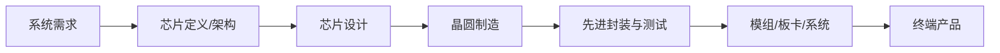
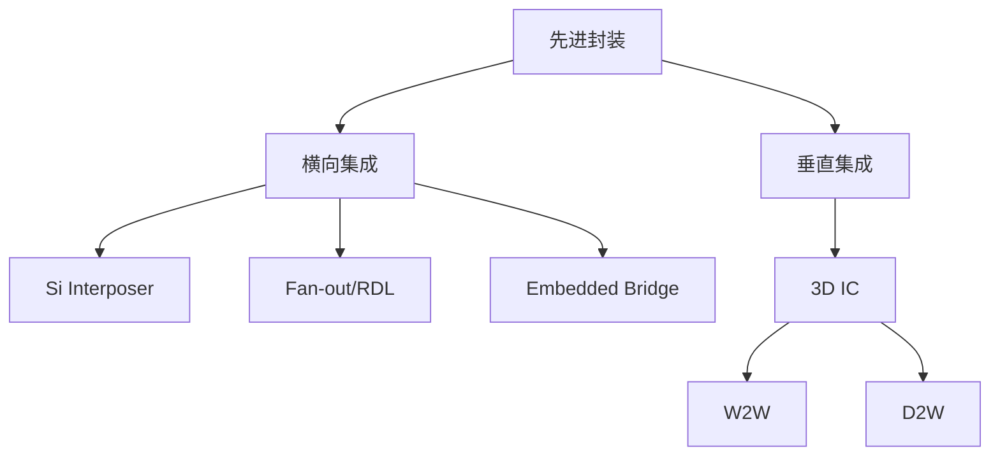
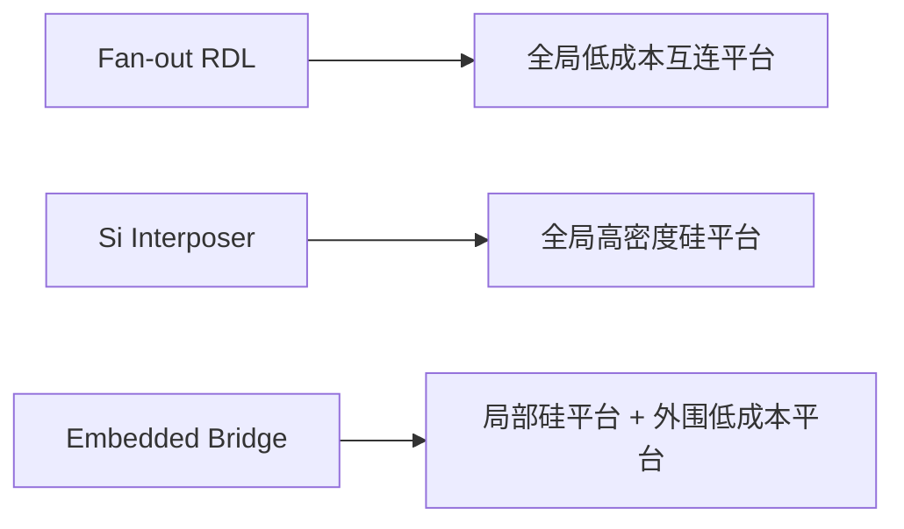
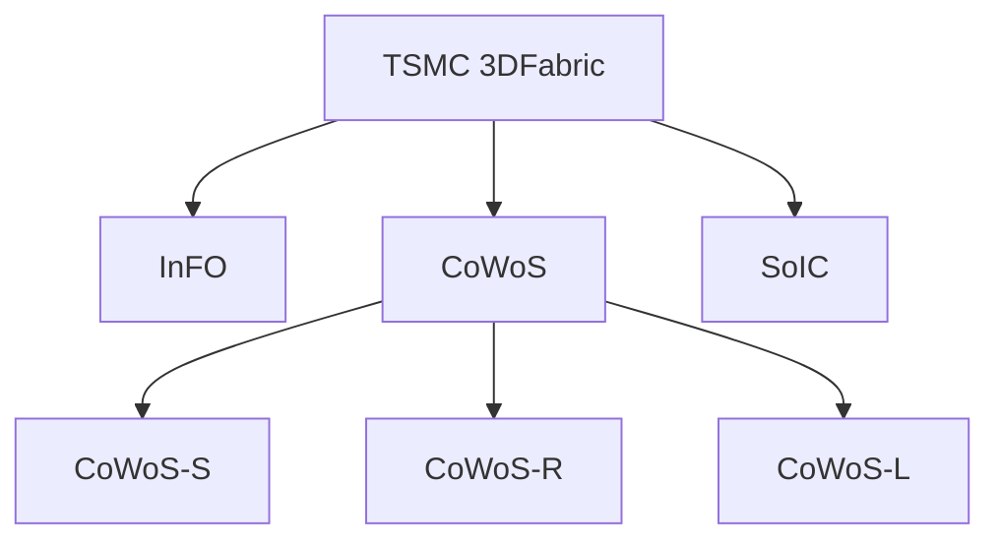
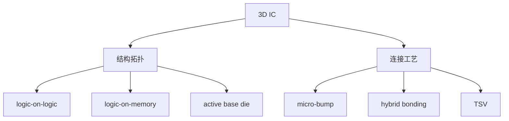
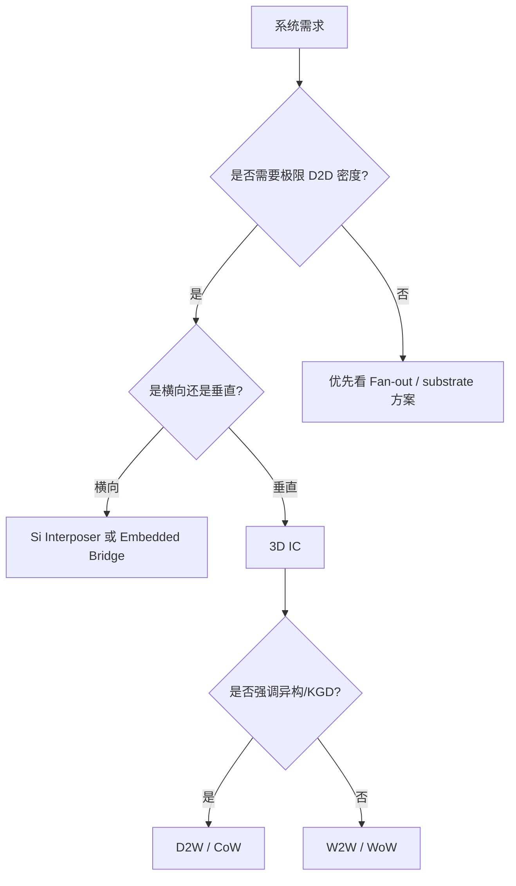
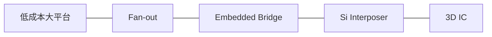

# 先进封装图解版

上级：[[00 - 先进封装 Wiki 索引]]

相关：[[03 - 技术路线总览]]、[[07 - TSMC 先进封装地图]]、[[08 - 3D IC]]

## 1. 一张总图：从产业链到先进封装

结论：

先进封装位于后道，但其影响已经前移到架构、chiplet 切分、PI、热设计和测试策略。

## 2. 一张总图：先进封装分类

## 3. 四条主线对照表

| 路线 | 核心平台 | 主要优势 | 主要短板 | 典型应用 |
| --- | --- | --- | --- | --- |
| Si Interposer | 整块硅中介层 | 极高密度、HBM 友好、PI/SI 强 | 成本高、面积扩展难 | AI/HPC、GPU + HBM |
| Fan-out RDL | polymer + Cu RDL | 更薄、灵活、成本通常更低 | 极限密度较弱、warpage 仍难 | mobile、多芯片整合 |
| Embedded Bridge | 局部硅桥 + 外围平台 | 局部高密度、整体扩展性强 | 工艺复杂、协同难 | chiplet、短距高带宽 D2D |
| 3D IC | 垂直堆叠 + 高密度键合 | 带宽高、功耗低、面积省 | 热、测试、良率困难 | cache-on-logic、3D chiplet |

## 4. Fan-out、Interposer、Bridge 的关系图

一句话：

- Fan-out：整个平台都偏 RDL
- Interposer：整个平台都偏硅
- Bridge：只有关键区域用硅

## 5. TSMC 技术地图

## 6. TSMC 平台强化对照

| 平台 | 技术本质 | 中间/核心平台 | 更像哪条通用路线 | 常见场景 |
| --- | --- | --- | --- | --- |
| InFO | fan-out RDL 家族 | 高密度 RDL | Fan-out | mobile、部分 HPC |
| CoWoS-S | silicon interposer 2.5D | Si interposer | Si Interposer | AI / GPU / HBM |
| CoWoS-R | RDL interposer 2.5D | RDL interposer | RDL-based 2.5D | 大型复杂封装 |
| CoWoS-L | RDL + local silicon enhancement | RDL interposer + LSI | Bridge-like 混合路线 | 更大尺寸 HPC |
| SoIC | 真正 3D IC | silicon stacking | 3D IC | 高密度垂直堆叠 |

## 7. 3D IC 的两层理解

## 8. W2W 与 D2W 对照

| 维度 | W2W | D2W |
| --- | --- | --- |
| 连接对象 | wafer 对 wafer | die 对 wafer |
| TSMC 术语 | WoW | CoW |
| 灵活性 | 较低 | 更高 |
| KGD 使用 | 不方便 | 很适合 |
| 适合同尺寸规则阵列 | 很适合 | 也可，但非必须 |
| 异构集成 | 一般 | 更强 |
| 良率敏感性 | 很高 | 相对更可控 |
| 制造组织 | 并行度高 | 更复杂 |

## 9. 选型逻辑图

## 10. 工程上真正要比较的六件事

| 维度 | 关键问题 |
| --- | --- |
| 互连密度 | line/space、pitch、可支持的 I/O 数量 |
| 电性能 | 带宽、功耗、寄生、PI/SI |
| 热 | 热路径是否受阻，热点如何处理 |
| 力学 | CTE mismatch、warpage、stress |
| 良率 | 大面积平台损失、键合良率、KGD 能否使用 |
| 测试 | stack 前后测试节点是否清晰，失效可见性如何 |

## 11. 最终压缩理解

这不是严格的“先进程度”排序，而是从“全局低成本、较低密度”逐步走向“更高密度、更高复杂度、更强系统约束”的连续技术地图。

