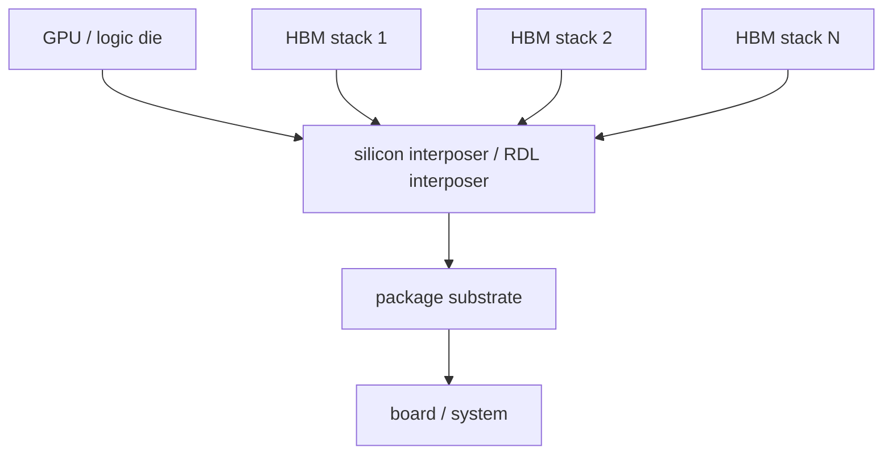
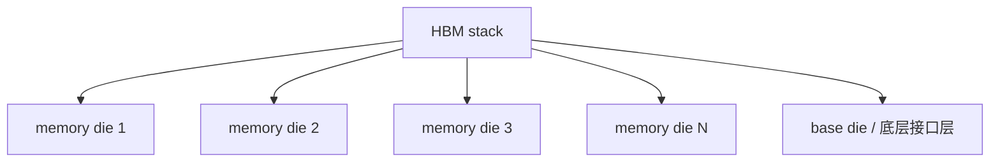
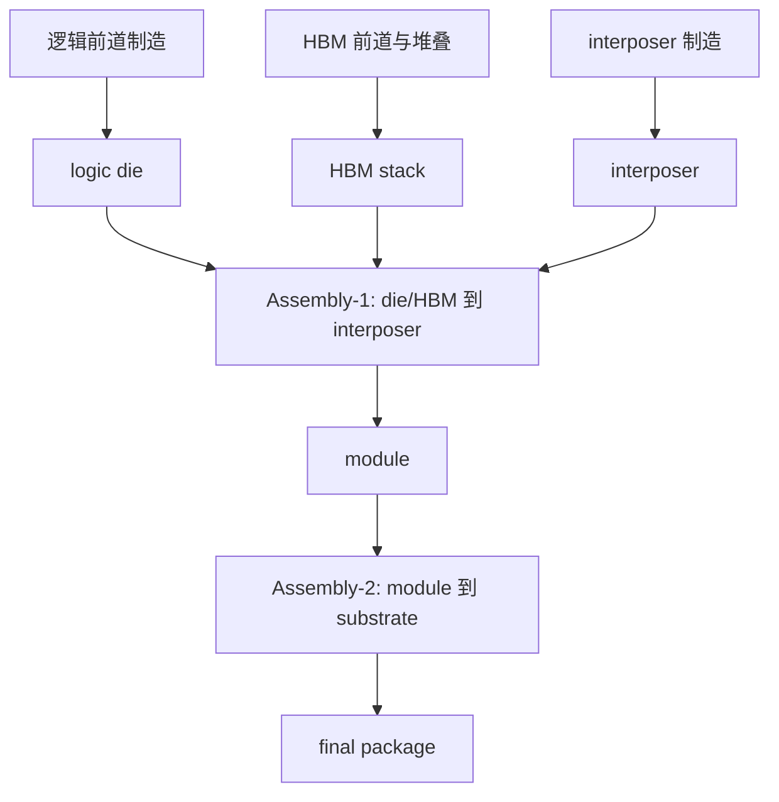

# AI GPU + HBM 封装的完整对象关系图

上级：[[17 - 为什么 HBM 逼着产业走向 2.5D 和 3D]]

相关：[[21 - HBM Stack 是怎么制造出来的]]、[[27 - CoWoS-S 的完整制造流程]]

## 为什么要单独画这张图

因为很多人在学 AI/HPC 封装时，会把对象混在一起：

- GPU die
- HBM die
- HBM stack
- interposer
- substrate
- package

只要这些对象没分开，后面讲 CoWoS、热、PI、测试都会一直糊。

## 1. 对象关系总图

## 2. HBM stack 内部不是单 die

这意味着在 CoWoS 里参与组装的“HBM”，通常是一个已经先做好的 memory 模块。

## 3. 完整系统层级图

## 4. 这张图真正想说明什么

### 第一层

HBM 在进入最终 AI package 前，自己已经是高复杂度堆叠器件。

### 第二层

GPU / logic 与多个 HBM stack 之间，需要一个高密度中间互连平台。

### 第三层

最终 package 不是“单 die 封装”，而是多层对象的系统集成。

## 5. 一句话压缩理解

AI GPU + HBM 封装，本质上是：

`已经先做好的高价值 logic die + 已经先做好的 HBM stacks + 一个高密度中间平台 + 一个大系统级 package`

