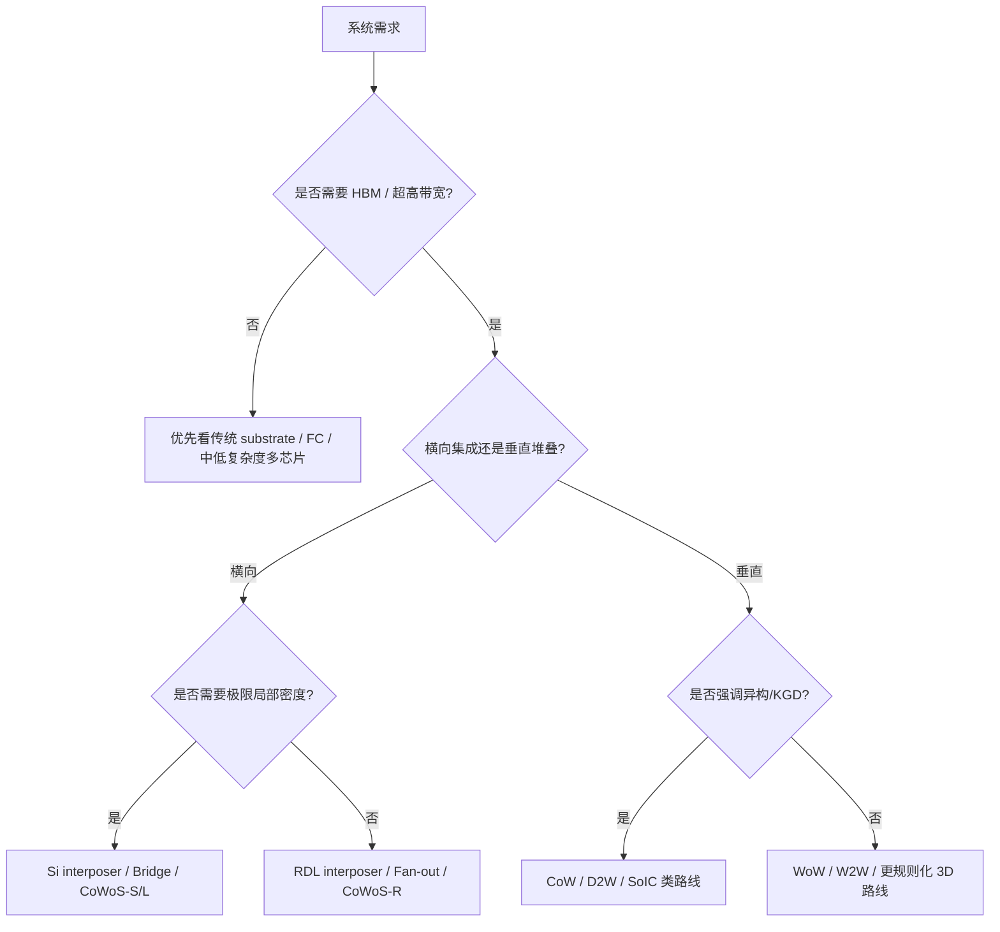

# 从系统需求反推封装路线的选型方法

上级：[[03 - 技术路线总览]]

相关：[[17 - 为什么 HBM 逼着产业走向 2.5D 和 3D]]、[[24 - 台积电、Intel、大陆平台在 AI 封装上的真实差距]]

## 为什么要反着学

如果只按工艺名词去学，很容易变成：

- 记了一堆平台名
- 但不知道为什么这个产品要选这条路线

更好的方式是：

`从系统需求反推封装结构。`

## 1. 第一个问题：到底需不需要超高带宽 memory

### 如果不需要

可以先看：

- 普通 substrate
- FC-BGA
- 中低复杂度多芯片方案

### 如果需要

问题会直接转向：

- HBM
- 2.5D
- 更高密度 interposer / RDL / bridge

## 2. 第二个问题：die-to-die 密度需要多高

### 很高

优先看：

- Si interposer
- local silicon interconnect / bridge
- 3DIC

### 中高但不追极限

优先看：

- Fan-out / RDL interposer
- RDL-based chiplet integration

## 3. 第三个问题：是横向问题还是垂直问题

### 如果核心是 logic 与 HBM / 多 chiplet 并排集成

更偏：

- 2.5D
- interposer
- bridge
- RDL interposer

### 如果核心是想把 die 直接堆起来

更偏：

- SoIC
- Foveros
- 3DIC

## 4. 第四个问题：最优先的是性能，还是尺寸/成本/量产性

### 性能压倒一切

更容易接受：

- 全局硅平台
- 更高密度路线
- 更复杂热与 PI 设计

### 成本与扩展性更重要

更容易倾向：

- RDL
- bridge-like 混合方案
- 更灵活的 package 架构

## 5. 第五个问题：产品量产形态是什么

### 高价值、低出货、追求极限性能

可以接受更高复杂度、更贵的封装。

### 大规模量产、成本敏感

就不能只看技术上“最好”，还要看：

- 工艺窗口
- 良率
- 交期
- 生态成熟度

## 6. 一个通用选型流程图

## 7. 这套方法真正的价值

它会逼你每次都先想：

- 为什么要这么高密度
- 为什么要上 HBM
- 为什么要 2.5D 而不是 3D
- 为什么要 bridge 而不是整块 interposer

只要这几个问题想清楚，路线选择就会自然很多。

## 8. 最终压缩理解

先进封装路线不是从“工艺喜好”选出来的，而是从：

- 带宽
- 功耗
- 热
- 尺寸
- 成本
- 良率
- 量产节奏

这些系统需求反推出来的。

