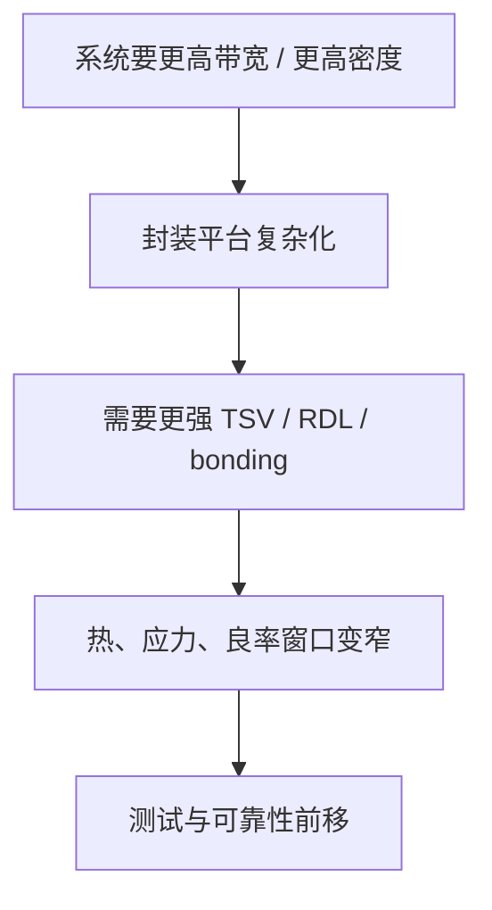

# 工艺深水区：先进封装关键工艺总览

上级：[[00 - 先进封装 Wiki 索引]]

相关：[[25 - TSV 到底是什么，和 2.5D、3D 是什么关系]]、[[26 - RDL 的截面结构和制造流程]]、[[19 - Hybrid Bonding vs Micro-bump]]、[[28 - 先进封装测试：Wafer Sort、KGD、中测、Final Test]]

## 这页的作用

前面的 wiki 已经能让你理解：

- 技术路线怎么分
- 为什么会选某条路线

这一层开始往“工艺深水区”走，回答的是：

`真正决定先进封装难度上限的底层工艺对象是什么？`

## 1. 四个最关键工艺对象

### TSV

解决：

- 硅平台内垂直引出
- interposer / HBM / 某些 3D 结构中的垂直通路

详见：[[42 - 工艺深水区：TSV]]

### RDL

解决：

- I/O 重分配
- 封装级多层互连
- power / signal routing

详见：[[43 - 工艺深水区：RDL]]

### Hybrid Bonding

解决：

- 更细 pitch 的 die-to-die 连接
- 更低寄生、更高带宽密度的 3D 互连

详见：[[44 - 工艺深水区：Hybrid Bonding]]

### 测试与可靠性

解决：

- 高价值对象不被错误地带入后续高成本组装
- 堆叠/封装后可验证、可筛选、可交付

详见：[[45 - 工艺深水区：先进封装测试与可靠性]]

## 2. 一条总的工艺逻辑链

## 3. 为什么要单独学“工艺深水区”

因为当你再往下走时，问题就不再是：

- 什么是 CoWoS
- 什么是 3DIC

而会变成：

- TSV 为什么难
- RDL 为什么会裂
- hybrid bonding 为什么窗口这么窄
- 为什么高端封装测试要前移

也就是说，从这里开始，你就进入“真正决定能否量产”的区域。

