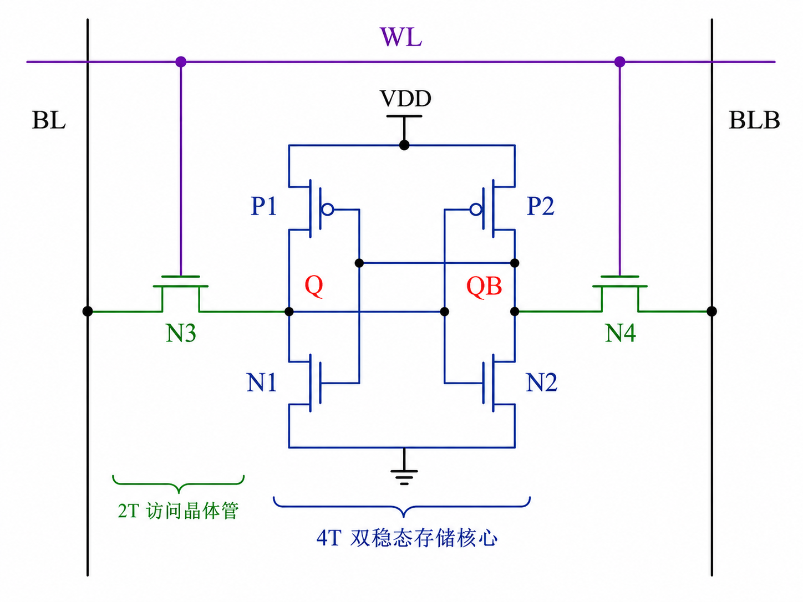

# 6T cell 为什么是 6 个晶体管，双稳态如何对抗扰动

上级：[SRAM 基础](./README.md)
相关：[字线、位线、读出放大器：SRAM 的电路骨架](./wordline-bitline-sense-amp.md), [1T1C cell，一颗电容为什么改变了一切](../04-dram-foundations/1t1c-cell-destructive-read.md)

## 这页在回答什么问题

为什么主流 SRAM 单元长期收敛到 6T 结构，而不是更少或更多晶体管的任意组合。更精确地说，这 6 个晶体管分别在为哪件事付账，以及 SRAM cell 要想真正可用，为什么必须同时满足“能保持、能被读、能被写”这三个条件。

## 正文

如果把 SRAM 只描述成”6 个晶体管存一个 bit”，几乎等于什么都没说。真正值得理解的是：为什么一个稳定可用的 SRAM bit，不能只要求”能存住 0 和 1”，而必须同时满足三件事——就像一个保险柜，不能只要求”能锁住东西”，还必须同时做到：没人动时东西不会自己掉出来（`hold stability`），查看里面的东西时不能意外把东西弄丢（`read stability`），以及需要更换内容时必须能打开重新放入（`write-ability`）。这三件事彼此冲突：保险柜越结实越不容易被意外打开，但你自己想换东西时也越难打开。6T 结构本质上就是在这三者之间找一个长期可制造、可扩展的平衡点。

6T SRAM cell 的核心骨架是两个交叉耦合反相器，再加两个访问晶体管。两个反相器互相把对方的输出作为输入，于是系统存在两个稳定工作点：一个节点高、另一个节点低，或者反过来。这就是所谓双稳态。想象一个山谷两侧各有一个凹坑的地形，一颗小球放进任何一个凹坑里都会稳定停住，你轻轻推它，它会自动滚回原来的凹坑——这就是正反馈再生的物理直觉。只要供电存在，电路会持续把当前状态再生出来，因此不需要像 DRAM 那样依赖电容里的电荷去”勉强记住”一个 bit。



先看中间四个晶体管，也就是两个 CMOS 反相器。它们的任务不是简单地产生逻辑反相，而是形成一个局部可再生存储体。假设内部节点 `Q=1`、`QB=0`，那么左侧反相器会继续驱动 `Q` 保持高，右侧反相器会继续驱动 `QB` 保持低；如果状态是反过来，机制也同样成立。这里的关键不是“两个节点互补”这个结果，而是只要有一个节点稍微占优，正反馈就会把这个优势放大，重新拉回稳定状态。也正因为这种结构依赖正反馈，SRAM 才天然具备快速恢复能力，但同时也意味着读写时稍有处理不当，就会和这个正反馈正面冲突。

再看另外两个晶体管，也就是访问晶体管。它们由字线 `WL` 控制，把 cell 内部两个存储节点分别接到两根位线 `BL` 和 `BLB`。为什么不能省掉它们？就像教室里每个学生的桌子上有一扇可以关闭的小窗口：只有老师叫到你的名字（字线激活）时，你才把窗口打开让老师看你的答案。如果所有窗口永远开着，教室里的噪声就会不断干扰每个学生的思路。访问晶体管的存在，本质上是在说：保持状态和暴露状态必须被隔离，只有在这一行被明确选中时，内部节点才允许和阵列外部交换信息。常见误解是把这两个晶体管看成简单的开关；实际上，它们的尺寸和导通能力直接决定后面的读稳定性和写能力。

为什么不是 4T？如果只保留交叉耦合结构而没有两个访问晶体管，cell 可以是一个局部锁存器，但它不是一个可阵列化、可寻址的存储单元。为什么不是 5T？5T 变体确实存在，它们试图减少面积或位线数量，但通常要在电源、预充策略、噪声容限或外围复杂度上额外付费，因此很难成为通用高性能 SRAM 的默认答案。为什么不是更多晶体管？8T、10T 甚至更多管的 SRAM 也存在，尤其在低电压、低功耗或读隔离要求更高的场景里更有吸引力，但它们付出的代价是面积显著增加。主流 6T 之所以稳定存在，不是因为它在任何指标上都最优，而是因为它在面积、速度、读写平衡和成熟度之间形成了最常见的工程折中。

真正让 6T cell 难的，不是理解结构图，而是理解三种工作状态之间的张力。回到凹坑的类比：保持状态下，你希望凹坑尽可能深，这样小球不容易被外界振动颠出来。读取状态下，你需要探头进去看看小球在哪个凹坑里，但你的探头不能碰到小球把它推到另一边。写入状态下，你又需要一根足够粗的棍子，能把小球从一个凹坑推进另一个。凹坑越深（cell 越稳），读的时候越安全，但写的时候也越难推动。回到电路语言：把 cell 做得”更稳”，往往会让它更难写；把访问晶体管做得”更强”，可以提高写能力，却可能削弱读稳定性——因为更强的访问通路也让读取时的干扰更容易灌进来。这就是 SRAM cell sizing 的核心矛盾。

这一矛盾通常会通过几个比值来表征。最经典的是 `cell ratio`，也就是下拉晶体管相对访问晶体管的强度比，它主要影响读稳定性；还有 `pull-up ratio` 或更广义的写入强度关系，它影响写能力。虽然具体工艺下的最优值不同，但思路是稳定的：为了读不翻，存储节点内部维持状态的晶体管不能太弱；为了写得动，访问路径和外部写驱动又不能太弱。常见误解是以为 SRAM 只要逻辑功能对就行；实际上，一个逻辑上能工作的 6T 拓扑，如果尺寸比选得不好，到了低电压、快慢角、温度角下就可能根本不是可制造的 cell。

这里必须引入一个常见但容易被忽略的事实：SRAM 的”静态”不等于”绝对稳定”——就像说一栋房子”抗震”不是说地震来了纹丝不动，而是说在一定震级范围内能保持结构完整。真实 silicon 上的 cell 会受到工艺失配、随机阈值波动、温度变化、供电噪声和邻近切换干扰影响，因此工程上常用 `SNM`，也就是 static noise margin，来衡量在保持或读取时能承受多大扰动。先进制程下，器件尺寸更小、波动更大、工作电压更低，SNM 往往更难保证，这也是为什么 SRAM 会成为很多先进节点下最顽固的收敛问题之一。

从系统角度回看，6T cell 的意义不只是“片上存储很快”，而是它把一次访问的主要成本局限在局部电路范围内。读取一个 SRAM bit，不需要像 DRAM 那样先开整行、再感测、再恢复；cell 本身已经处在可再生的稳定状态，阵列只需要小心地观察和驱动它。这种局部性，是后面 register file、cache、scratchpad、TCM 和 NPU 本地 buffer 能承担低延迟角色的根本原因。代价则同样明确：每个 bit 更贵、更占面积，而且一旦容量和端口数做大，稳定性与布线代价会很快浮现。

因此，6T 不是一个教科书偶然选出来的数字，而是一个非常具体的工程平衡点。少了访问晶体管，存储单元不能阵列化；少了双稳态骨架，它就不再是 SRAM；把它做得更强或更弱，读、写、保持三者中的一个就会先出问题。理解这一点，后面再看位线预充、sense amp、多端口和低功耗 SRAM 时，很多看似独立的设计选择就会自动连起来。

## 一句话理解

6T SRAM cell 的本质，不是“6 个晶体管存 1 bit”，而是用 4 个晶体管提供可再生双稳态、2 个晶体管提供受控接入，在保持、读取和写入三种互相冲突的要求之间取得平衡。

## 建模启示

在 cycle-level 性能模型里，通常不会显式模拟 6T cell 的晶体管级行为，但这不代表这部分可以被完全忘掉。它留下的系统级后果至少有三类：`读延迟和写延迟未必完全对称`，`最小工作电压会限制频率/功耗模式`，以及 `端口和容量扩张会快速推高面积与能耗`。如果模型完全忽略这些后果，就会把 SRAM 误当成一个可以随意扩展的理想低延迟黑盒。

如果只关心高层性能，可以把 cell 级细节折叠成几组派生参数，例如：

```text
SramCellDerivedParams {
  nominal_read_latency: cycle
  nominal_write_latency: cycle
  min_retention_voltage_mV: int
  read_energy_pJ_per_access: float
  write_energy_pJ_per_access: float
  unstable_below_vmin: bool
}
```

如果进一步关心低功耗模式或 DVFS 行为，最好显式保留一个和稳定性相关的状态判定，例如：

```text
event EnterLowVMode(array_id, target_voltage)
guard target_voltage >= min_retention_voltage_mV
```

这里的关键不是去还原 SNM 曲线，而是承认 SRAM 的“可访问性”与“可保持性”不是无条件的。对多数架构探索任务，晶体管级 `cell ratio` 可以抽象掉，但由它决定的 `read/write latency split`、`retention floor` 和 `energy scaling limit` 不应被抹平。
